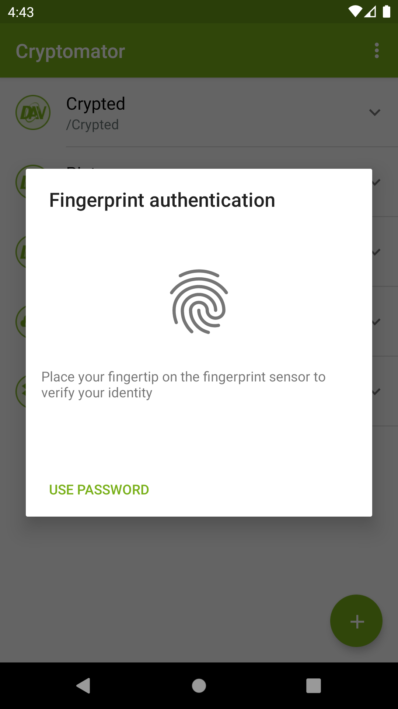
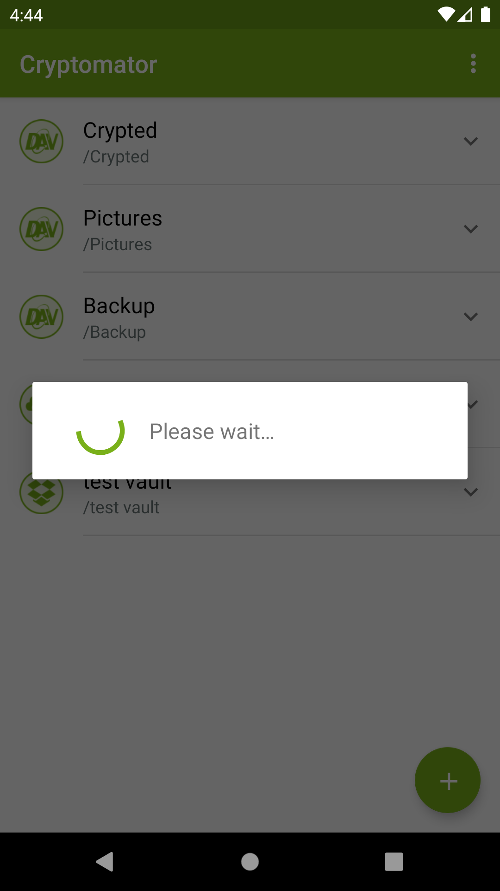
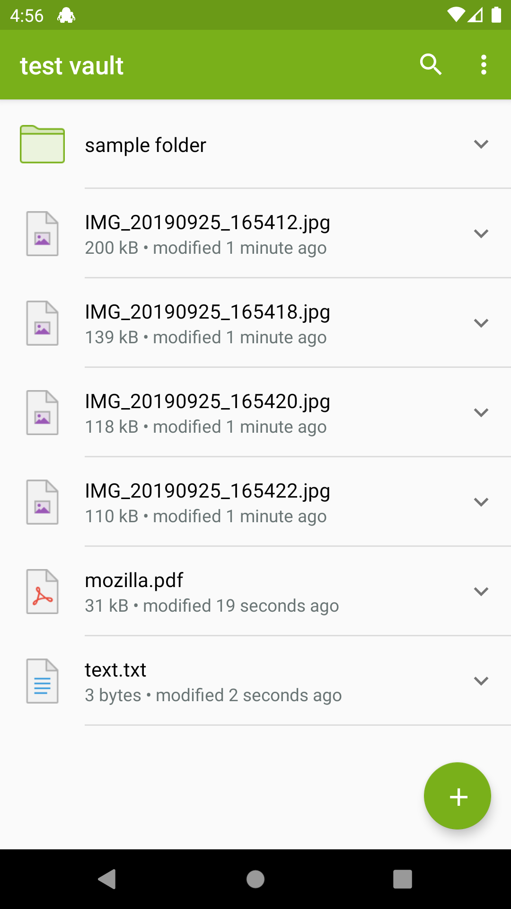

# Unlock vault

If you want to access the data inside a vault, you have to unlock it by selecting it.

{:style="width: 346px"}

In the next step you've to unlock the vault using the password. If the device supports fingerprint authentication and you've activated it in the settings for this vault, you will be prompted to unlock using fingertip. How to setup fingerprint authentication will be documented in a seperate chapter.

{:style="width: 346px"} {:style="width: 346px"}

After providing the credentials the vault gets unlocked and opened.

{:style="width: 346px"} {:style="width: 346px"}

You're now able to edit the content of the vault.
