# Unlock vault

If you want to access the data inside a vault, you have to unlock it by selecting it.

{:style="width: 346px"}

In the next step you've to unlock the vault using the password. If the device supports fingerprint authentication and you've activated it in the settings for this vault, you will be prompted to unlock using fingertip. How to setup fingerprint authentication will be documented in a separate chapter.

{:style="width: 346px"} {:style="width: 346px"}

After providing the credentials the vault gets unlocked and opened.

{:style="width: 346px"} {:style="width: 346px"}

You're now able to edit the content of the vault.

# Lock vault

To lock a unlocked vault you can choose between this solutions:

* use the lock button in the vault list ①
* use the lock button in the notification ②
* use the lock button in the vault actions ③ and ④

{:style="width: 346px"} 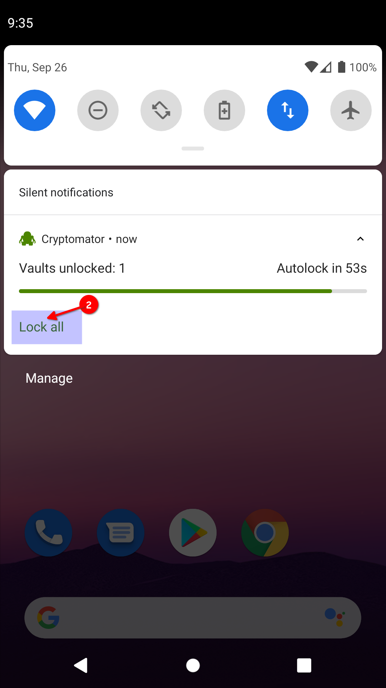{:style="width: 346px"}

{:style="width: 346px"} {:style="width: 346px"}

All of the possibilities will result in the locked vault.

{:style="width: 346px"}

!!! note
    The auto lock timeout specified in the settings will lock the vault if Cryptomator is in background. Furthermore if not changed in settings, the vault gets locked if the screen turns out.

# View and edit file

Start the view and edit process by clicking on a file. Finish the editing or viewing using the back button of the device until you're back in Cryptomator. If the content has changed, the upload process starts.

{:style="width: 346px"}

# Rename file or folder

Change the name of a specific file or folder in Cryptomator, you select the `V` next to the file or folder ①.
After that choose _Rename_ ②.

{:style="width: 346px"} 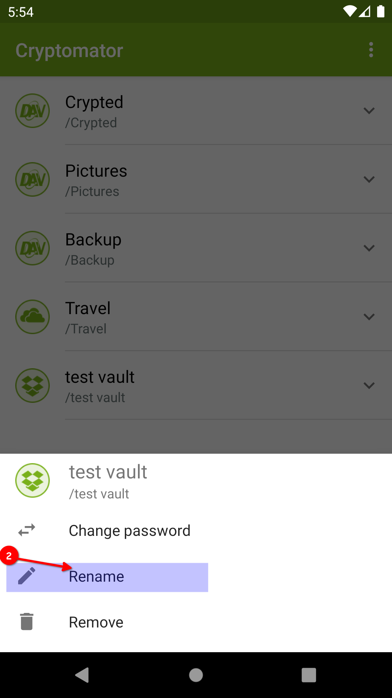{:style="width: 346px"}

Choose a new name and confirm using the `RENAME` button.

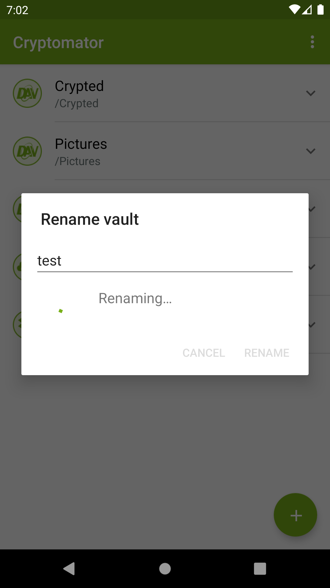{:style="width: 346px"} 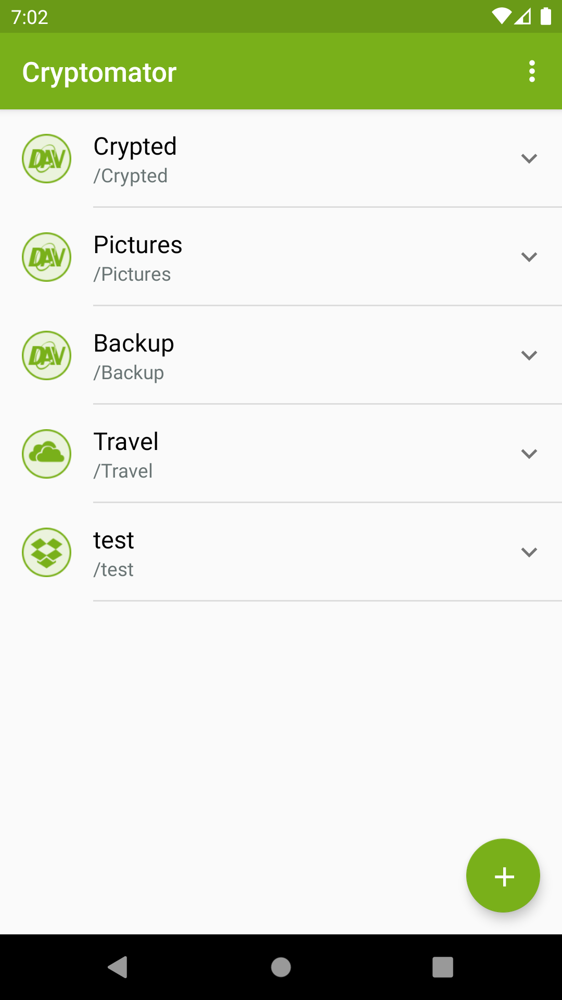{:style="width: 346px"}

# Move file or folder

To move a file or a folder into another folder follow this instructions:

Move a file or folder in Cryptomator, you select the `V` next to the file or folder ①.
After that choose _Move_ ②.

{:style="width: 346px"} {:style="width: 346px"}

Choose a new location by selecting a folder or pressing the back button of your phone to jump a folder up.

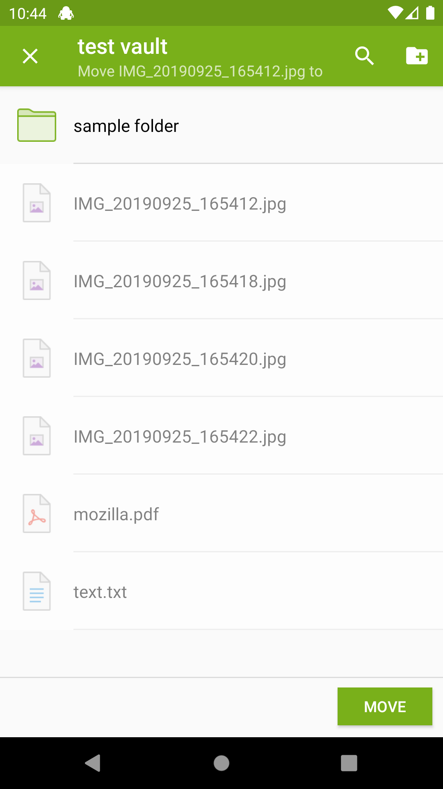{:style="width: 346px"} {:style="width: 346px"}

Confirm using the `MOVE` button.

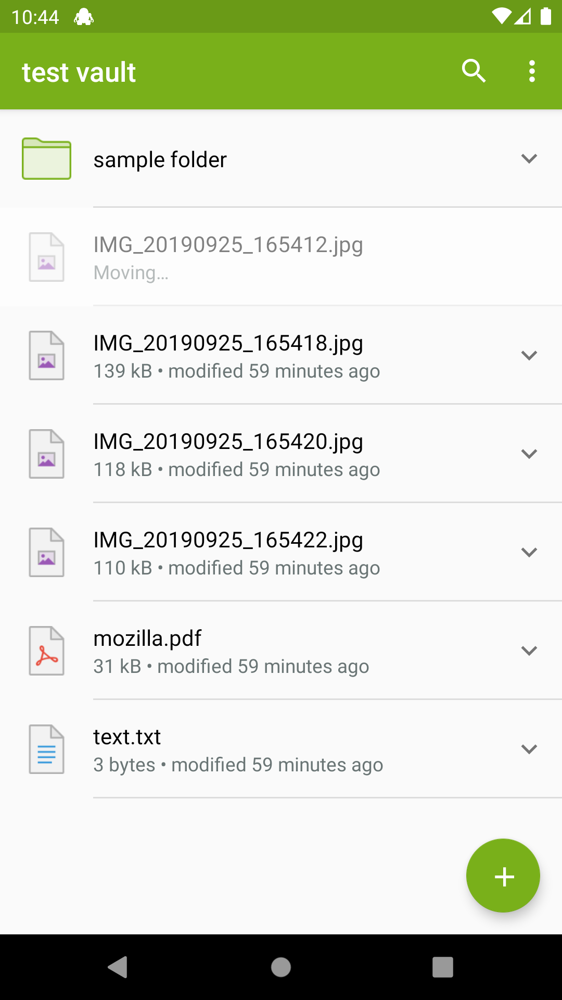{:style="width: 346px"} {:style="width: 346px"}

While moving you can use the ③ button to create a new folder in the current folder.

{:style="width: 346px"}

# Delete file or folder

Delete a specific file or folder in Cryptomator, you select the `V` next to the file or folder ①.
After that choose _Delete_ ②.

{:style="width: 346px"} 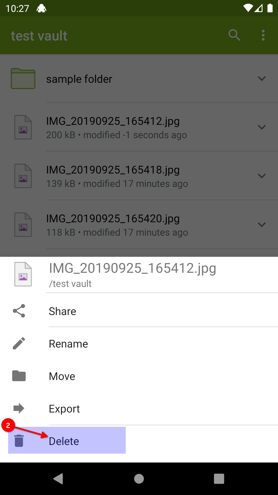{:style="width: 346px"}

Confirm the deletion process using the `DELETE` button.

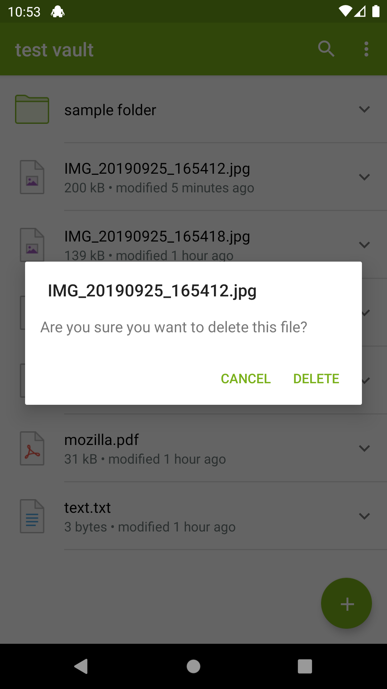{:style="width: 346px"}

{:style="width: 346px"} {:style="width: 346px"}

!!! note
    By deleting a folder, all sub folders and files are deleted inside recursively.

# Export file or folder

Export a specific file or folder in Cryptomator, you select the `V` next to the file or folder ①.
After that choose _Export_ ②.

{:style="width: 346px"} {:style="width: 346px"}

Chose the target location where the file or folder should be exported to.

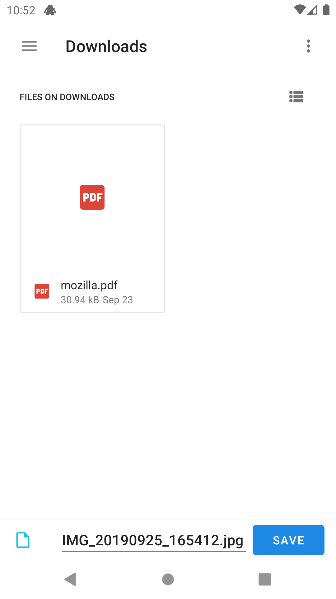{:style="width: 346px"}

{:style="width: 346px"} {:style="width: 346px"}

# Share file with other app

Share a specific file or folder in Cryptomator with another app, you select the `V` next to the file or folder ①.
After that choose Share ②.

{:style="width: 346px"} 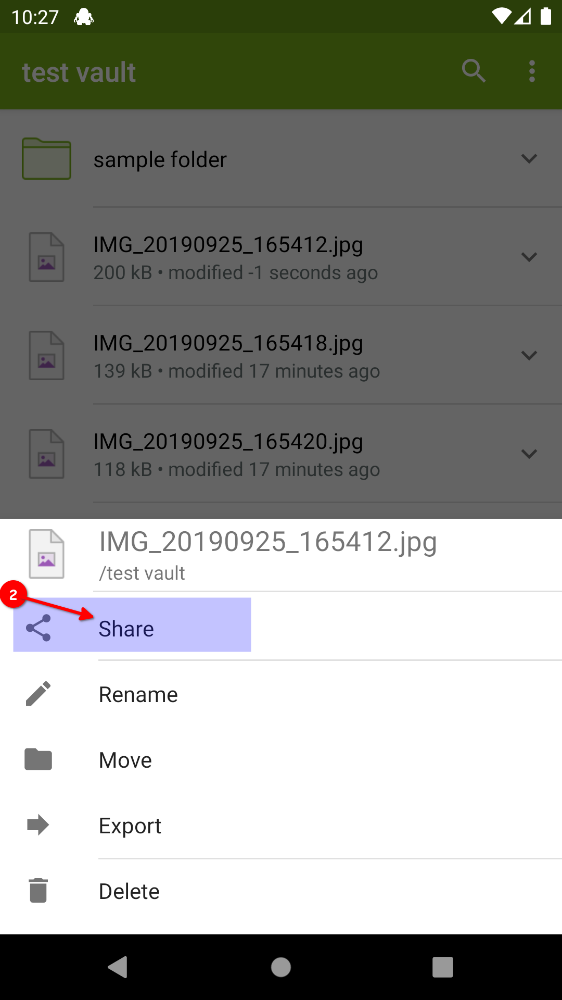{:style="width: 346px"}

Choose the target app in which you will use the file or folder.

{:style="width: 346px"}

!!! note
    By sharing a file or folder from Cryptomator with Cryptomator, you can copy content from one vault to another one.

# Share file with Cryptomator

Share specific file(s) with Cryptomator from another app, starts in the specific app, where you have the file(s) which should be encrypted. We use as example the Files app from Android.

You select the file(s) to share by long clicking on it ①. Press the share button ② to choose to share these file(s). After that select Cryptomator ③.

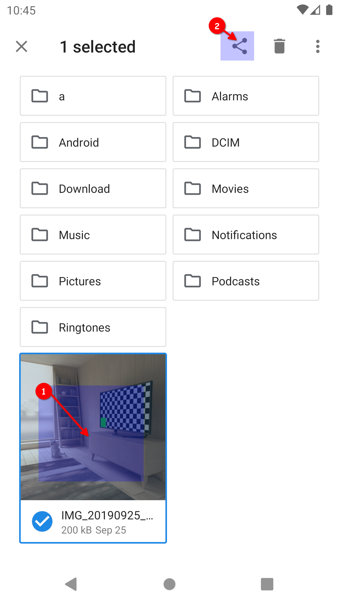{:style="width: 346px"} {:style="width: 346px"}

Choose the vault ④ and optionally specify the target folder in the vault ⑤ (default is the root).

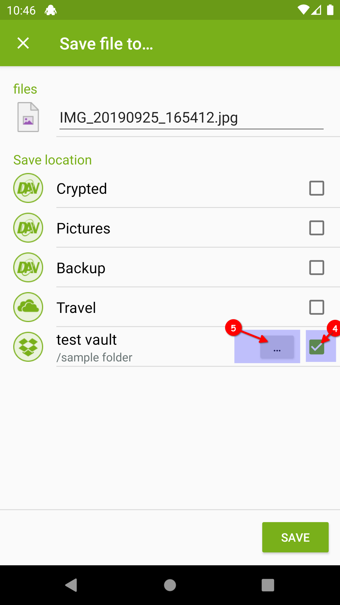{:style="width: 346px"}

Then the encryption and upload starts.

{:style="width: 346px"} 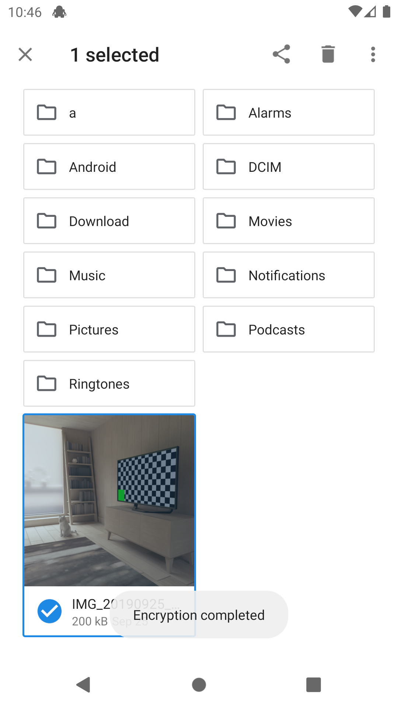{:style="width: 346px"}

# Filter / Search

Search for files or folders within the same folder using the magnifier ①.

{:style="width: 346px"}

Now you can enter the pattern after which you want to search in this folder.

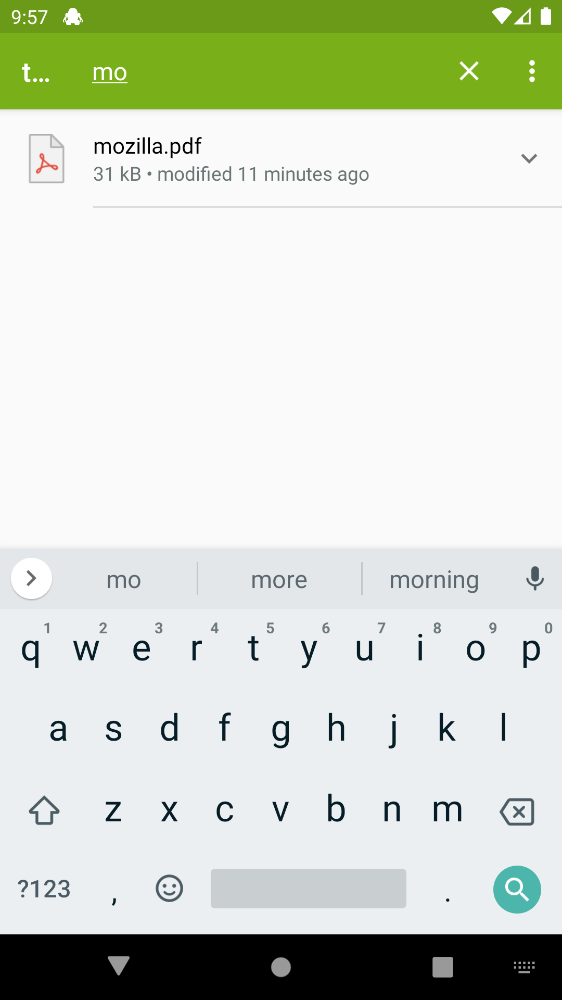{:style="width: 346px"}

Using the `X` ② you can clear the pattern and after pressing it again, the filter mode is finished.

{:style="width: 346px"}
