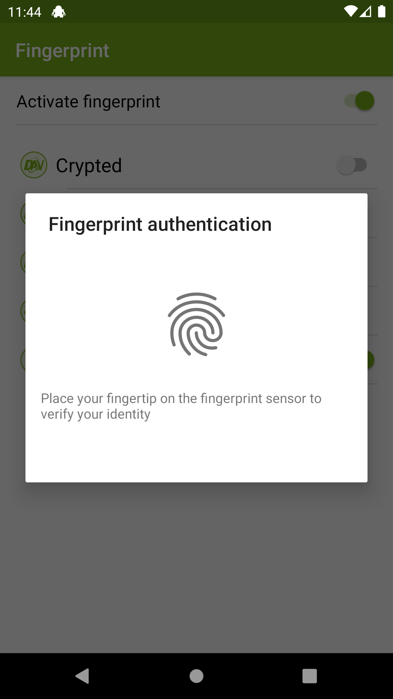

# General Settings

After pressing the three dots ① and clicking on `Settings`, you will find options to customize Cryptomator.

{:style="width: 346px"} {:style="width: 346px"}

## Cloud Services

This setting lists all cloud services. When pressing on a service, the authentication starts or if you're already authenticated, you will be logged out.

{:style="width: 346px"}

## Fingerprint

!!! note
    This setting is only available if your device supports the fingerprint authentication.

With the toggle button in the right upper corner ①, the fingerprint will be generally enabled/disabled.
Using the toggle button next to the vault, it will be enabled/disabled for this vault ②.

{:style="width: 346px"} {:style="width: 346px"}

After enabling, you have to unlock the vault using the password.

{:style="width: 346px"} {:style="width: 346px"}

To have access to the key stored in the keystore, you have to authenticate against the system using the fingerprint.

## Block App When Obscured

Under certain circumstances, Cryptomator for Android may not respond to touches.

This is most often caused by apps which apply a color filter to the device. Examples are the apps Twilight or Blue Light Filter. When disabling or uninstalling such apps, Cryptomator will work again.

The reason for Cryptomator not working is that the user interface of Cryptomator is obscured. Whenever another app obscures Cryptomator, it could intercept the input done to Cryptomator or display a false UI tricking the user into doing stuff he does not want to do. For security reasons, Cryptomator is disabled by default when obscured. The Android documentation contains [some more details](https://developer.android.com/reference/android/view/View.html#Security){:rel="external"}.

Starting from version 1.3.0, this protection can be disabled in the settings. We rather recommend to use the app without a blue light filter because this is more secure.

If you want to disable protection, the blue light filter or any app obscuring Cryptomator has to be disabled one time. Afterwards, the settings can be opened and the option "Disable app when obscured" can be disabled. And then the relevant apps can be reenabled again.

To identify apps which could cause this, open the Android settings and navigate to **Settings - Apps - Advanced (gear icon) - Draw over other apps**. This will list the installed Apps and will show you which ones are allowed to draw over other apps. You can disable this for most apps (but not for system apps like the keyboard but this should not cause any problems).

If you see this dialog, some app is able to draw over Cryptomator: 
{:style="width: 346px"}

## Live Search

If this setting is enabled, the search mode is `live`. That means, the search starts immediately after entering the search pattern. If it is disabled, you have to use the magnifier or the enter button in your keyboard to start the search.

{:style="width: 346px"}

## Screen Security

Android provides the possibility to prevent the system and other apps from doing screenshots, screen recordings etc. while Cryptomator is active. This feature is very important because it prevents other apps from reading data across the screen.

This feature is enabled for all our views. For some devices, e.g. a Chromebook with a second display or to create a screenshot and disable it again, we made this option since the 1.3.9 configurable.

Read more: [FLAG_SECURE](https://developer.android.com/reference/android/view/Display.html#FLAG_SECURE){:rel="external"}

## Style

You can choose between the following three styles:

* Automatic (follow system): Follows the system specified in the Android settings
* Light: App shows in light mode
* Dark: App shows in dark mode

{:style="width: 346px"} {:style="width: 346px"}

# Automatic Locking

If a vault is unlocked and Cryptomator isn't active, the automatic locking timeout is counting down. After the timeout expires, all vaults get locked. You can choose between:

* 1 minute
* 2 minutes
* 5 minutes
* 10 minutes
* Never

`When screen is disabled` can be deactivated so that the vaults don't get locked when the screen locks.

# Automatic Photo Upload

If the `Automatic photo upload` is enabled, all photos taken will be marked for upload and after the specified vault gets unlocked again, the upload starts.

Under the setting `Choose vault for upload`, you can specify the target vault and folder in the vault where the images will be placed.

Which pictures will be tracked, depends on the Android version on your phone:

* Nougat (API level 24 or 7.x) and later: All images which Android adds to the gallery will be uploaded to the vault
* Pre-Nougat: Only the images created with the camera will be uploaded to the vault

# Support

If you have problems with the app you can enable the `Debug mode`. After reproducing the problem, you can disable the `Debug mode` again and `Send log file`.
