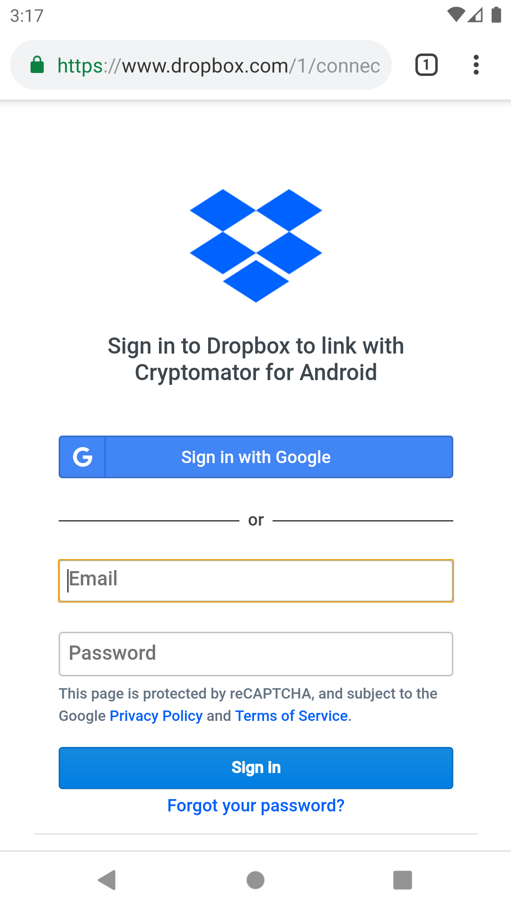
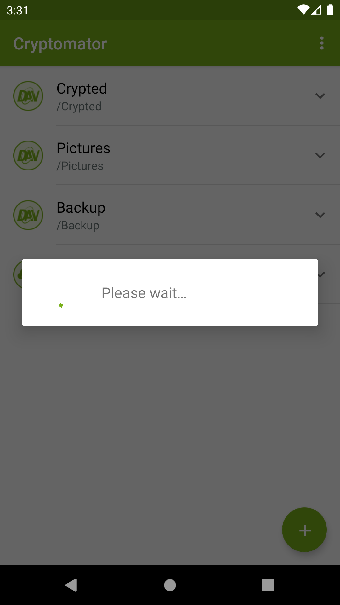
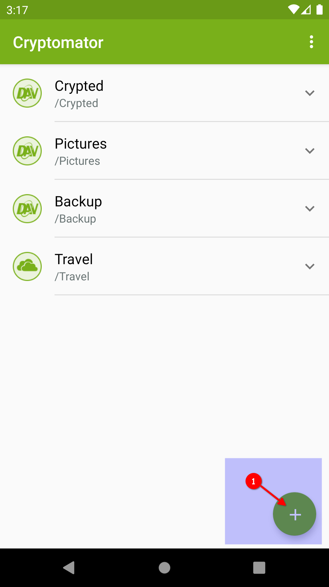
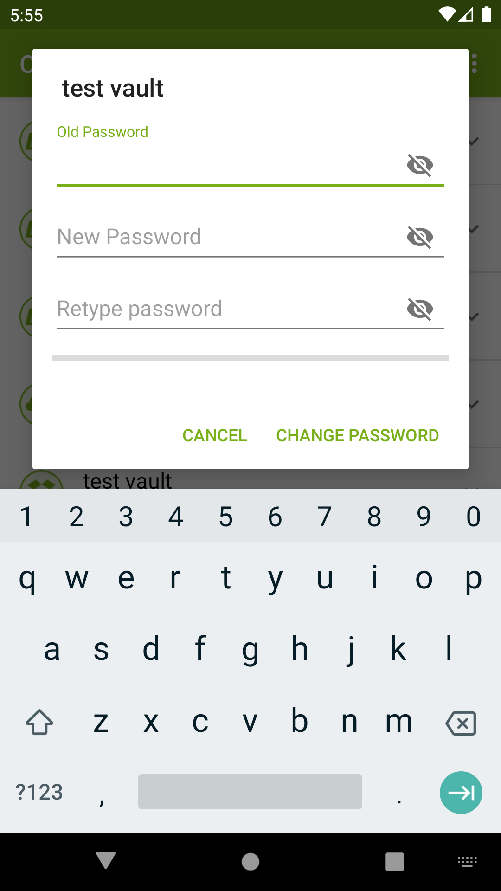
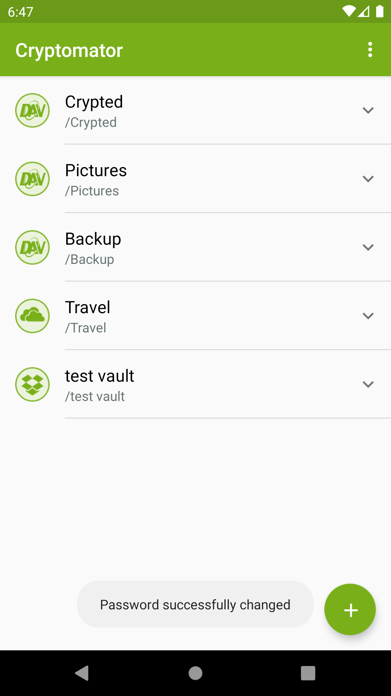

# Create a New Vault

To create a new vault, click on the plus sign ① and choose _Create new vault_ ② in the next screen.

{:style="width: 346px"} {:style="width: 346px"}

!!! note
    If you already have a vault created with the desktop app and just want to add this vault to your mobile app, please select go to chapter `Add Existing Vaults`.

You will now be prompted to select the cloud provider where you want to store your vault.

Choose between _Dropbox_, _Google Drive_, _OneDrive_ (works also with _OneDrive for Business_) or _Local storage_ (which means your local device with all attached devices).

If your desired provider is not listed and offers WebDAV access, please select _WebDAV_ as the storage location of your vault. Here you can find [WebDAV URLs of Common Cloud Storage Services](https://community.cryptomator.org/t/webdav-urls-of-common-cloud-storage-services/75).

{:style="width: 346px"}

In the next step, you will create the connection between the Cryptomator app and your storage provider account.

(In this example, _Dropbox_ was chosen.)

Please enter the credentials for your provider account. If your authentication was successful, the provider might ask you to grant Cryptomator access permission to your online files. Please allow this permission.

{:style="width: 346px"} {:style="width: 346px"}

You can only create one connection between your cloud storage account and the Cryptomator app for each provider. You can't connect to (for example) two different _Dropbox_ accounts.

You can remove Cryptomator permissions from your online storage account at any time. Please keep in mind that Cryptomator then cannot connect to your vault anymore.

Now that you've established a connection, you'll create the actual vault.

In the first step, please enter a name for your new vault. This name will also be the folder name of your vault files in your online storage.

{:style="width: 346px"}

Then choose the location on your cloud storage where you want to have your encrypted vault files stored.

{:style="width: 346px"}

And last but not least create a **secure** password for your vault. Basically, you have the whole Unicode for choosing a password, including non-printable characters.

{:style="width: 346px"}

!!! warning
    You have to remember this password at all times because there is **no way to access your data if you forget your password**. Choose a [good password](../../security/advice/#good-passwords) to make your data secure.

After you have confirmed your password, the vault is created. You will find it now on the start page of your Cryptomator app, where you can open your vault and optionally change settings. [documentation will follow]

{:style="width: 346px"} {:style="ywidth: 346px"}

# Add Existing Vaults

Adding a vault is quiet similar to creating a vault because of this, you'll find a lot of duplicate text but if you skipped the `Create a New Vault` chapter you need all the informations.

To add an existing vault, click on the plus sign ① and choose _Add existing vault_ ② in the next screen.

{:style="width: 346px"} {:style="width: 346px"}

You will now be prompted to select the cloud provider where the vault is located.

Choose between _Dropbox_, _Google Drive_, _OneDrive_ (works also with _OneDrive for Business_) or _Local storage_ (which means your local device with all attached devices).

If your desired provider is not listed and offers WebDAV access, please select _WebDAV_ as the storage location of your vault. Here you can find [WebDAV URLs of Common Cloud Storage Services](https://community.cryptomator.org/t/webdav-urls-of-common-cloud-storage-services/75).

{:style="width: 346px"}

If not already done, you have to create the connection between the Cryptomator app and your storage provider account.

(In this example, _Dropbox_ was chosen.)

Please enter the credentials for your provider account. If your authentication was successful, the provider might ask you to grant Cryptomator access permission to your online files. Please allow this permission.

{:style="width: 346px"} {:style="width: 346px"}

You can only create one connection between your cloud storage account and the Cryptomator app for each provider. You can't connect to (for example) two different _Dropbox_ accounts.

You can remove Cryptomator permissions from your online storage account at any time. Please keep in mind that Cryptomator then cannot connect to your vault anymore.

Now that you've established a connection, you'll add the existing vault.

In the first step, please choose the folder in which the vault is located. This folder name is the same like the vault name (in this example our vault name is _test vault_ so we select this folder).

{:style="width: 346px"}

Then choose the `masterkey.cryptomator` file.

{:style="width: 346px"}

Now the vault is added to the list of vaults. You will find it now on the start page of your Cryptomator app, where you can open your vault and optionally change settings. [documentation will follow]

{:style="width: 346px"} {:style="ywidth: 346px"}

# Remove Vaults

If you want a specific vault to stop being displayed in Cryptomator, you select the `V` next to the vault ①.
After that choose _Remove_ ②.

{:style="width: 346px"} {:style="ywidth: 346px"}

Confirme the deletion process using the `Delete` button.

{:style="width: 346px"} {:style="ywidth: 346px"}

!!! note
    By removing a vault, it is only removed from the list but not deleted in the cloud. You can re-add the vault afterwards.

# Change Vault Password

If you want change the password of a specific vault in Cryptomator, you select the `V` next to the vault ①.
After that choose _Change password_ ②.

{:style="width: 346px"} {:style="ywidth: 346px"}

Enter the old password and choose a **secure** new one. Basically, you have the whole Unicode for choosing a password, including non-printable characters.

{:style="width: 346px"}

!!! warning
    You have to remember this password at all times because there is **no way to access your data if you forget your password**. Choose a [good password](../../security/advice/#good-passwords) to make your data secure.

Start the process using the `CHANGE PASSWORD` button.

{:style="width: 346px"} {:style="width: 346px"}

!!! note
    The password is used to derive a [KEK](https://en.wikipedia.org/wiki/Glossary_of_cryptographic_keys){: rel="external"}, which is then used to encrypt futher keys. The KEK changes, but the keys encrypted with the KEK will stay the same. The actual files will not get re-encrypted, meaning you can not upgrade a weak passphrase to a stronger one once the data has been synced to a service that allows recovery of older versions of the masterkey file.
    
    If you like to encrypt your vault files with a new, stronger password you need to create a new vault and drag the data from the old to the new one. Make sure to wipe all backups of the old vault afterwards.

# Rename Vault

If you want to change the name of a specific vault in Cryptomator, you select the `V` next to the vault ①.
After that choose _Rename_ ②.

{:style="width: 346px"} {:style="ywidth: 346px"}

Choose a new name and confirm using the `RENAME` button.

{:style="width: 346px"} {:style="ywidth: 346px"}
