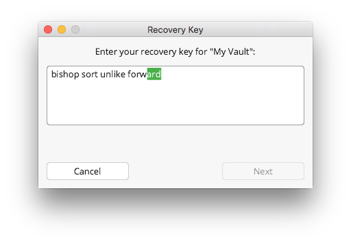

# Forgot a Vault Password

If you forgot the password for a vault, but created and saved the recovery key somewhere, you are able to define a new password and have access to the vault again.

## Prerequisites

To be able to access the data of your vault again, there need to be three conditions fullfilled:

1. The vault was created with version 1.5.0 or newer,
1. during vault creation the recovery key was created and
1. you have access to this recovery key

## Recover Access to the Vault

In the main window of Cryptomator, select the vault where you forgot the password and open the [`Vault options`](TODO).

[//]: # (TODO: add picture with "ForgotPassword" vault)

In the next step, navigate to the `Password` tab and click the `Recover Password` button.

A new prompt is opened, asking to insert your recovery key into the shown text box. Enter it there by copying it from a file or typing.

!!! tip
    If you printed your recovery on paper or stored it somewhere where you cannot copy it, Cryptomator offers you an auto completion feature for insertion.
    Type a letter and see if the shown word matches your key part.
    If so, you can press tab or right arrow key to auto complete the word.
    Otherwise enter more letters, the suggestion will change accordingly.

If the recovery key is valid, Cryptomator indicates this by a small message and activates the `Next` button

In the last step you need to assign a new password to your vault.
It is the same as during [vault creation](./adding-vaults.md#) and as noted there, read the suggestion for choosing a [good password](../security/advice.md#good-passwords)
Finish the dialog by entering the same password again and clicking the `Done` button.