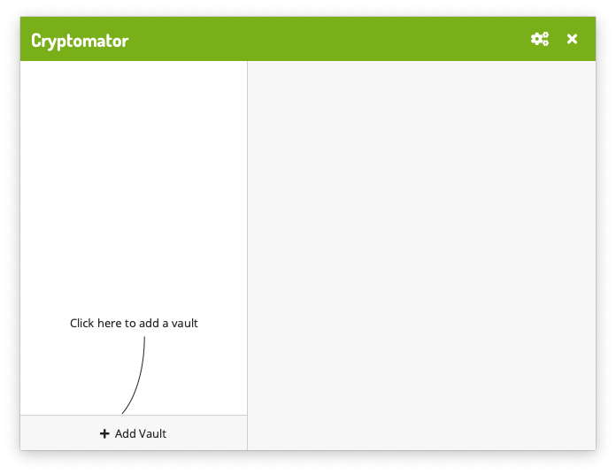

With Cryptomator you can create encrypted *vaults*. Each vault is protected by a password and can contain as many files and folders as you like.

When you're a first-time user of Cryptomator, you obviously don't have any vaults yet. If you start the application, you will be greeted with the following screen:

By clicking on the  [`Add Vault`](../adding-vaults/) button in the lower left corner of the window, you can create a new vault.

<!--
# Tutorial Video

{:rel="external"}
-->