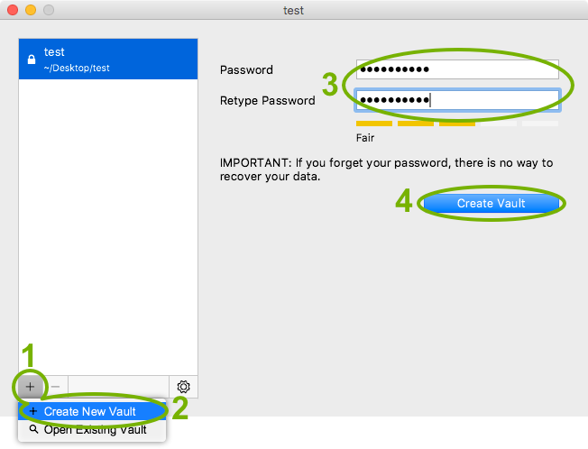

# Create a new vault

To create a new vault click on the plus sign (`1`) and choose `Create vault` (`2`). You can now select the storage location. Navigate to the desired location, enter the name for your vault and click `Save`.

After choosing the storage location you will be prompted for a password (`3`). You have to remember this password at all times because there is no way to access your data if you forget your password. Choose a good password to make your data secure. We recommend to use at least 10 characters, ideally [use sentences instead of words](https://xkcd.com/936/).

After you’ve created the vault (`4`), you can access your data.

# Add Existing Vaults
You have to open vaults you created on another device, e.g your iPhone, to have them displayed in Cryptomator. To do this click on the plus sign and choose `Open vault`. Navigate to the storage location of your vault and choose the file `masterkey.cryptomator` and click on `Open`.

# Remove Vaults
If you want a specific vault to stop being displayed in Cryptomator, you can select it and remove it using the minus sign or by right-clicking on it. This is only possible while the vault is locked. By removing a vault, it is only removed from the list but not deleted from your filesystem. You can re-add the vault afterwards.

# Delete Vaults
To delete a vault permanently navigate to the storage location of the vault. The storage location is displayed in Cryptomator below the vault name or when hovering the vault. The symbol `~` stands for your user directory.

You can now delete the folder that contains the `masterkey.cryptomator` file as you would do with other files and folders.
