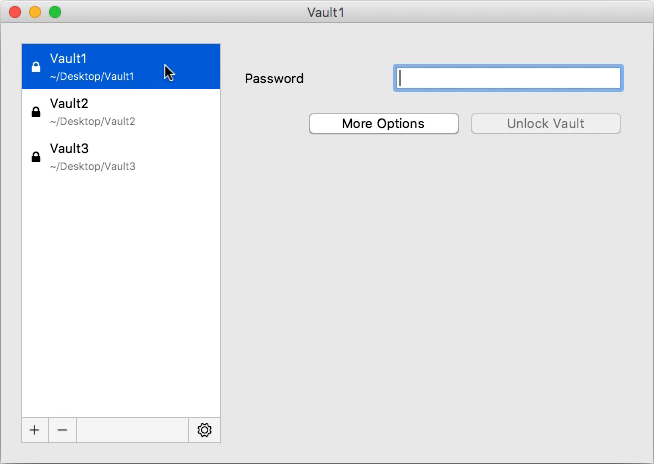

# Remove Vaults

You can remove a vault from the vault list by right clicking on the list entry. This is only possible while the vault is locked. 

!!! hint
    By removing a vault from this list, it is **not** deleted from your filesystem. You can re-add the vault afterwards.
    
    To irrevocably get rid of the vault, you can simply delete the vault directory (which contains your `masterkey.cryptomator` and the `d` directory) using your normal file manager.

# Reorder Vaults

You can change the order of your vaults by dragging them to the desired position.

# Vault Options

Each vault has an own set of settings which can be viewed and customized in the `Vault Options` window.
To open it, select in the main window the _locked_ vault in question and click the `Vault options` button with the gear.

[//]: # (TODO image of vault options dialog)

The options are divided in three categories:

1. General - Options not fitting into another category
1. Mounting - All options about where and how you can access your unlocked vault
1. Password - Options and actions regarding your vault password and the recovery key

In the `General` tab you can select if the vault is unlocked as soon as Cryptomator is started.

For [`Mounting`](../vault-mounting) and [`Password`](../password-and-recovery-key) we refer to the regarding sections.