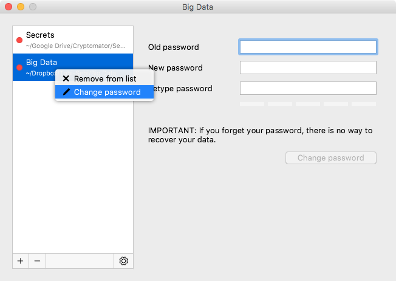

# Remove Vaults

If you want a specific vault to stop being displayed in Cryptomator, you can select it and remove it using the minus sign or by right-clicking on it. This is only possible while the vault is locked. By removing a vault, it is only removed from the list but not deleted from your filesystem. You can re-add the vault afterwards.

# Delete Vaults

To delete a vault permanently, navigate to the storage location of the vault. The storage location is displayed in Cryptomator below the vault name or when hovering the vault. The symbol `~` stands for your user directory.

You can now delete the folder that contains the `masterkey.cryptomator` file as you would do with other files and folders.

# Reordering Vaults

You can change the order of your vaults by dragging them to the desired position.

# Change Vault Password

The password can be changed by right-clicking on a vault while it is locked. Currently, it's not possible to change the password while the vault is unlocked.

!!! note
    The password is used to derive a [KEK](https://en.wikipedia.org/wiki/Glossary_of_cryptographic_keys){:rel="external"}, which is then used to encrypt futher keys. The KEK changes, but the keys encrypted with the KEK will stay the same. The actual files will not get re-encrypted, meaning you can not upgrade a weak passphrase to a stronger one once the data has been synced to a service that allows recovery of older versions of the masterkey file.
    
    If you like to encrypt your vault files with a new, stronger password, you need to create a new vault and drag the data from the old to the new one. Make sure to wipe all backups of the old vault afterwards.
