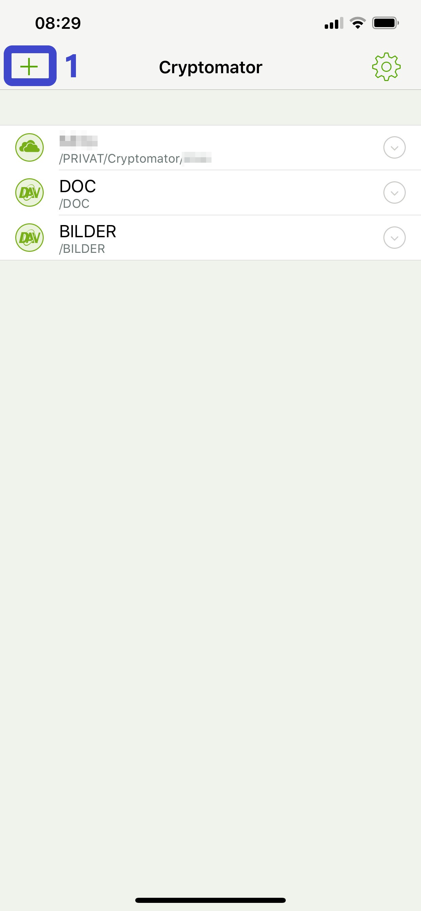
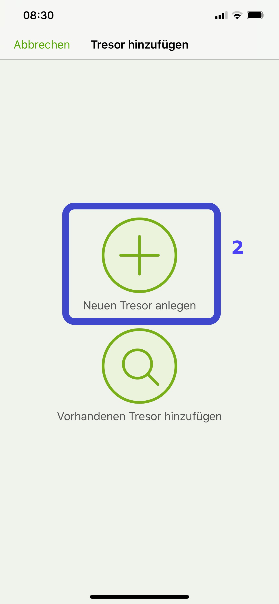
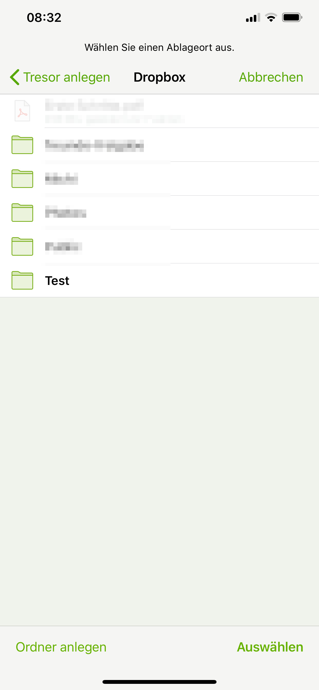
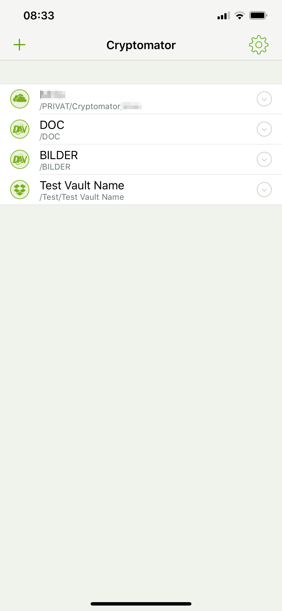

# Create a New Vault

To create a new vault, click on the plus sign ① and choose _Create New Vault_ ② in the next screen.

{:style="width: 346px"} {:style="width: 346px"}

!!! note
    If you already have a vault created with the desktop app and just want to add this vault to your mobile app, please select _Add Existing Vault_ and proceed. [documentation will follow]

You will now be prompted to select the cloud provider where you want to store your vault.

Choose between _iCloud Drive_, _Dropbox_, _Google Drive_, or _OneDrive_ (works also with _OneDrive for Business_).

If your desired provider is not listed and offers WebDAV access, please select _WebDAV_ as the storage location of your vault.

{:style="width: 346px"}

In the next step, you will create the connection between the Cryptomator app and your storage provider account.

(In this example, _Dropbox_ was chosen.)

Please enter the credentials for your provider account. If your authentication was successful, the provider might ask you to grant Cryptomator access permission to your online files. Please allow this permission.

{:style="width: 346px"} {:style="width: 346px"}

!!! note
    Cryptomator uses the login process offered by the cloud providers. Any account information (e.g., tokens for remembering your login) is stored locally on your device and secured in the iOS keychain. In case of WebDAV, the credentials are stored in the iOS keychain.

You can only create one connection between your cloud storage account and the Cryptomator app for each provider. You can't connect to (for example) two different _Dropbox_ accounts.

You can remove Cryptomator permissions from your online storage account at any time. Please keep in mind that Cryptomator then cannot connect to your vault anymore.

Now that you've established a connection, you'll create the actual vault.

In the first step, please enter a name for your new vault. This name will also be the folder name of your vault files in your online storage.

{:style="width: 346px"}

Then choose the location on your cloud storage where you want to have your encrypted vault files stored.

{:style="width: 346px"}

And last but not least create a **secure** password for your vault. Basically, you have the whole Unicode for choosing a password, including non-printable characters.

{:style="width: 346px"}

!!! warning
    You have to remember this password at all times because there is **no way to access your data if you forget your password**. Choose a [good password](../../security/advice/#good-passwords) to make your data secure.

After you have confirmed your password, the vault is created. You will find it now on the start page of your Cryptomator app, where you can open your vault and optionally change settings. [documentation will follow]

{:style="width: 346px"} {:style="width: 346px"}
