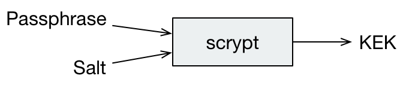
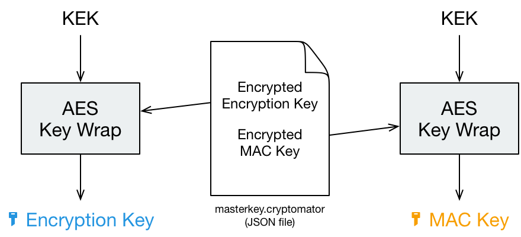
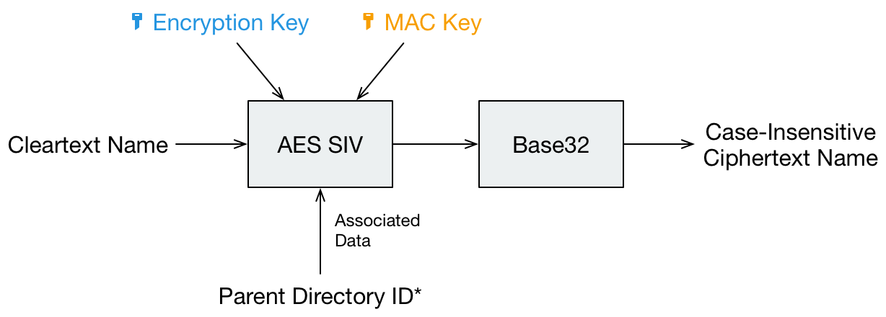
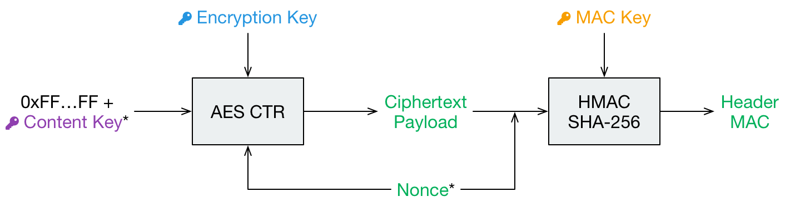
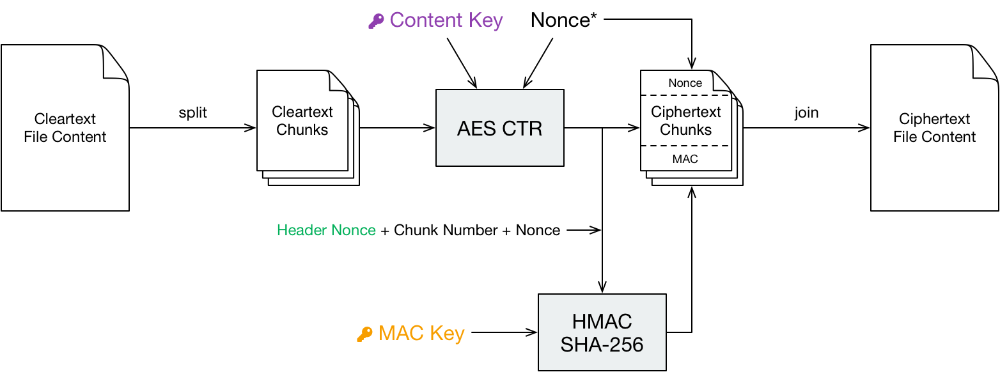

# Virtual Filesystem

Cryptomator provides a virtual drive. Add, edit, remove files as you're used to with just any disk drive.

Files are transparently en- and decrypted. There are no unencrypted copies on your hard disk drive. With every access on your files inside the virtual drive, Cryptomator will en- and decrypt these files on-the-fly.

Currently Dokany (on Windows) and FUSE (on macOS and Linux) are our frontends of choice. If they're not available on your system, Cryptomator will fall back on WebDAV, as it is supported on every major operating system. WebDAV is an HTTP-based protocol and Cryptomator acts as a WebDAV server accepting so-called loopback connections on your local machine only.

Whenever your file manager accesses files through this virtual drive, Cryptomator will process this request via the following layers.

# Masterkey Derivation

Each vault has its own 256 bit encryption as well as MAC masterkey used for encryption of file specific keys and file authentication, respectively.

These keys are random sequences generated by a <abbr title="Cryptographically secure pseudorandom number generator">CSPRNG</abbr>. We use [SecureRandom](https://docs.oracle.com/javase/8/docs/api/java/security/SecureRandom.html){: rel="external"} with SHA1PRNG, seeded with 440 bits from `SecureRandom.getInstanceStrong()`.

Both keys are encrypted using [RFC 3394](https://tools.ietf.org/html/rfc3394){: rel="external"} key wrapping with a <abbr title="Key-encryption key">KEK</abbr> derived from the user's password using [scrypt](https://en.wikipedia.org/wiki/Scrypt){: rel="external"}.

```
encryptionMasterKey := createRandomBytes(32)
macMasterKey := createRandomBytes(32)
kek := scrypt(password, scryptSalt, scryptCostParam, scryptBlockSize)
wrappedEncryptionMasterKey := aesKeyWrap(encryptionMasterKey, kek)
wrappedMacMasterKey := aesKeyWrap(macMasterKey, kek)
```

{:style="width: 336px" .center}

The wrapped keys and the parameters needed to derive the KEK are then stored as integers or Base64 strings in a JSON file named `masterkey.cryptomator`, which is located in the root directory of the vault.

```
{
  "version": 6, /* vault version for checking software compatibility */
  "scryptSalt": "QGk...jY=",
  "scryptCostParam": 16384,
  "scryptBlockSize": 8,
  "primaryMasterKey": "QDi...Q==", /* wrappedEncryptionMasterKey */
  "hmacMasterKey": "L83...Q==", /* wrappedMacMasterKey */
  "versionMac": "3/U...9Q=" /* HMAC-256 of vault version to prevent undetected downgrade attacks */
}
```

When unlocking a vault the KEK is used to unwrap (i.e. decrypt) the stored masterkeys.

{:style="width: 440px" .center}

# Filename Encryption

Before we deal with the actual file contents, file and foldernames get encrypted.

At first, each folder gets a unique identifier called _directory ID_. The directory ID for the root folder is special and always empty. For all other folders a <abbr title="Universally unique identifier">UUID</abbr> is created.

```
dirId := createUuid()
```

The cleartext name of a file gets encoded using UTF-8 in [Normalization Form C](https://unicode.org/reports/tr15/#Norm_Forms){: rel="external"} to get a unique binary representation.

Cryptomator uses [AES-SIV](https://tools.ietf.org/html/rfc5297){: rel="external"} to encrypt file as well as directory names. The directory ID of the parent folder is passed as associated data. This prevents undetected movement of files between directories.

{:style="width: 614px" .center}
<figcaption>* Unique identifier is created for each directory</figcaption>

```
ciphertextName := base32(aesSiv(cleartextName, parentDirId, encryptionMasterKey, macMasterKey))
```

If it's a file, an encrypted file with this name is created in the corresponding directory.

If it's a directory name, we prepend a zero. We then create a file with this name, in which we write the directory ID. The files and folders inside this directory are stored in a different location:

```
dirIdHash := base32(sha1(aesSiv(dirId, null, encryptionMasterKey, macMasterKey)))
dirPath := vaultRoot + '/d/' + substr(dirIdHash, 0, 2) + '/' + substr(dirIdHash, 2, 30)
```

Thus, a nested directory structure, e.g.:

```
a
|- dataA.txt
\- b
 |- data-data.txt
 \- c
    |- dataB.txt
    \- d
```

Becomes a structure of sibling directories, e.g.:

```
d
|-L6
| \- V4YL7GBW4A4KKNSSJXVSUVRWH3ONI6
|    |- P6FBAFY7HJJLJYBY4IPZTWGMKKE2ONK3II======
|    \- 0CEOH7OJH3CY6PUFTOTULXALNNCCE5CEOA6IMBW4X
|-LN
| \- T3MOJAPX7MHPV7HMUYRWVI76PUGDQG
|    |- WPKQKC7NSNLMH7LCA3TGZVZXASK34C4JSF4ERZNO6AWFWF34A7SMO3XM
|    \- 034GWQ2GONIZZPACRD6P2VBWQOPWHA27DYE5KGRRB
|-Q2
| \- LWWOK3BVOVNIW5FUQIAWUT2A64ZEE6
\-YH
 \- UMPFQE22AFP66MQJUCZ4AOMMVZE522
    |- L76ZSEYYPGJJZM7YGANJO7JQVDGFQ7XXY6XDU4JH4MOZW4NWHFST4BQ=
    \- 0ZJAF3BSANWHI7Q5IM6UB6YCSXRD3MLRV2B76ZOY2
```

By making all directories effectively siblings (or cousins to be precise), we not only obfuscate the directory hierarchy but also limit path depth regardless of its actual hierarchy to ensure compatiblity with some cloud storage services.

# File Header Encryption

The file header stores certain metadata, which is needed for file content encryption. It consists of 88 bytes.

- 16 bytes nonce used during header payload encryption
- 40 bytes [AES-CTR](https://en.wikipedia.org/wiki/Block_cipher_mode_of_operation#Counter_.28CTR.29){: rel="external"} encrypted payload consisting of:
  - 8 bytes filled with 1 for future use (formerly used for file size)
  - 32 bytes file content key
- 32 bytes header MAC of the previous 56 bytes

```
headerNonce := createRandomBytes(16)
contentKey := createRandomBytes(32)
cleartextPayload := 0xFFFFFFFFFFFFFFFF . contentKey
ciphertextPayload := aesCtr(cleartextPayload, encryptionMasterKey, headerNonce)
mac := hmacSha256(headerNonce . ciphertextPayload, macMasterKey)
```

{:style="width: 706px" .center}
<figcaption>* Random per file change</figcaption>

# File Content Encryption

This is where your actual file contents get encrypted.

The cleartext is broken down into multiple chunks, each up to 32 KiB + 48 bytes consisting of:

- 16 bytes nonce
- up to 32 KiB encrypted payload using AES-CTR with the file content key
- 32 bytes MAC of
  - file header nonce (to bind this chunk to the file header)
  - chunk number as 8 byte big endian integer (to prevent undetected reordering)
  - nonce
  - encrypted payload

Afterwards the encrypted chunks are joined preserving the order of the cleartext chunks. The payload of the last chunk may be smaller than 32 KiB.

```
cleartextChunks[] := split(cleartext, 32KiB)
for (int i = 0; i < length(cleartextChunks); i++) {
  chunkNonce := createRandomBytes(16)
  ciphertextPayload := aesCtr(cleartextChunks[i], contentKey, chunkNonce)
  mac := hmacSha256(headerNonce . bigEndian(i) . chunkNonce . ciphertextPayload, macMasterKey)
  ciphertextChunks[i] := chunkNonce . ciphertextPayload . mac
}
ciphertextFileContent := join(ciphertextChunks[])
```

{:style="width: 782px" .center}
<figcaption>* Random per chunk change</figcaption>

# Name Shortening

This layer doesn't modify any file contents. Its sole purpose is to limit the path length to ensure compatibility with certain Microsoft products that do not support long paths.

Even with the flattened directory structure [achieved during filename encryption](#filename-encryption), the file path might be longer than 255 characters. If a ciphertext filename exceeds the threshold of 129 characters, it is replaced by its much shorter SHA-1 hash and gets a `.lng` file extension. Additionally, an equally named metadata file is created in the `m` directory containing a reverse-mapping back to the original name.

```
if (length(ciphertextName) <= 129) {
  deflatedName := ciphertextName
} else {
  deflatedName := base32(sha1(ciphertextName)) + '.lng'
  metadataPath := vaultRoot + '/m/' + substr(deflatedName, 0, 2) + '/' + substr(deflatedName, 2, 2)
  metadataContent := ciphertextName
}
```

This layer doesn't provide any additional security. Its sole purpose is to maximize compatibility.

# Target Directory

After your files have been processed by all above layers, they are finally stored into your chosen directory.

This is where Cryptomator's job is done and the synchronization client of your favorite cloud provider will start synchronization.
