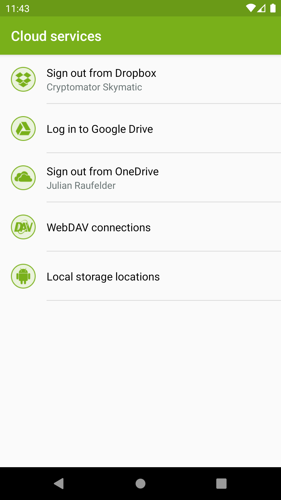
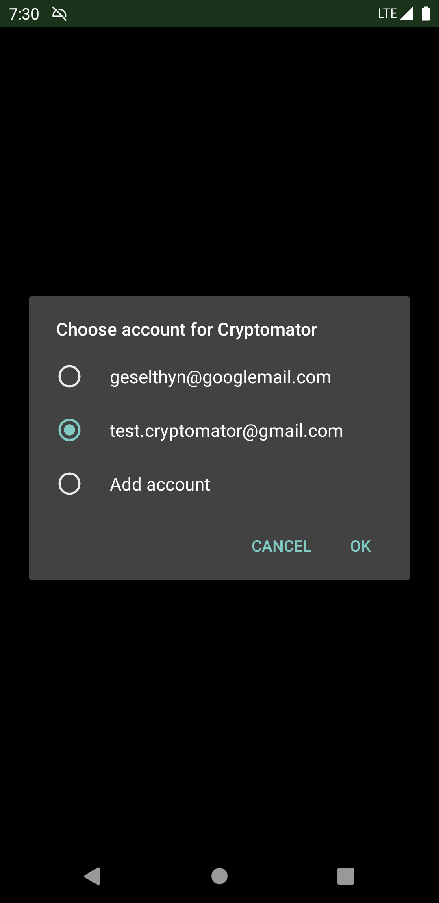
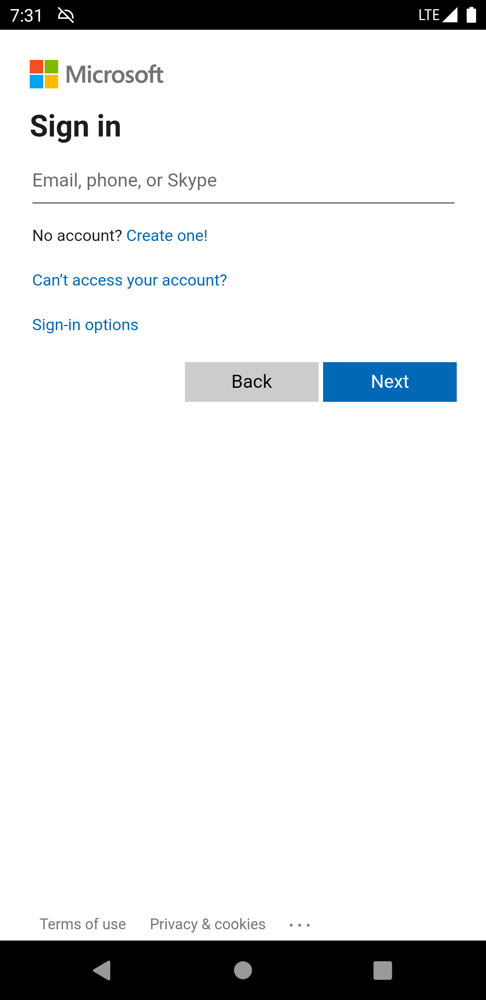
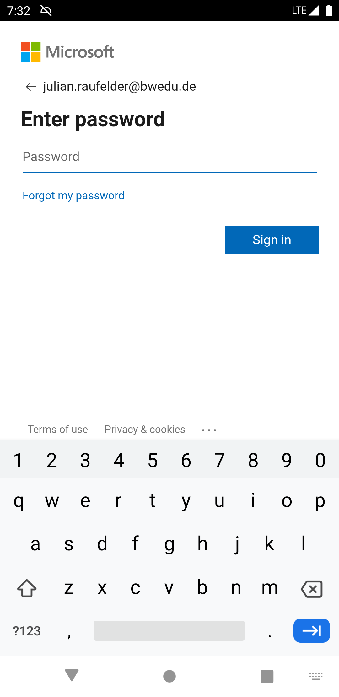
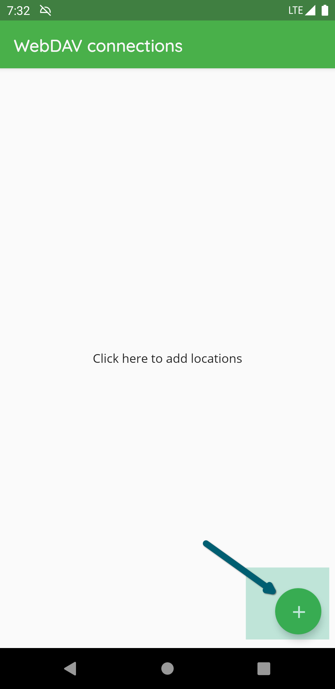
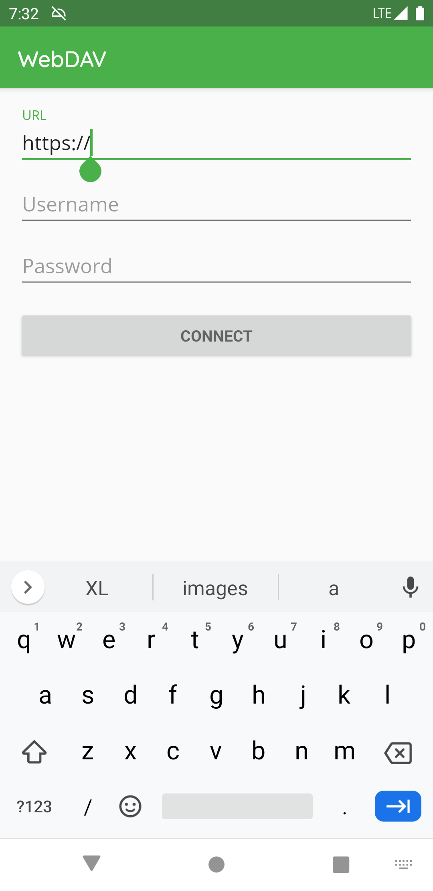
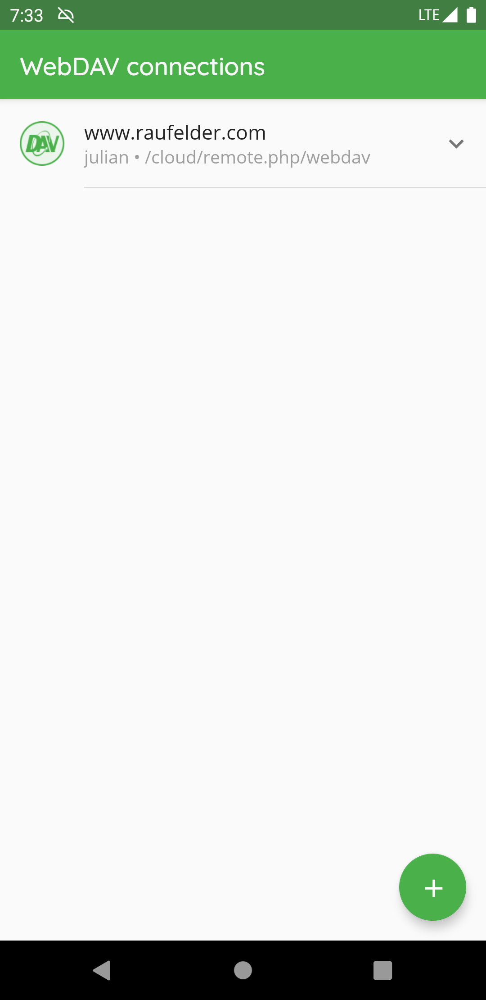
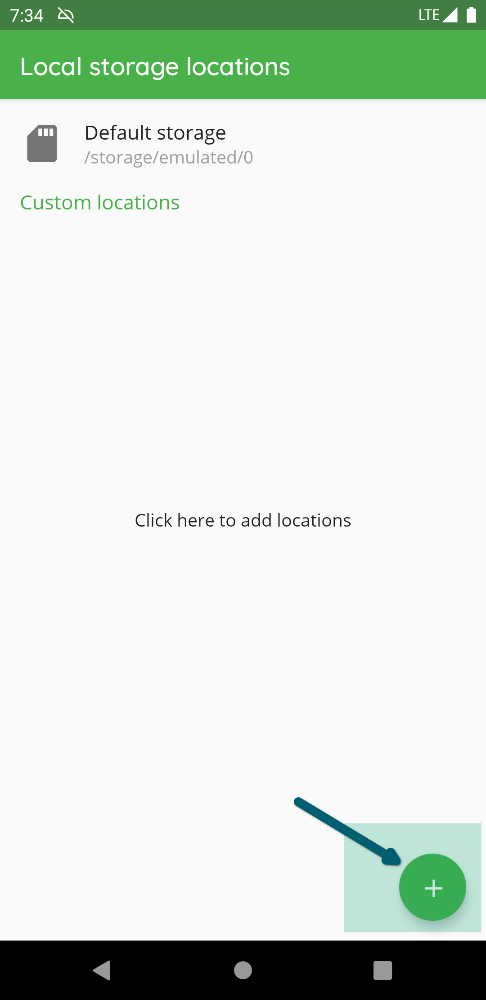
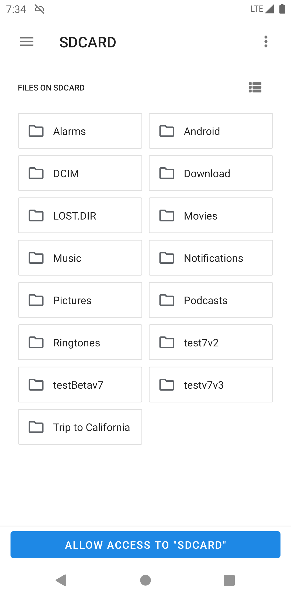
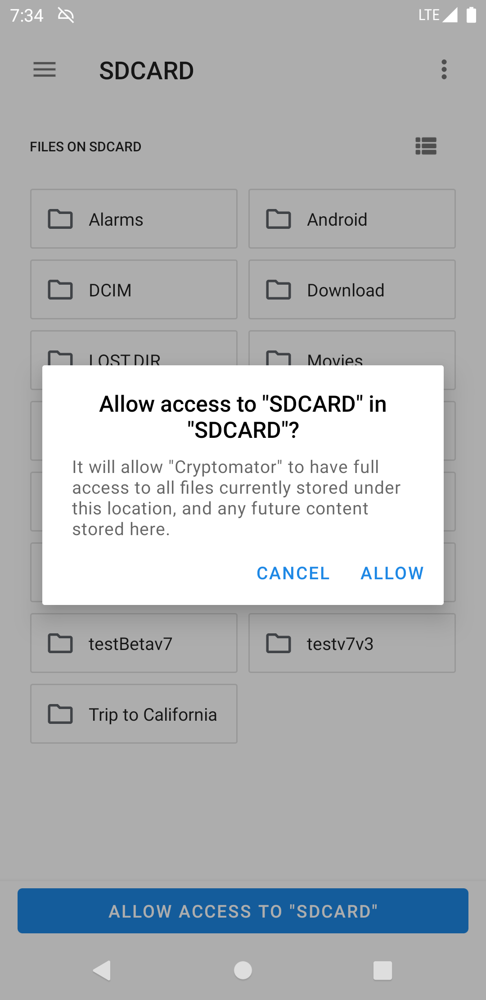

.. _android/cloud-management:

Cloud Management
========================

In "Cloud Services", you can create or edit the connection between the Cryptomator app and your storage provider accounts.

Please enter the credentials for your provider account or in case of Google Drive choose your account.
If your authentication was successful, some of the providers might ask you to grant Cryptomator access permission to your online files.
Please allow this permission.

In Google Drive, OneDrive and Dropox you can only create one connection between your cloud storage account and the Cryptomator app.
You can't connect to (for example) two different *Dropbox* accounts.

If the provider requested permission to access your online files you can remove Cryptomator permissions from your online storage account at any time.
Please keep in mind that Cryptomator then cannot connect to your vault anymore.

.. _android/cloud-management/login-dropbox:

Login Dropbox
------------------

.. image:: ../img/android/add-dropbox-login-provider-0.png
    :alt: How to handle cloud services with Android
    :width: 346px

.. image:: ../img/android/add-dropbox-login-provider-1.png
    :alt: How to handle cloud services with Android
    :width: 346px

.. _android/cloud-management/login-google-drive:

Login Google Drive
------------------

.. _android/cloud-management/login-onedrive:

Login OneDrive
------------------

.. _android/cloud-management/login-WebDAV:

Login WebDAV
------------------

You can find `here <https://community.cryptomator.org/t/webdav-urls-of-common-cloud-storage-services/75>`_ a list of the most common WebDAV URLs.

.. note::
    While creating the WebDAV connection, please make sure to add the root of the accessible stroge and don't navigate directly into the vault.

.. _android/cloud-management/login-local-storage:

Login Local Storage
-----------------------

There can be used two types of local storages: 

* "Default storage" : This is the default internal storage of the android phone.
* "Custom location" : Using custom locatins you can access a vault stored on e.g. a removabal device like a SD card

The following pictures describes how to setup a custom location to access vaults stored on the SD card:

.. image:: ../img/android/add-localstorage-login-provider-3.png
    :alt: How to handle cloud services with Android
    :width: 346px

After creating the custom location, you can access it by clicking on the name of the location to add the vault or create a new vault.

.. note::
    If you use a custom location please make sure to add the root folder of the storage like described in the pictures and don't navigate directly into the vault.
