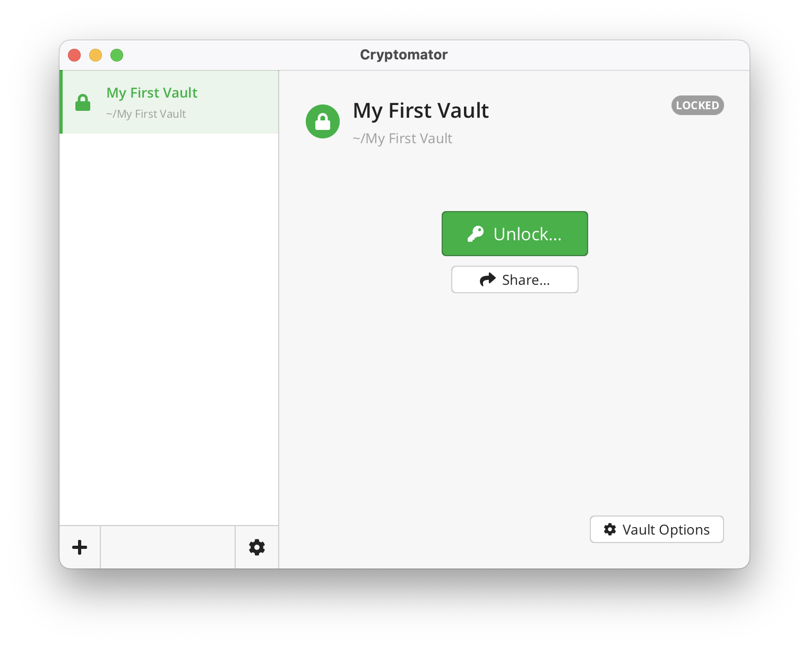
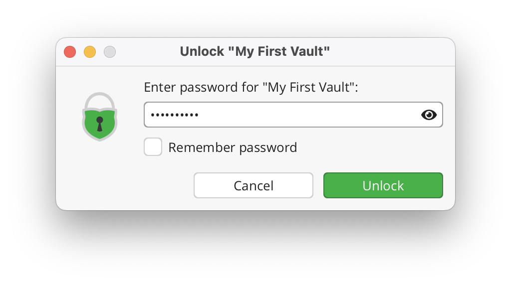
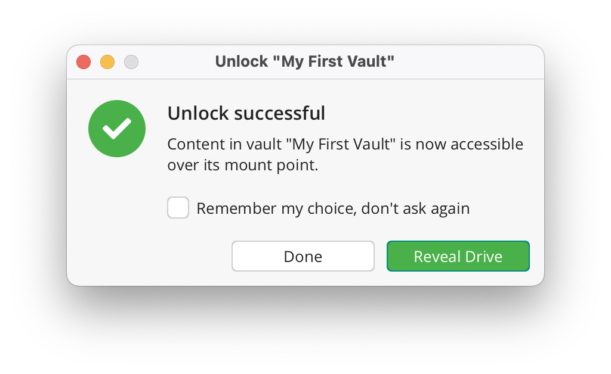
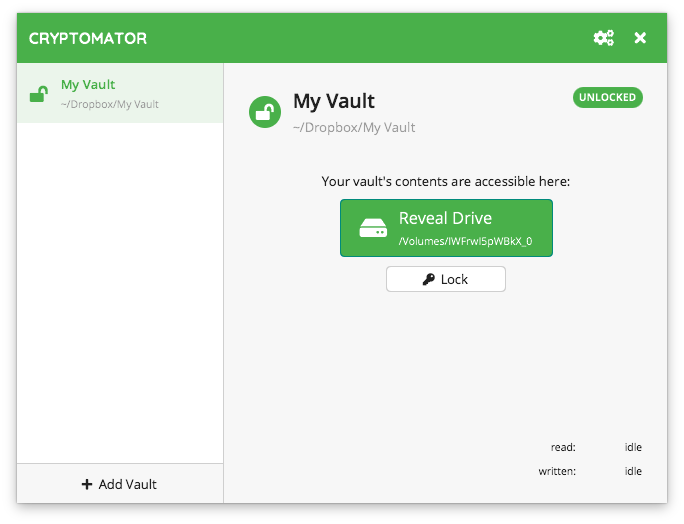

Accessing Vaults
================

Once you have added a vault to Cryptomator, you will probably want to unlock it, so you can start adding files.

.. _desktop/accessing-vaults/unlocking-a-vault:

Unlocking a Vault
-----------------

To unlock the selected vault, click on the large ``Unlock`` button in the center of Cryptomator window.
You will then be prompted for your vault's password:

.. note::

    By checking the "Save Password" checkbox, the password will be stored in your operating system's keychain.

.. warning::

    Only store your password on trusted devices. Anyone with access to this computer will be able to access your vault, if the password is stored in the system keychain.

If your password is correct a confirmation is displayed.
You can either just close this Window by clicking ``Done`` or click ``Reveal Vault`` in order to show your unlocked vault in your file manager.

.. _desktop/accessing-vaults/working-with-the-unlocked-vault:

Working with the Unlocked Vault
-------------------------------

After unlocking, your vault's contents will become available as a virtual drive on your PC.
This means, that you interact with your confidential files in the same way as with any other hard drive or USB stick.

If you can not find the unlocked vault in your systems file manager (Windows Explorer, Finder, ...), you can always click on ``Reveal Drive`` in your Cryptomator window:

.. note::

    On Windows, you can choose the drive letter of the virtual drive for each vault via the advanced vault options.

.. _desktop/accessing-vaults/locking-a-vault:

Locking a vault
---------------

TODO