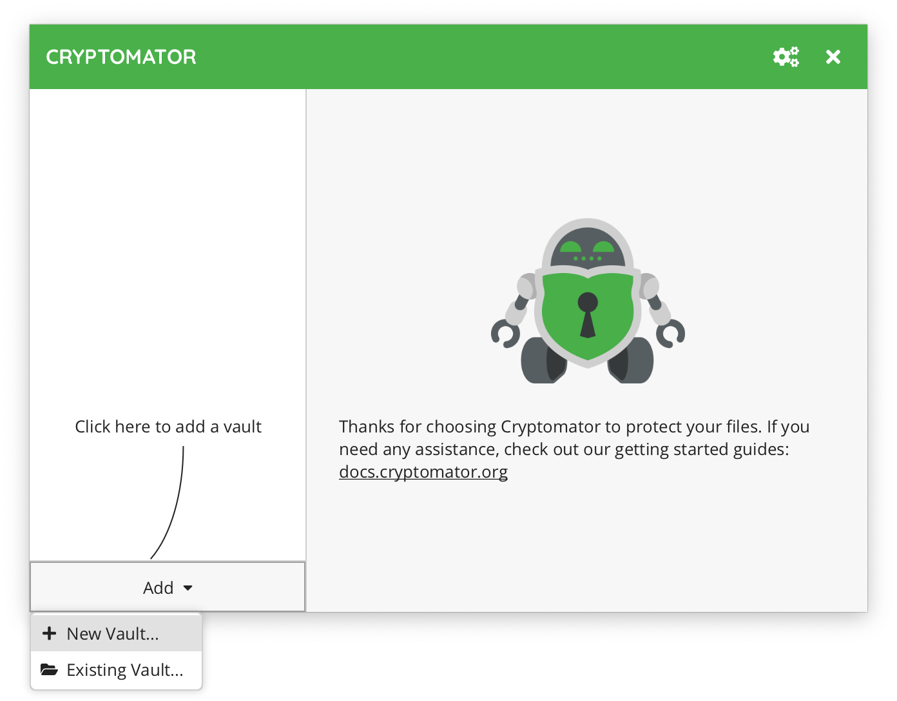
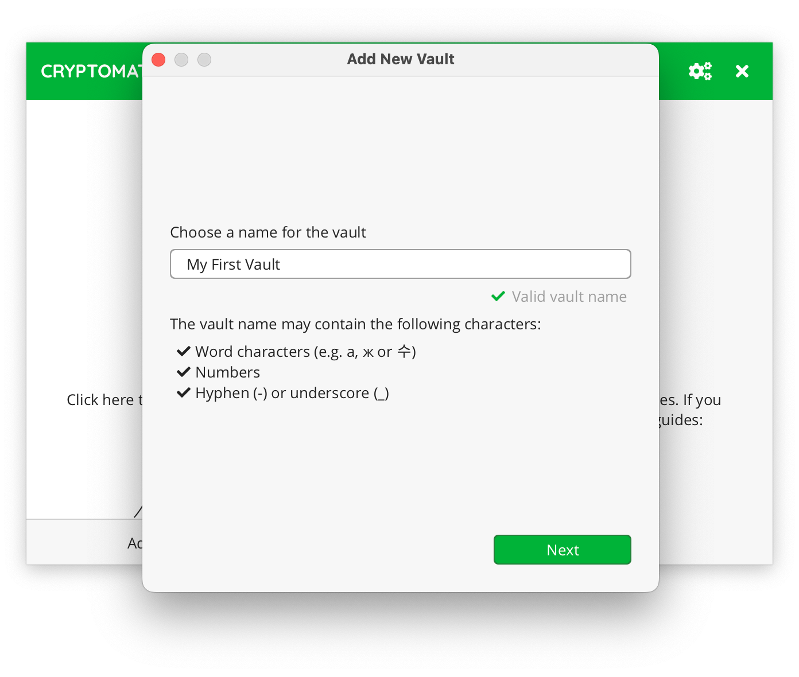
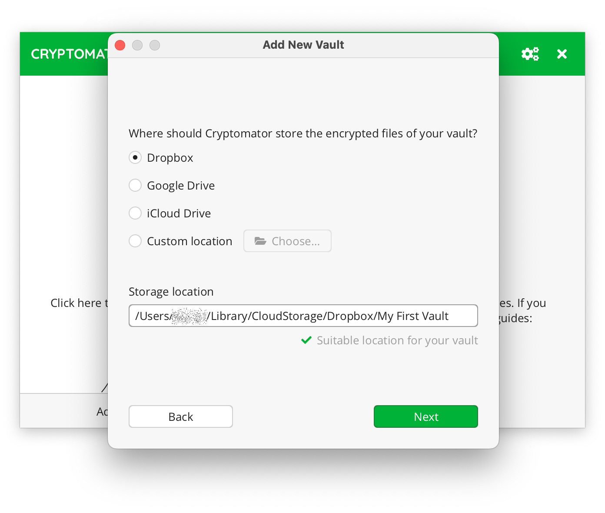
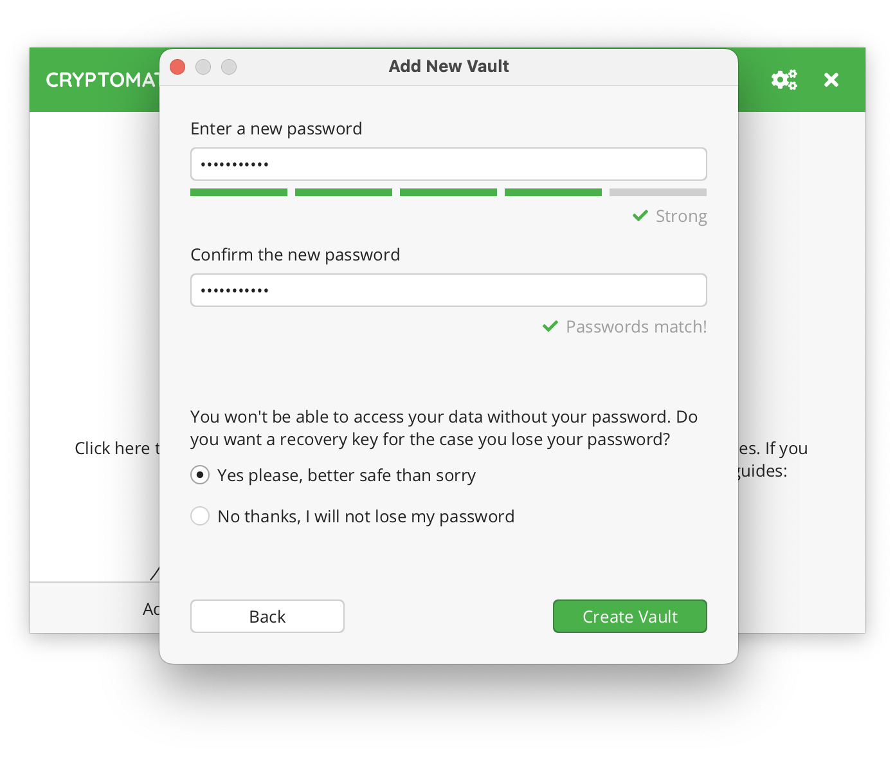
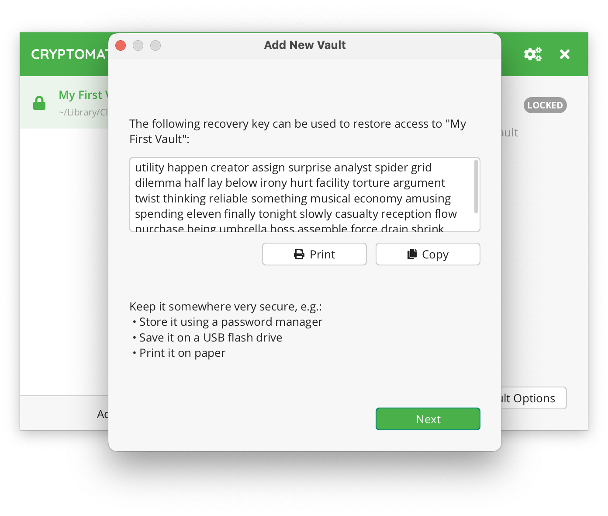
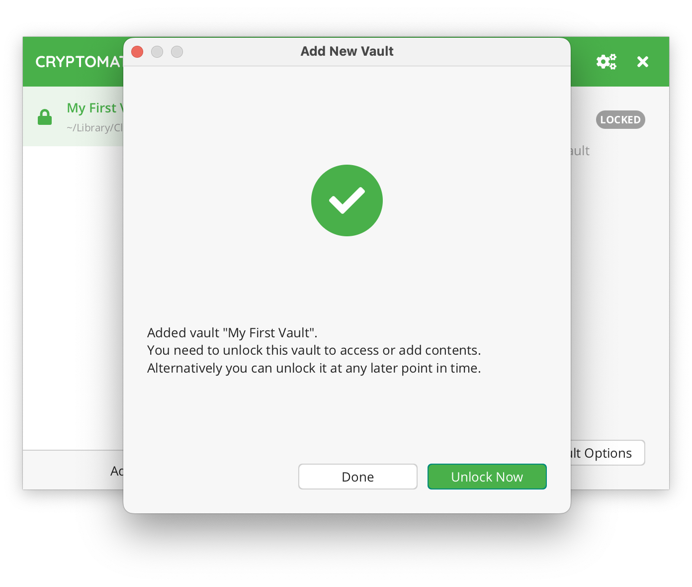

Adding Vaults
=============

If you want to add a new vault, you have essentially two options:

#. If you want to create a vault yourself, choose |CreateVault|_.
#. If you already have a vault, for example because someone shared a vault with you via a cloud storage service, you can instead choose |OpenVault|_.

.. |CreateVault| replace:: ``Create New Vault``
.. _CreateVault: ./adding-vaults.html#create-a-new-vault

.. |OpenVault| replace:: ``Open Existing Vault``
.. _OpenVault: ./adding-vaults.html#open-an-existing-vault

.. _desktop/adding-vaults/create-a-new-vault:

Create a New Vault
------------------

If you chose to create a new vault, the wizard will now guide you through the vault creation process.

.. _desktop/adding-vaults/1.-choose-a-name:

1. Choose a Name
^^^^^^^^^^^^^^^^

You start by simply choosing a name for your vault.

.. note::

    Your vault name will be used as a directory name on your file system.
    Make sure not to use any characters that might cause problems with your setup.
    Especially if you want to share the vault via the cloud with other users, keep in mind that these users might use different software or operating systems that might not cope well with special characters.

.. _desktop/adding-vaults/2.-choose-a-storage-location:

2. Choose a Storage Location
^^^^^^^^^^^^^^^^^^^^^^^^^^^^

Next, choose where you want to save your vault.
Since a vault is just a directory containing encrypted files, you need to store it somewhere.
Usually this would be inside your cloud-synced directory.
But you can choose any storage location, you like.

Keep in mind that Cryptomator is not a sync tool.
You still need the software from your favourite cloud storage service.

In this example I want to encrypt files that get synchronized via Dropbox.

.. note::

    You might not see all the above options, depending on what cloud services you have installed on your PC.
    Cryptomator tries to detect some well-known locations.
    You can always choose ``Custom Location`` and navigate to your cloud storage directory manually.

.. _desktop/adding-vaults/3.-choose-a-passwords:

3. Choose a Passwords
^^^^^^^^^^^^^^^^^^^^^

Now it is time to choose a :ref:`good password <security/best-practices/good-passwords>` for your vault.
Cryptomator requires at least 8 characters but we recommend you to use a longer phrases such as pass-sentences.
The bar below the password field estimates the strength of your password.

.. warning::

    Nobody except for yourself knows this password and other than you might know it from online services, nobody can "reset" your password for you.
    
.. note:: 
    If you plan to share this vault with a different person, you will both need to know the password.
    In this case, choose a password that is different from anything you tend to only use yourself.
    To share the password, use an encrypted messenger or any other secure means of communication.

Since we can not reset your password, we recommend you to create an additional *recovery key*.

.. _desktop/adding-vaults/4.-show-recovery-key-(optional-step):

4. Show Recovery Key (optional step)
^^^^^^^^^^^^^^^^^^^^^^^^^^^^^^^^^^^^

If you chose to create a recovery key in the previous step, it will now be displayed.
Make sure not to lose it.
Ideally make a hard copy of it.

.. warning::

    Keep the recovery key secret. Remember, just like your password, its purpose is to gain access to your vault!

For more details, take a look at our chapter about :ref:`how to use a recovery key <desktop/password-and-recovery-key/reset-password>`.

.. _desktop/adding-vaults/5.-done:

5. Done
^^^^^^^

That's it.
You have successfully created a new vault.

You can now unlock this vault using your password and start adding sensitive files to it.

.. _desktop/adding-vaults/open-an-existing-vault:

Open an Existing Vault
----------------------

If you chose to open an existing vault, all you need to do is to locate the ``masterkey.cryptomator`` file of the vault you want to open.

.. note::

    If you created the vault on another device and cannot find it or its masterkey file, make sure that the directory containing the vault is properly synchronized and fully accessible on your device.
