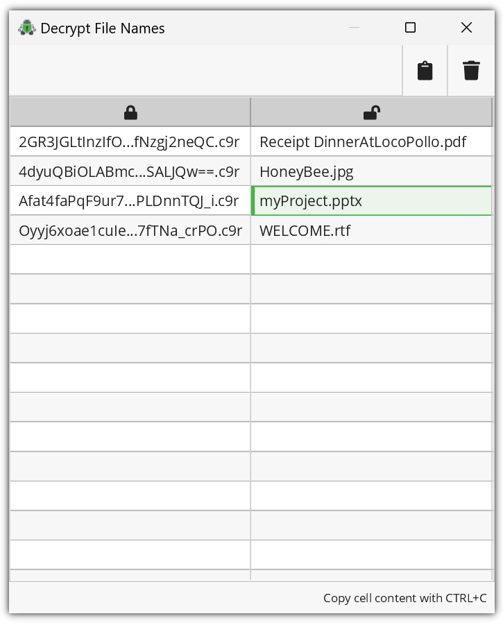

Encrypted File Names
====================

.. note::

    Neither file name nor directory structure encryption can be disabled.

Cryptomator protect your files by not only encrypting their content, but also their names and the overall directory structure of the vault.
For example, if you have a directory structure inside your vault like this:

.. code-block:: console

    .
    ├─ myProject.pptx
    ├─ Images for Project
    │  └─ ImageOfBees.jpg
    └─ ...

The actual directory structure of the vault on your hard drive/cloud will look like this:

.. code-block:: console

    .
    ├─ d
    │  ├─ BZ
    │  │  └─ R4VZSS5PEF7TU3PMFIMON5GJRNBDWA
    │  │     ├─ dirId.c9r  # internal vault file
    │  │     ├─ 5TyvCyF255sRtfrIv**83ucADQ==.c9r  # myProject.pptx
    │  │     └─ FHTa55bH*sUfVDbEb0gTL9hZ8nho.c9r  # Linking entry for directory "Images for Project"
    │  │        └─ dir.c9r  # contains information for the link
    │  └─ FC
    │     └─ ZKZRLZUODUUYTYA4457CSBPZXB5A77  # content of the directory "Images for Project"
    │        └─ 4lmrQYfE_5ETusEkVJlTJrcFzjwxNBymig==.c9r # ImageOfBees.jpg
    ├─ masterkey.cryptomator
    ├─ masterkey.cryptomator.DFD9B248.bkup
    └─ vault.cryptomator

While this increases security, it also makes it impossible to see the original file names and directory structure without decrypting them first.
When you need to know the original name of a file (e.g. to restore an older version), you can use the ``Decrypt file name`` feature to decrypt the file name.

.. _desktop/encrypted-file-names/decryption:

Decrypting File Names
---------------------

.. note::

    Due to technical reasons, Cryptomator can only decrypt the filen name given an encrypted file .
    It cannot compute the path inside the vault to the file.

You can access this feature from the unlocked view of a vault in the Cryptomator main window.
On the bottom of the unlocked view, drop files on the "Decrypt file name" zone or click on it.
A modal window with the encrypted-decrypted-mapping opens.

.. image:: ../img/desktop/vault-detail-unlocked.png
    :alt: Vault detail view in the unlocked state

The encrypted-decrypted-table has an action bar at the top with two buttons:
* Clipboard button to copy the whole table as a CSV into the system clipboard
* Trash button to clear the table

Encrypted file names and their corresponding decrypted, original name are shown inside a two column table, with the encrypted names on the right.
If you have not dropped any files, the table is empty.
You can click inside the empty table to select files with a file picker dialog.

Once the table has content, you can select single cells and copy their content with the OS specific keyboard copy shortcut.
