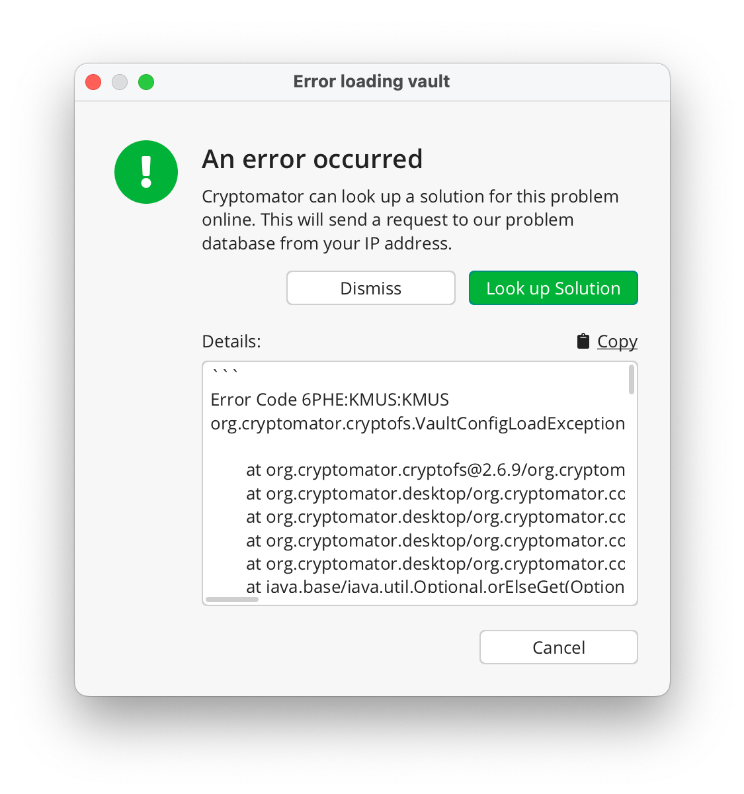
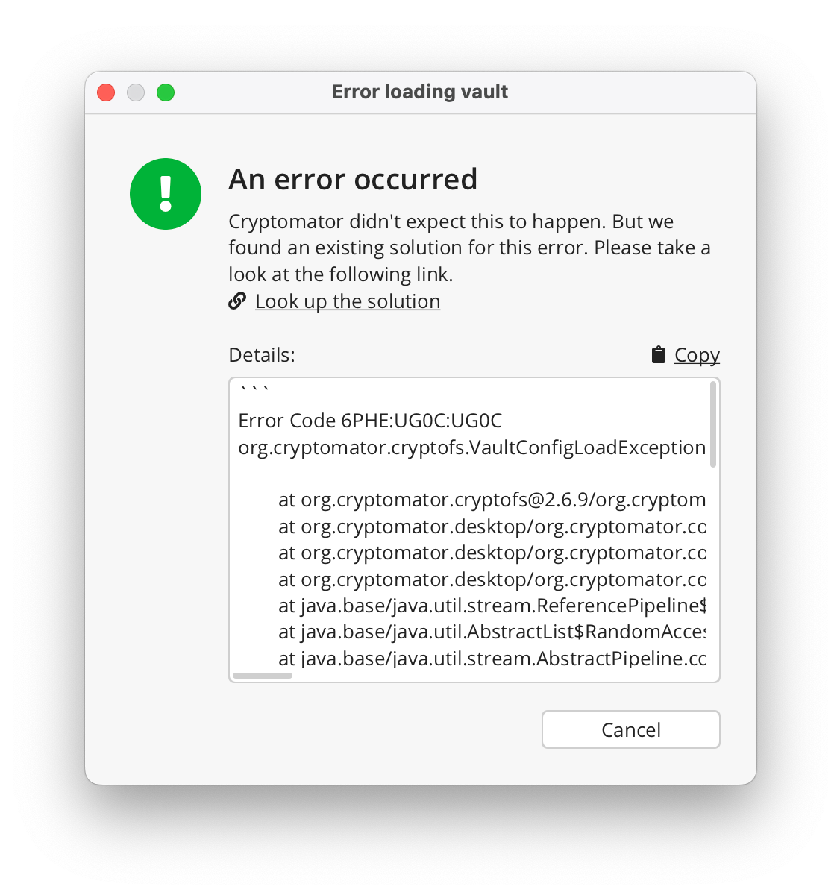
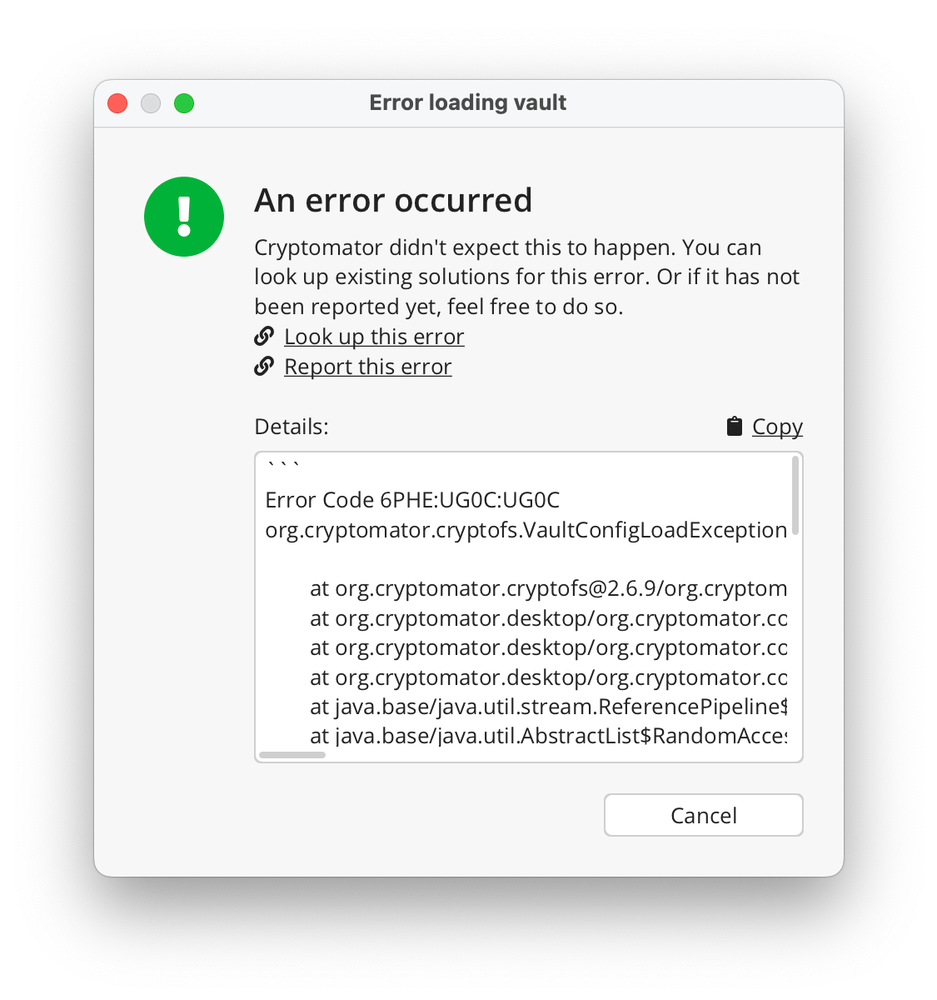

Error Handling
=============

If you encounter an unexpected error, Cryptomator gives you the option to look up a solution in our error database. It's possible that the error has already been reported and a solution has been suggested for you to follow.

Simply click the ``Look up Solution`` button.

We will cross-reference your current error with the database and provide a solution link if one is available.

If no results are found, you have the option to initiate your own search by selecting ``Look up this error``, or create a ticket by selecting ``Report this error``.

Your privacy is important to us. We assure you that all requests are handled with your explicit consent and are directed exclusively to our server. This feature operates solely on an Opt-In basis to protect your privacy.

For further information, please visit our |privacy policy|.

.. |privacy policy| raw:: html

   <a href="https://cryptomator.org/privacy/#812-cross-reference-with-error-database" target="_blank">privacy policy</a>