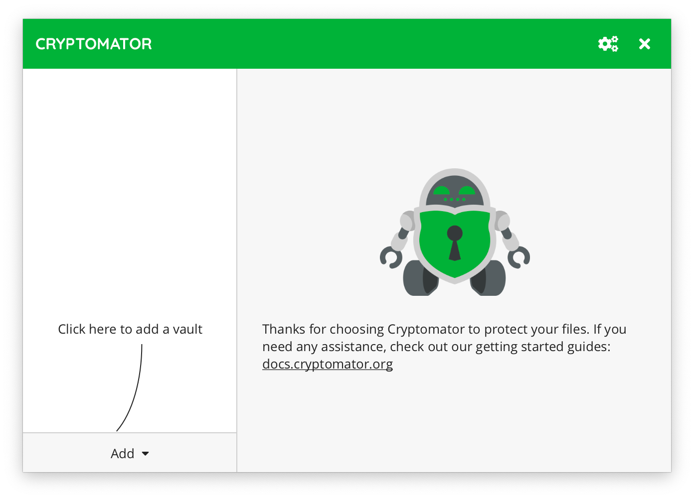

.. _desktop/getting-started:

Getting Started
===============

With Cryptomator you can create encrypted *vaults*.
Each vault is protected by a password and can contain as many files and folders as you like.

When you're a first-time user of Cryptomator, you obviously don't have any vaults yet.
If you start the application, you will be greeted with the following screen:

By clicking on the |AddVault|_ button in the lower left corner of the window, you can create a new vault.

.. |AddVault| replace:: ``AddVault``
.. _AddVault: ./adding-vaults.html

.. _desktop/getting-started/tutorial-video:

..
    Tutorial Video
    --------------

    .. image:: https://img.youtube.com/vi/g9A0zihHZ14/0.jpg
        :alt: Cryptomator Tutorial: Get Started
        :target: https://www.youtube.com/watch?v=g9A0zihHZ14
