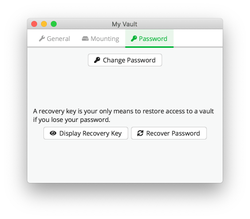
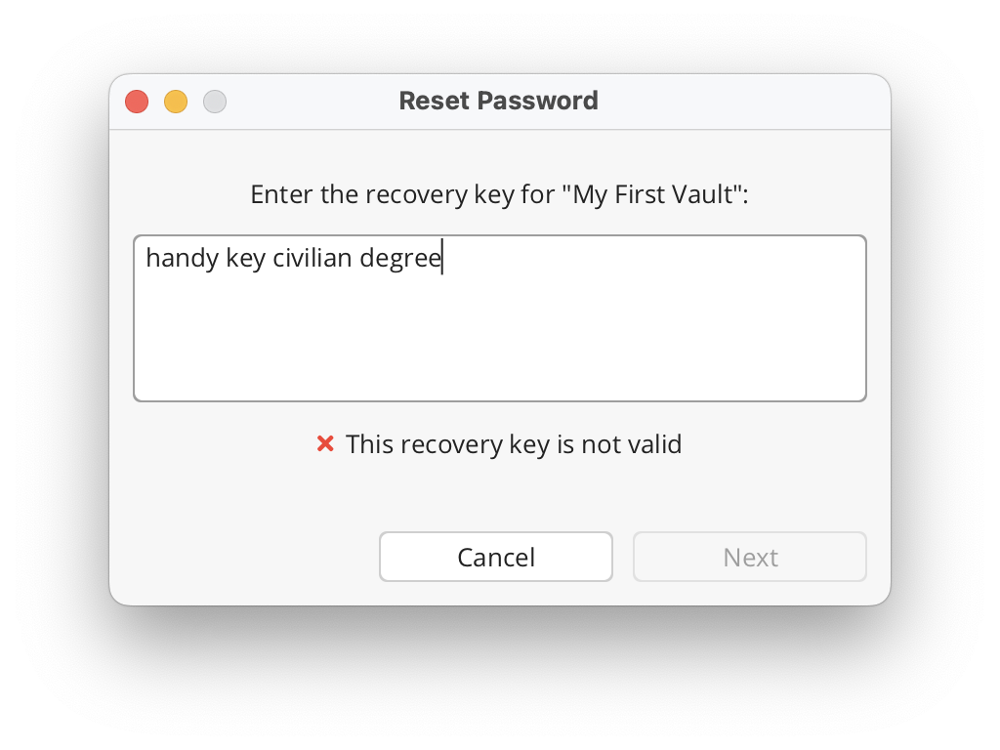
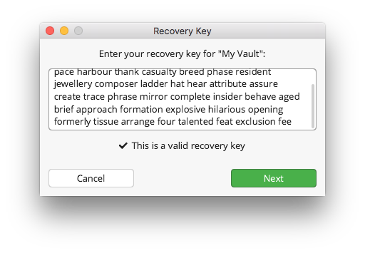

Password And Recovery Key
=========================

Each Cryptomator vault is secured by a password.
The security of your vault depends directly on the strength of its password, so we :ref:`choosing a strong password <security/best-practices/good-passwords>` is key.

Additionally for each vault exists a unique *recovery key*.
This key ensures that if you forget your password, you are able to create a new one.
For more information about the difference of the password and the recovery key, see :doc:`TODO <>`.

This section explains how to change a password for a vault, show its recovery key and reset the password to a new one.
All actions are done in the ``Password`` tab of the vault options.
You can access it over the main window by selecting the vault in question, lock it if necessary and then open its ``Vault Options``.

.. _desktop/password-and-recovery-key/change-password:

Change Password
---------------
You can change the password of an already existing vault.
The only thing you need is to remember the current one.

To do so, click on the ``Change Password`` button in the ``Password`` tab of the vault options.
In the opened window, you see three text input fields:

.. todo:: TODO add image to for change password dialog)

1. In the first you need to enter the current password of the vault.
2. The second one takes the new password in and as already said, we suggest to follow the creation rules for :ref:`good passwords <security/best-practices/good-passwords>`.
3. In the third for confirmation you need to enter the new password again.

In order to proceed, you need to confirm what you are doing by selecting the checkbox.

To finish the workflow and really change the password, click now on the ``Change`` button.

.. note::

    Only if the second and third text input fields match *and* the checkbox is selected, the ``Change`` button is activated.

.. note::

    The password is used to derive a `KEK <https://en.wikipedia.org/wiki/Glossary*of*cryptographic*keys>`_, which is then used to encrypt further keys. The KEK changes, but the keys encrypted with the KEK will stay the same. The actual files will not get re-encrypted, meaning you can not upgrade a weak passphrase to a stronger one once the data has been synced to a service that allows recovery of older versions of the masterkey file.
    
    If you like to encrypt your vault files with a new, stronger password, you need to create a new vault and drag the data from the old to the new one. Make sure to wipe all backups of the old vault afterwards.

.. _desktop/password-and-recovery-key/show-recovery-key:

Show Recovery Key
-----------------

It is no problem, if you missed during vault creation to generate a recovery key.
You are still able to generate and view at a later point in time.
To ensure safety, Cryptomator does not store it on your hard drive and always generates it on the fly.

.. warning::

    Bear in mind that due to the ability of the recovery key to reset the current password, it is highly confidential.
    Ensure that only trusted persons have access to it and keep it a safe spot.

To do so, click on the ``Display Recovery Key`` in the ``Password`` tab of the ``Vault Options``.
The open window shows inside a text field a sequence of words, the recovery key of the vault.

.. todo:: add image show recovery key dialog

You can copy it to your clipboard or print it to paper.
If you are finished, close the window with the ``Done`` button.

.. _desktop/password-and-recovery-key/reset-password:

Reset Password
--------------

If you forgot the password for a vault, saved the recovery key somewhere external, you are able to define a new password and have access to the vault again.

Again, navigate to the ``Password`` tab in the vault options and click the ``Recover Password`` button.
A new prompt is opened, asking to insert your recovery key into the shown text box. Enter it there by copying it from a file or typing.

.. note::

    If you printed your recovery key on paper or stored it somewhere where you cannot copy it, Cryptomator offers you an auto completion feature for insertion.
    Type a letter and see if the shown word matches your key part.
    If so, you can press tab or right arrow key to auto complete the word.
    Otherwise enter more letters, the suggestion will change accordingly.

If the recovery key is valid, Cryptomator indicates this by a small message and activates the ``Next`` button

In the last step you need to assign a new password to your vault.
It is the same as during :ref:`vault creation <desktop/adding-vaults/3.-choose-a-passwords>` except that no new recovery key is generated.
As already noted there, read the suggestion for choosing a :ref:`good password <security/best-practices/good-passwords>`.

.. warning::

    Even thou you have a new password for the vault afterwards, *the recovery key stays the same*. So keep it!

Finish the dialog by entering the same password again and clicking the ``Done`` button.
You can unlock your vault now with the new password.