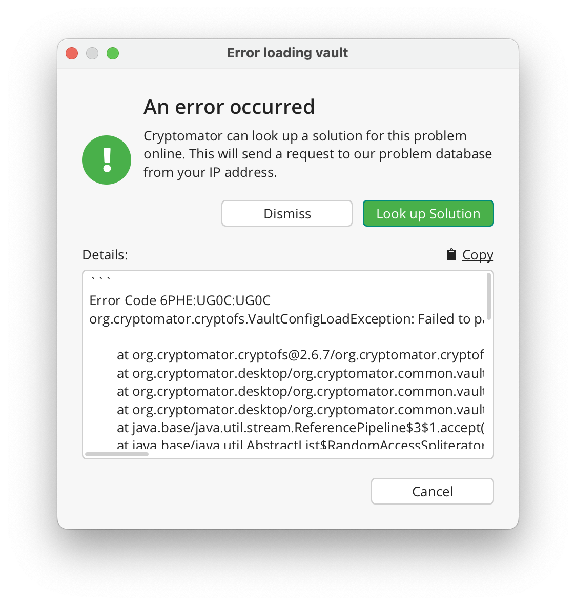

Privacy
============

Error support
-----------------------------

Cryptomator is primarily developed with privacy concerns in mind, and we have not compromised on this principle when introducing this feature.
As part of our continuous software improvement process, we employ this feature to provide users with available solutions, identify potential error clusters, and manage them with prioritization, all while ensuring the preservation of user privacy.

Enhancing error management and facilitating problem resolution, we offer you the option to access our up-to-date error database.
The error database is hosted on our server, so all requests are directed exclusively to it.
Without your explicit consent, no requests will be executed, as this feature operates solely on an Opt-In basis.

Simply click the ``Look up Solution`` button.

We will cross-reference your current error with the database and provide a solution link if one is available.

.. ToDo:
   Add "More info..." hyperlink to error dialog and refresh screenshot.

