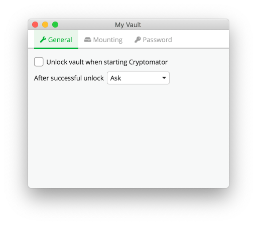
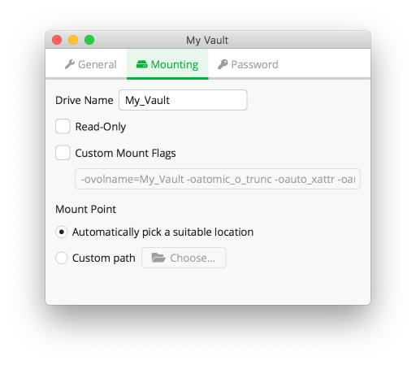

Vault Management
================

A *vault* is where your files are stored encrypted.
For your operating system or other apps, a vault is a just a normal directory containing some encrypted files.
Only Cryptomator can decrypt the vault's contents when you unlock it using a password.

.. _desktop/vault-management/remove-vaults:

Remove Vaults
-------------

To remove a vault from the vault list, right click on a vault, and click remove. 
This is only possible if the vault is locked.

.. note::

    The vault is **not** deleted from your PC by removing it from the list. If you wish to permanently delete your encrypted files, you need to delete the vault directory using the file manager.

.. _desktop/vault-management/reorder-vaults:

Reorder Vaults
--------------

You can change the order of the vaults in the list by dragging them.

.. image:: ../img/desktop/move-vaults.gif
    :alt: How to reorder vaults

.. _desktop/vault-management/vault-options:

Vault Options
-------------

Each vault has its own settings which can be customized under vault options.
To open a vault's settings, select a vault, lock it, and click on ``Vault Options``.

The options are divided across three categories:

1. General - Options not fitting in other categories.

You can select this option if the vault is unlocked as soon as Cryptomator starts.

- ``Vault Name`` - The name of the vault. *You can edit this field to rename the vault.*
- ``Lock when idle for <n> minutes`` - The vault will be locked automatically after the specified time of inactivity.
- ``Unlock vault when starting Cryptomator`` - On app start, Cryptomator will unlock the vault (otherwise the vault will remain locked).
- ``After successful unlock``
    - ``Do nothing`` - Cryptomator will do nothing after unlocking the vault.
    - ``Reveal Drive`` - Opens the mount location using the default file manager (Windows Explorer, Finder, …).
    - ``Ask`` - Cryptomator will ask you what to do after unlocking the vault.

2. Mounting - Settings that manage how and where a vault is mounted.

.. note:: The mount options depend on the selected :ref:`volume type <desktop/volume-type/general-volume-type-selection>`

3. Password - Here you can manage the vault's password and recovery key.

.. image:: ../img/desktop/vault-options-password.png
    :alt: Vault options regarding the password

Take a look at the |Mounting|_ and |Password|_ sections to understand how vault mounting and passwords work.

.. |Mounting| replace:: ``Volume Type``
.. _Mounting: ../volume-type/

.. |Password| replace:: ``Password And Recovery Key``
.. _Password: ../password-and-recovery-key/
