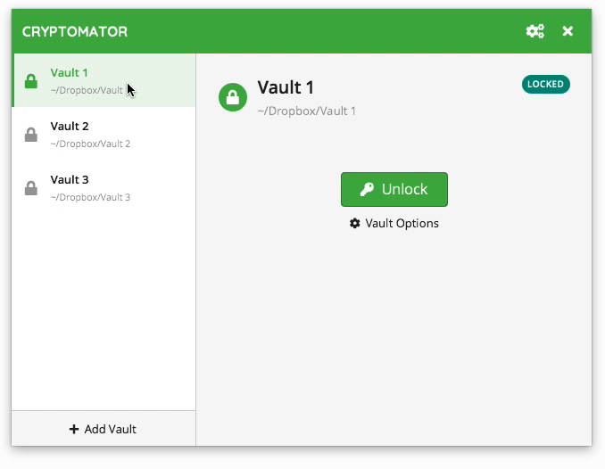

Vault Management
================

A *vault* is the fundamental object in Cryptomator.
Like the term suggests, it represents the single location where all files inside this vault are stored encrypted.
From the perspective of your operating system it is a normal directory containing at least two files and one directory:

.. _desktop/vault-management/remove-vaults:

Remove Vaults
-------------

You can remove a vault from the vault list by right clicking on the list entry. This is only possible while the vault is locked. 

.. note::

    By removing a vault from this list, it is **not** deleted from your filesystem.
    To irrevocably get rid of the vault, you can simply delete the vault directory (which contains your ``masterkey.cryptomator`` and the ``d`` directory) using your normal file manager.

.. _desktop/vault-management/reorder-vaults:

Reorder Vaults
--------------

You can change the order of your vaults by dragging them to the desired position.

.. _desktop/vault-management/vault-options:

Vault Options
-------------

Each vault has an own set of settings which can be viewed and customized in the vault options window.
To open it, select in the main window the *locked* vault in question and click the ``Vault Options`` button with the gear.

.. todo:: image of vault options dialog

The options are divided in three categories:

1. General - Options not fitting into another category
2. Mounting - All options about where and how you can access your unlocked vault
3. Password - Options and actions regarding your vault password and the recovery key

In the ``General`` tab you can select if the vault is unlocked as soon as Cryptomator starts.

For |Mounting|_ and |Password|_ we refer to the regarding sections.

.. |Mounting| replace:: ``Mounting``
.. _Mounting: ./vault-mounting.html

.. |Password| replace:: ``Password``
.. _Password: ./password-and-recovery-key.html