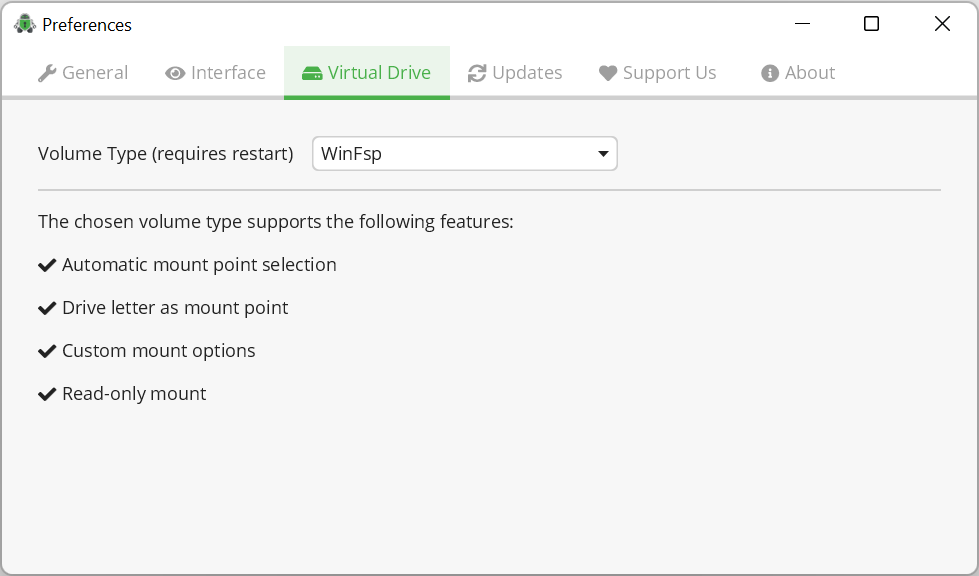

.. _desktop/volume-type/general-volume-type-selection:

Volume Types
============

Volume types play an important role when handling your files.

When you unlock a vault, Cryptomator makes decrypted files available in your file manager by mounting a virtual drive on your operating system.
This mounting of a virtual drive is handled differently depending on the volume type chosen in Cryptomator's preferences.

In general, all volume types Cryptomator offers can be categorized into three categories:

#. :ref:`WebDAV <desktop/volume-type/webdav>`
#. :ref:`FUSE <desktop/volume-type/fuse>`
#. :ref:`Other <desktop/volume-type/dokany>`

.. _desktop/volume-type/webdav:

What is a WebDAV volume type?
-----------------------------

WebDAV is a standardized `communication protocol <https://en.wikipedia.org/wiki/WebDAV>`_ used to perform operations on resources (files, directories/folders) between a client (you) and a server (your local computer).
WebDAV was intended for remote access, but Cryptomator uses it to start a local-only server, which you can use to browse your decrypted files.

You can tweak WebDAV's settings for each vault by navigating to `Cryptomator Preferences` -> `Virtual Drive`.

WebDAV has widespread support and adequate performance, but its implementation differs between operating systems.

.. _desktop/volume-type/fuse:

What is a FUSE volume type?
---------------------------

Filesystem in Userspace (`FUSE <https://en.wikipedia.org/wiki/Filesystem_in_Userspace>`_) is a filesystem interface originally developed for Unix operating systems that let non-privileged users create their own file systems without editing kernel code.
Which means, FUSE does not require admin privileges and is has good support across all major desktop operating systems.
FUSE volume type also delivers good performance when working on files.

All FUSE related volume types support custom mount options, but every option must be prefixed with ``-o``.
For example, you must enter ``-oallow_other`` if you want to specify ``allow_other`` option.

Choosing a Volume Type
----------------------

Cryptomator uses the same volume type for all vaults.
You can select which volume type to use in the preferences.
Every volume type offers fixed set of features for mounting a vault.
The feature set is shown when selecting the volume type.

In Cryptomator's window, navigate to ``Preferences`` (gear icon at top right), then ``Virtual Drive`` to set the volume type.
The availability of volume types depends on your operating system and installed drivers.
You might have to restart Cryptomator when changing volume types.
A notification will be displayed if a restart is needed.

Windows
-------

.. _desktop/volume-type/fuse/winfsp:

WinFsp / WinFsp (Local Drive)
^^^^^^^^^^^^^^^^^^^^^^^^^^^^^

**Requirements:** Windows, WinFsp installed

The `WinFsp project <https://winfsp.dev/>`_ provides FUSE bindings for Windows.
WinFsp is automatically installed along Cryptomator when you are using the EXE installer, but there's also a WinFsp standalone installer `here <https://winfsp.dev/rel/>`_ if you ever need it.

By default, unlocked vaults are mounted to a random drive letter, either as a network or a local drive.
Info on custom mount options is available at `WinFsp repository <https://github.com/winfsp/winfsp/blob/c61679a35d041d843173fa3b2eba106b5ab7b01f/src/dll/fuse/fuse.c#L628-L654>`_.

.. note:: Vaults mounted to a drive letter are only accessible to the `current user`. If you want to access the vault as a different/elevated user, you have to use WinFsp (Local Drive) and :ref:`mount to a directory <desktop/vault-management/vault-options>`.

.. _desktop/volume-type/webdav/explorer:

WebDAV (Windows Explorer)
^^^^^^^^^^^^^^^^^^^^^^^^^

**Requirements:** Windows

WebDAV on Windows uses the `net use <https://learn.microsoft.com/en-us/previous-versions/windows/it-pro/windows-server-2012-R2-and-2012/gg651155(v=ws.11)>`_ command to mount/unmount the virtual drive.
By default, unlocked vaults are mounted as a network drive and assigned a random drive letter.
Using WebDAV on Windows has the following drawbacks:

    * The size of transferred files is restricted to a maximum of 4 GB.
    * The total space and free space of the network drive are shown to be the same as the total space and free space of the C: drive, which is technically incorrect.

.. Additionally, sometimes mounting fails with ``System error 67 has occurred. The network name cannot be found.`` (or its translations).
.. If it happens, follow you can follow the guide TODO to get access again.

.. _desktop/volume-type/dokany:

Dokany (v1.5.1)
^^^^^^^^^^^^^^^^

.. warning::

    Dokany support in Cryptomator is deprecated since version 1.7.0. We suggest switching to :ref:`desktop/volume-type/fuse/winfsp`.

**Requirements:** Windows, Dokany 1.5.1 installed

The `Dokany project <https://dokan-dev.github.io/>`_ aims to achieve the same goals as FUSE, but specific for Windows: Provide an interface to create your own filesystem without requiring to write your own kernel filesystem driver.
It has to be installed separately by downloading an installer from `Dokany's releases page <https://github.com/dokan-dev/dokany/releases/tag/v1.5.1.1000>`_.
By default, unlocked vaults are mounted to a random drive letter.

macOS
-----

.. _desktop/volume-type/fuse/macFUSE:

macFUSE
^^^^^^^

**Requirements:** macOS, macFUSE installed

.. warning::

    Apple has deprecated the OS APIs used by macFUSE since macOS 12.3 and made installation difficult. We recommend you to use FUSE-T and only fallback to macFUSE, if there are any errors.

macFUSE volume type depends on a library provided by the `macFUSE project <https://osxfuse.github.io/>`_.
It is not included with Cryptomator due to license restrictions.
However, you can install the latest version from `macFUSE's release page <https://github.com/osxfuse/osxfuse/releases>`_.

By default, unlocked vaults are mounted to `/Volumes`.
Info on custom mount options is available at `macFUSE wiki <https://github.com/osxfuse/osxfuse/wiki/Mount-options>`_.

.. _desktop/volume-type/fuse/fuse-t:

FUSE-T (Experimental)
^^^^^^^^^^^^^^^^^^^^^

**Requirements:** macOS, FUSE-T installed

This volume type depends on a library provided by the new `FUSE-T project <https://www.fuse-t.org/>`_.
You can install it using brew:

.. code-block:: shell

    brew tap macos-fuse-t/homebrew-cask
    brew install fuse-t

By default, unlocked vaults are mounted to `/Volumes`.
Info on custom mount options is available at `wiki of the FUSE-T project <https://github.com/macos-fuse-t/fuse-t/wiki#supported-mount-options>`_.

.. note::

    FUSE-T is a new project, so support for it is currently marked as experimental. Be sure to keep FUSE-T up to date to benefit from the latest improvements.

.. _desktop/volume-type/webdav/applescript:

WebDAV (AppleScript)
^^^^^^^^^^^^^^^^^^^^

**Requirements:** macOS

WebDAV on macOS utilizes the scripting language `AppleScript` to mount/unmount the virtual drive.
By default, unlocked vaults are mounted to `/Volumes`.

.. In certain environments, mounting fails with the message ``osascript: can't open default scripting component``.
.. The cause is unclear, but there are suggestions, that third party applications/drivers block the execution.

Linux based OS
--------------

.. _desktop/volume-type/fuse/fuse:

FUSE
^^^^

**Requirements:** Linux, ``libfuse3`` installed

FUSE on Linux works only if the `libfuse3` library is installed.
Luckily, `libfuse3` library comes pre-installed on all major Linux distributions.

By default, unlocked vaults are mounted to `~/.local/share/Cryptomator/mnt`, but you can use custom mount options to change the path.
Info on custom mount options is available at `man page for mount\.fuse <https://man7.org/linux/man-pages/man8/mount.fuse3.8.html>`_.

.. note::

    ``allow_root`` and ``allow_other`` cannot be used as :ref:`custom mount flags <desktop/vault-management/vault-options>` without enabling (uncommenting) ``user_allow_other``option in **/etc/fuse.conf** configuration file.

.. _desktop/volume-type/webdav/gio:

WebDAV (gio)
^^^^^^^^^^^^

**Requirements:** Linux, ``gio`` installed

Due to the wide variety of Linux distributions, Cryptomator only supports system integrated WebDAV volume type if `gio <https://manpage.me/?gio>`_ is installed.
You can unlock your vault without ``gio`` using :ref:`desktop/volume-type/webdav/http-address`, but support across distributions is not guaranteed.
Also, it's up to yourself to figure out how to integrate WebDAV share with your distro.

OS Independent
-------------------

.. _desktop/volume-type/webdav/http-address:

WebDAV (HTTP Address)
^^^^^^^^^^^^^^^^^^^^^

**Requirements:** None - Works on all OS.

This volume type is always present and comes in handy when all other volume types fail to mount.
It starts a local-only WebDAV server, which can be manually integrated into the system or accessed using a third-party application, like `Cyberduck <https://cyberduck.io/>`_.
Check out the regarding manuals for your OS on how to connect to a WebDAV server.
The address of Cryptomators local-only WebDAV server can be copied from the vault detail screen by clicking the green "Copy" button.

