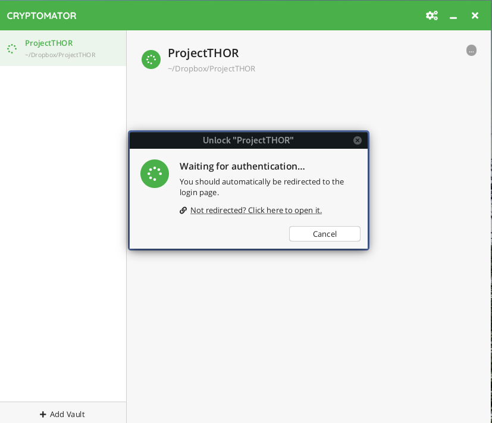
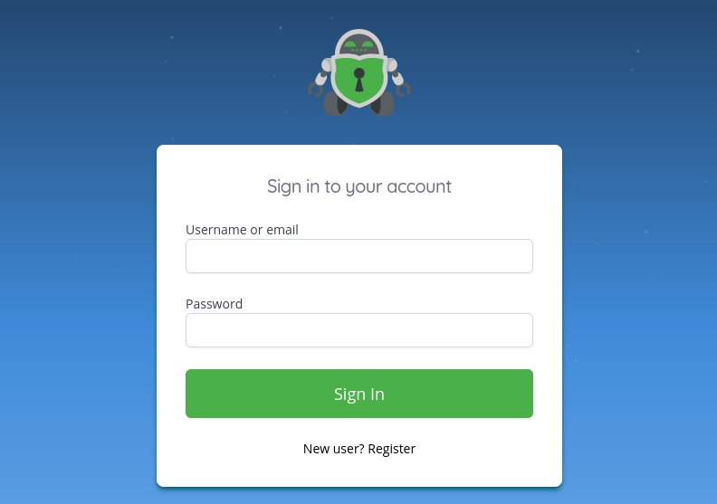
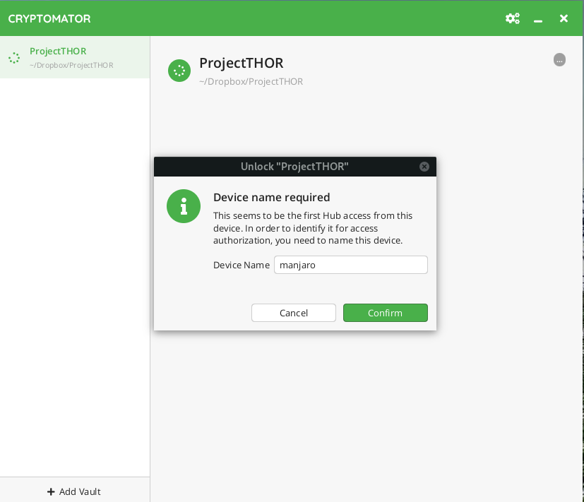
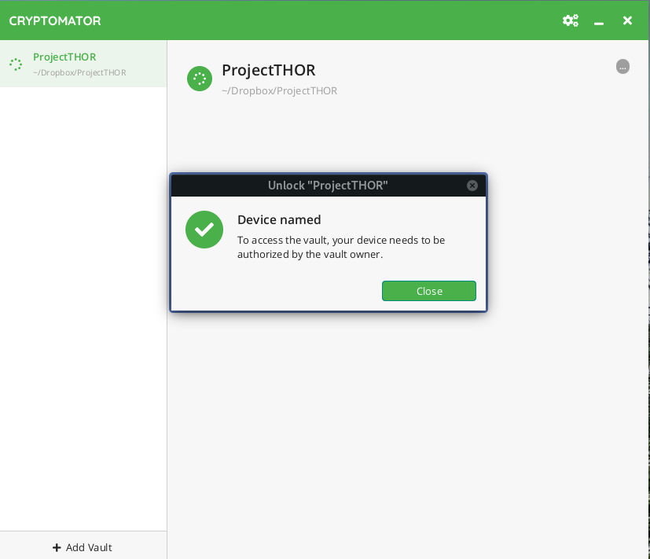
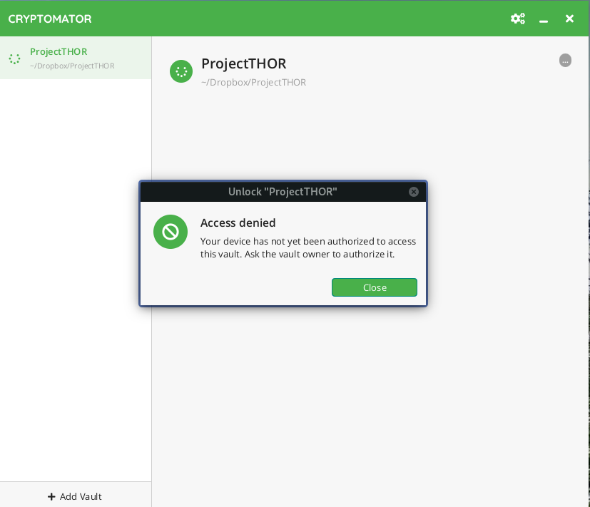

Working with Vaults
===================

This section describes exemplarily how to unlock a vault in the Desktop app. Android and iOS work analogously.

As described in :ref:`open an existing vault <desktop/adding-vaults/open-an-existing-vault>`, you should have already added the vault to the vault list, e.g., by selecting the `vault.cryptomator` file.

.. _hub/access-vault/unlocking-a-vault:

Unlocking a Vault
-----------------

.. _hub/access-vault/unlocking-a-vault/1.-click-unlock:

1. Click Unlock
^^^^^^^^^^^^^^^

To unlock the vault, click on the large ``Unlock`` button in the center of Cryptomator's main window. 

.. _hub/access-vault/unlocking-a-vault/2.-authenticate:

2. Authenticate
^^^^^^^^^^^^^^^

Cryptomator should open your default browser for authentication. If you're not already logged in, you need to provide your user credentials, e.g., by entering your username and password or by inserting your key when WebAuthn is enabled.

.. _hub/access-vault/unlocking-a-vault/3.-add-device:

3. Register Device
^^^^^^^^^^^^^^^^^^

If you connect to Hub with this device for the first time, you need to enter a unique name for this device.

After that, you will see the following confirmation dialog.

.. _hub/access-vault/unlocking-a-vault/4.-vault-unlocked:

4. Vault Unlocked
^^^^^^^^^^^^^^^^^

If you just registered the new device, a vault administrator needs to grant you access explicitly for the requested vault as described :ref:`here <hub/vault-management/updating-permission>`, otherwise you will see the following dialog.

After a vault administrator has granted you access, you are all set up and an unlock should be successful from now on. You can then reveal the vault's contents as usual.

.. image:: ../img/hub/unlock-step6.png
    :alt: After the unlock was successful, you're redirected to Cryptomator
    :width: 920px
