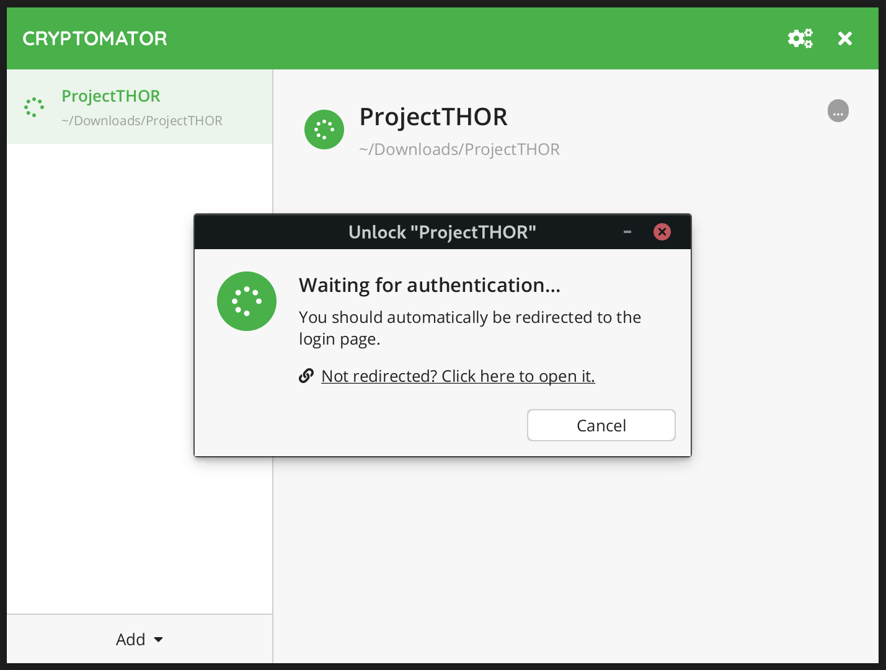
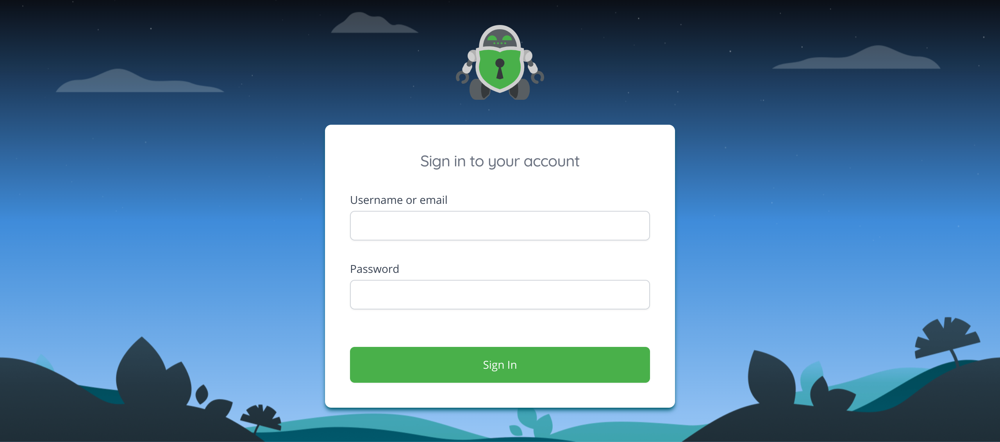
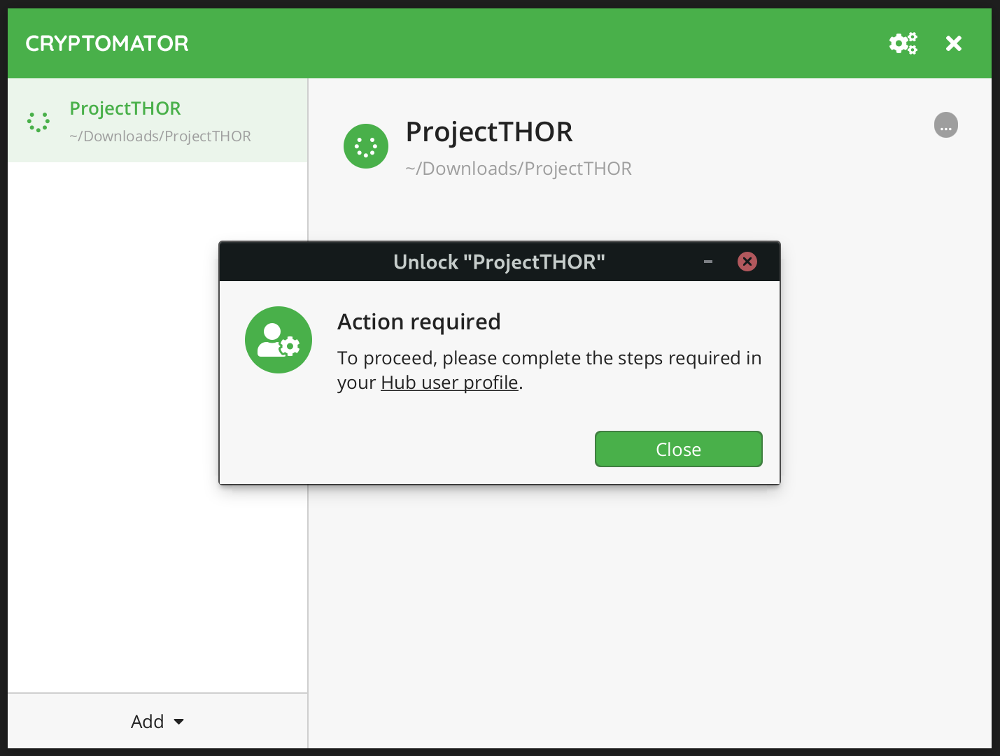
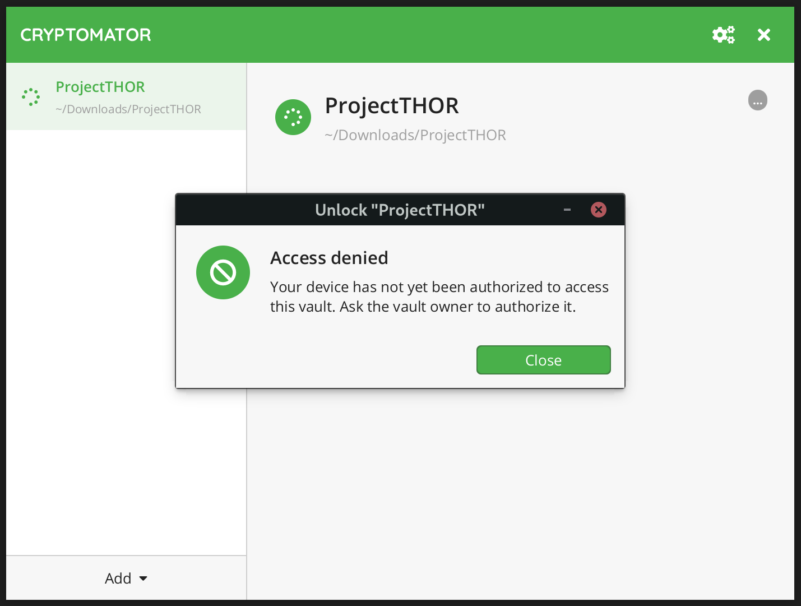
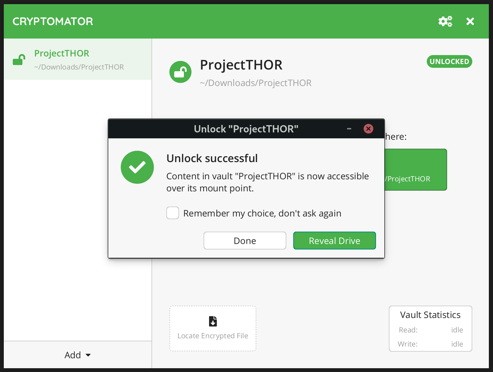
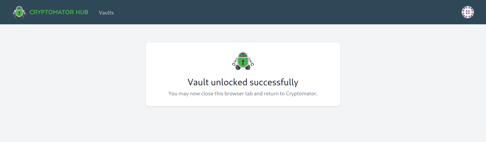

.. _hub/working-with-vaults:

Working with Vaults
===================

To encrypt your data securely with Cryptomator Hub vaults, you need the Cryptomator app for your OS.
Cryptomator runs on Windows, macOS, Linux, Android and iOS.
You can download the version for your OS from `cryptomator.org <https://cryptomator.org/downloads/>`_.

This section describes exemplarily how to unlock a vault in the Desktop app.
Android and iOS work analogously.

.. note::
    Currently, only our desktop version supports Cryptomator Hub vaults.
    We are working on adding support for Android and iOS.

As described in :ref:`open an existing vault <desktop/adding-vaults/open-an-existing-vault>`, you should have already added the vault to the vault list, e.g., by selecting the `vault.cryptomator` file.

.. _hub/access-vault/unlocking-a-vault:

Unlocking a Vault
-----------------

.. _hub/access-vault/unlocking-a-vault/click-unlock:

1. Click Unlock
^^^^^^^^^^^^^^^

To unlock the vault, click on the large ``Unlock`` button in the center of Cryptomator's main window. 

.. _hub/access-vault/unlocking-a-vault/authenticate:

2. Authenticate
^^^^^^^^^^^^^^^

Cryptomator should open your default browser for authentication. If you're not already logged in, you need to provide your user credentials, e.g., by entering your username and password or by inserting your key when WebAuthn is enabled.

.. _hub/access-vault/unlocking-a-vault/setup-user:

3. Account Setup
^^^^^^^^^^^^^^^^

If this is the first time you log into Hub, Cryptomator and Cryptomator Hub requests you to :ref:`set up your account <hub/your-account/setup>`.

Desktop

Hub

When you finished the account setup in Hub, unlock the vault again.

.. _hub/access-vault/unlocking-a-vault/add-device:

4. Register Device
^^^^^^^^^^^^^^^^^^

If you just did setup your accout, a vault owner needs to grant you access for the requested vault as described :ref:`here <hub/vault-management/updating-permission>`. Retry unlocking the vault after the vault owner granted you access.

If you connect to Hub with this device for the first time, you need to register it.

Desktop

Hub

Enter a name for the device to identify it later on and the :ref:`Account Key <hub/your-account/account-key>` which was generated during the account setup. You can also find it in the :ref:`account settings <hub/your-account/profile>`.

After that, you will see a confirmation dialog, unlock the vault again.

.. _hub/access-vault/unlocking-a-vault/vault-unlocked:

5. Vault Unlocked
^^^^^^^^^^^^^^^^^

You are all set up and an unlock should be successful from now on. You can then reveal the vault’s contents as usual.

Desktop

Hub

