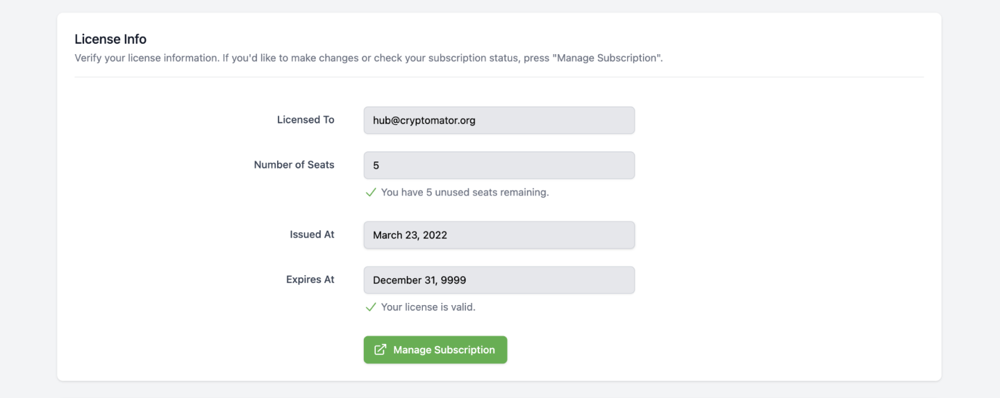
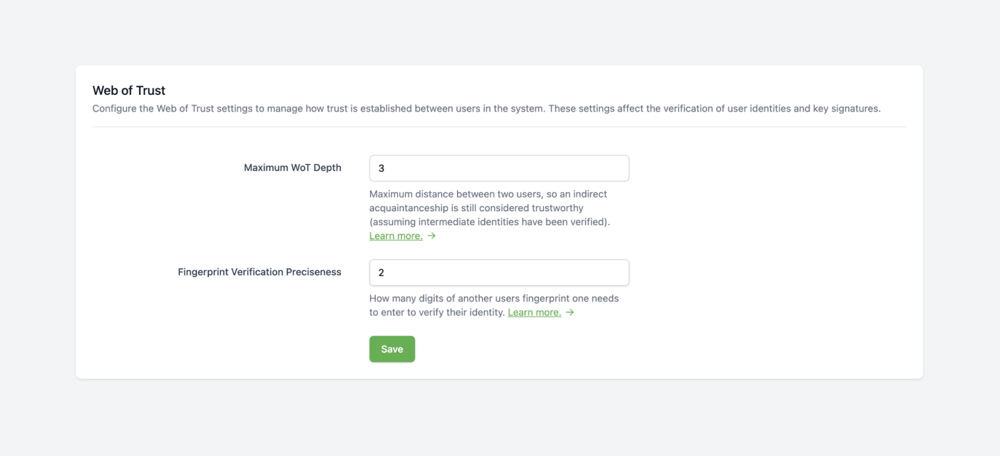

.. _hub/admin:

Admin
=====

.. _hub/admin/license:

License
-------

Every Cryptomator Hub instance requires a license.
The license is bound to the instance and cannot be transferred to another instance.
Every license has a number of seats and a validity period.
As an Hub administrator, you can view license information in the administration area.

.. _hub/admin/license/seat:

What is a Seat?
^^^^^^^^^^^^^^^

A regular license contains a fixed number of *seats*.
A *seat* is taken for every user, which is assigned to at least one, not-archived vault.
Note that:

* If a user is not assigned to any vault, it *does not occupy* a seat.
* If a user is assigned to multiple vaults, it only *occupies one* seat.
* If :ref:`a user is created or imported to Hub <hub/user-group-management>`, it does not occupy a seat.

.. note:: Enterprise licenses can have an unlimited number of seats. Visit `cryptomator.org <https://cryptomator.org/hub/>`_ for more information.

.. _hub/admin/license/community-license:

Community License
^^^^^^^^^^^^^^^^^

When you deploy Cryptomator Hub by yourself, it comes with a community license with life-long validity and 5 seats.

.. _hub/admin/license/buy-license:

Updating your License
^^^^^^^^^^^^^^^^^^^^^

If the community license is not sufficient for your needs, you can upgrade it to a paid license.
You can also upgrade an already existing, paid license.
To do so, click on the button in the lower right corner of the administration area.
It will redirect you to the Cryptomator Hub license store.
After the purchase, you will be automatically redirected back to your Hub instance.

.. _hub/admin/audit-logs:

Audit Logs
----------

The Audit Logs provide an overview of security-related events within Cryptomator Hub.
These logs allow administrators to track important account and vault-related actions.

.. note::
    Audit Logs are not available with a Community License.

Event Types
^^^^^^^^^^^

The following events are logged:

Device
"""""""

- **Register Device** - A user :ref:`registered a new device <hub/access-vault/unlocking-a-vault/add-device>`. This can be e.g. a Cryptomator app (desktop/mobile) to unlock a vault or a web browser to access Cryptomator Hub.
- **Remove Device** – A user :ref:`removed a device <hub/your-account/profile/authorized-devices>`.

Web of Trust
""""""""""""

- **Signed Identity** – A user :ref:`signed the identity of another user <hub/vault-management/wot>`.
- **Update Wot Setting** – A user updated :ref:`Web-of-Trust settings<hub/vault-management/wot>`, e.g. the ``wot_max_depth``.

Vault
""""""

- **Add Vault Member** – A vault owner :ref:`added a member to a vault <hub/vault-management/add-user>`. This only adds the member but does not derive the vault key for the new member.
- **Create Vault** – A user :ref:`created a vault <hub/vault-management/create-vault>`.
- **Grant Vault Access** – A user :ref:`derived the vault key for the new member <hub/vault-management/updating-permission>`.
- **Retrieve Vault Key** – A user retrieved a vault key. This happens when a user :ref:`unlocks a vault <hub/access-vault/unlocking-a-vault>` but also e.g. when a owner manages the vault. The IP address and device information are optional for legacy reasons.
- **Remove Vault Member** – A vault owner removed a member from a vault.
- **Update Vault Member** – A vault owner :ref:`changed a member’s role <hub/vault-management/change-ownership>` (owner or user).
- **Update Vault** – A vault owner :ref:`updated the vault metadata <hub/vault-management/edit-vault-metadata>`. This includes the vault name or description.

Account
""""""""

- **Account Key Changed** – A user :ref:`re-generated the account key <hub/your-account/profile/regenerate-account-key>`. This also logs ``User Keys Change`` because changing the account key also changes parts of the user keys.
- **Reset User Account** – A user :ref:`resetted it's account <hub/your-account/reset-account>`.
- **User Keys Change** – A user changed it's keys. This happens when e.g. the user :ref:`finished the account setup <hub/your-account/setup>` or when the ``Account Key Changed``.

Legacy
""""""

- **Claim Vault Ownership** – A user claimed vault ownership. This event is logged when a vault created with hub pre 1.3.0 is claimed by the vault creator using the `Vault Admin Password`.

.. _hub/admin/audit-logs/table-view:

Audit Log Table View
^^^^^^^^^^^^^^^^^^^^

The logs are displayed in a structured table containing the following columns:

- **Timestamp** – The exact time of the event.
- **Event** – The type of event that occurred.
- **Details** – Additional information about the event.

.. image:: ../img/hub/auditlogs-overview.png
    :alt: Audit Logs Table View

.. _hub/admin/audit-logs/filters:

Filtering Audit Logs
^^^^^^^^^^^^^^^^^^^^

To refine the displayed logs, a filtering function is available:

.. image:: ../img/hub/auditlogs-filter.png
    :alt: Audit Log Filtering Options

- **Date Range Filter**: Allows filtering logs between two specific dates.
- **Event Type Filter**: A multi-select dropdown enables filtering by event type.

.. image:: ../img/hub/auditlogs-filter-events.png
    :alt: Audit Log Filtering Options

.. _hub/admin/wot:

Web of Trust
------------

The Web of Trust (WoT) feature in Cryptomator Hub helps users verify each other's identity by signing the :ref:`User Key Pair <security/hub/keys/user-keys>` with their private keys using ECDSA.
First, the trusting user needs to verify the trustee by entering the first characters of the trustee's public key fingerprint. Once signed, the proof is uploaded to Hub, where others can check its authenticity.

WoT also supports transitive trust, meaning if Alice trusts Bob, and Bob trusts Charlie, then Alice implicitly trusts Charlie. This forms a trust chain, allowing users to establish indirect trust relationships.

**In the administration area, administrators can configure the following trust settings:**

The maximum depth of such chains can be configured using the **Maximum WoT Depth** property:

* The default value is 3 ("Great-Grandchild")
* The maximum value is 9
* The minimum value, 0, means no trust chain is allowed, only direct trust relationships are considered.

With the **Fingerprint Verification Preciseness** property, the minimum length of the entered public key fingerprint can be configured:

* The default value is 2
* The minimum value, 0, means the fingerprint of the trustee is fully shown without any input needed.

.. note::

    If a user resets their account, their :ref:`User Key Pair <security/hub/keys/user-keys>` is regenerated, invalidating all previously established trust relationships regarding this user.  
    Additionally, any existing trust chains that included the user will be broken, requiring re-verification to restore trust.
