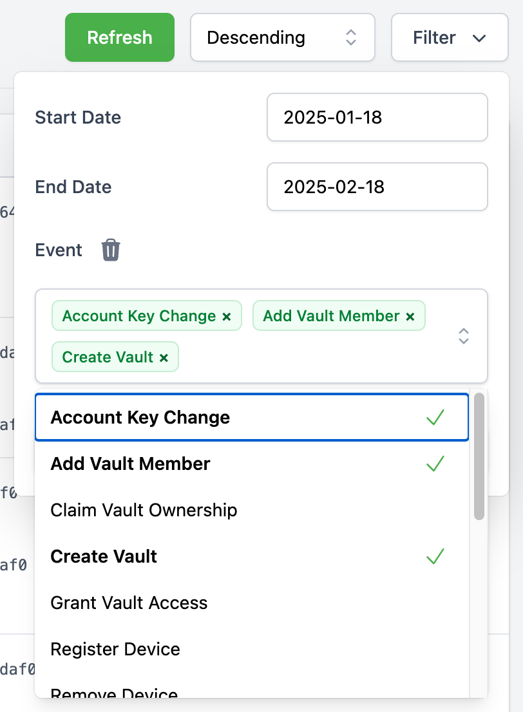

.. _hub/audit-logs:

Audit Logs
==========

The Audit Logs provide an overview of security-related events within Cryptomator Hub.
These logs allow administrators to track important account and vault-related actions.

.. note::
    Audit Logs are not available with a Community License.

.. _hub/audit-logs/event-list:

Event Types
-----------

The following events are logged:

Device
^^^^^^

- **Register Device** - A user :ref:`registered a new device <hub/access-vault/unlocking-a-vault/add-device>`. This can be e.g. a Cryptomator app (desktop/mobile) to unlock a vault or a web browser to access Cryptomator Hub.
- **Remove Device** – A user :ref:`removed a device <hub/your-account/profile/authorized-devices>`.

Web of Trust
^^^^^^^^^^^^

- **Signed Identity** – A user :ref:`signed the identity of another user <hub/vault-management/wot>`.
- **Update Wot Setting** – A user updated :ref:`Web-of-Trust settings<hub/vault-management/wot>`, e.g. the ``wot_max_depth``.

Vault
^^^^^

- **Add Vault Member** – A vault owner :ref:`added a member to a vault <hub/vault-management/add-user>`. This only adds the member but does not derive the vault key for the new member.
- **Create Vault** – A user :ref:`created a vault <hub/vault-management/create-vault>`.
- **Grant Vault Access** – A user :ref:`derived the vault key for the new member <hub/vault-management/updating-permission>`.
- **Retrieve Vault Key** – A user retrieved a vault key. This happens when a user :ref:`unlocks a vault <hub/access-vault/unlocking-a-vault>` but also e.g. when a owner manages the vault. The IP address and device information are optional for legacy reasons.
- **Remove Vault Member** – A vault owner removed a member from a vault.
- **Update Vault Member** – A vault owner :ref:`changed a member’s role <hub/vault-management/change-ownership>` (owner or user).
- **Update Vault** – A vault owner :ref:`updated the vault metadata <hub/vault-management/edit-vault-metadata>`. This includes the vault name or description.

Account
^^^^^^^

- **Account Key Changed** – A user :ref:`re-generated the account key <hub/your-account/profile/regenerate-account-key>`. This also logs ``User Keys Change`` because changing the account key also changes parts of the user keys.
- **Reset User Account** – A user :ref:`resetted it's account <hub/your-account/reset-account>`.
- **User Keys Change** – A user changed it's keys. This happens when e.g. the user :ref:`finished the account setup <hub/your-account/setup>` or when the ``Account Key Changed``.

Legacy
^^^^^^

- **Claim Vault Ownership** – A user claimed vault ownership. This event is logged when a vault created with hub pre 1.3.0 is claimed by the vault creator using the `Vault Admin Password`.

.. _hub/audit-logs/table-view:

Audit Log Table View
--------------------

The logs are displayed in a structured table containing the following columns:

- **Timestamp** – The exact time of the event.
- **Event** – The type of event that occurred.
- **Details** – Additional information about the event.

.. image:: ../img/hub/auditlogs-overview.png
    :alt: Audit Logs Table View

.. _hub/audit-logs/filters:

Filtering Audit Logs
--------------------

To refine the displayed logs, a filtering function is available:

.. image:: ../img/hub/auditlogs-filter.png
    :alt: Audit Log Filtering Options

- **Date Range Filter**: Allows filtering logs between two specific dates.
- **Event Type Filter**: A multi-select dropdown enables filtering by event type.

