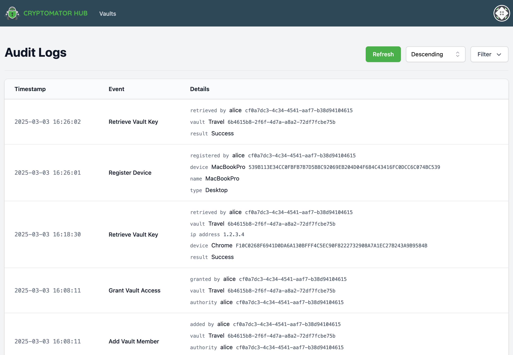
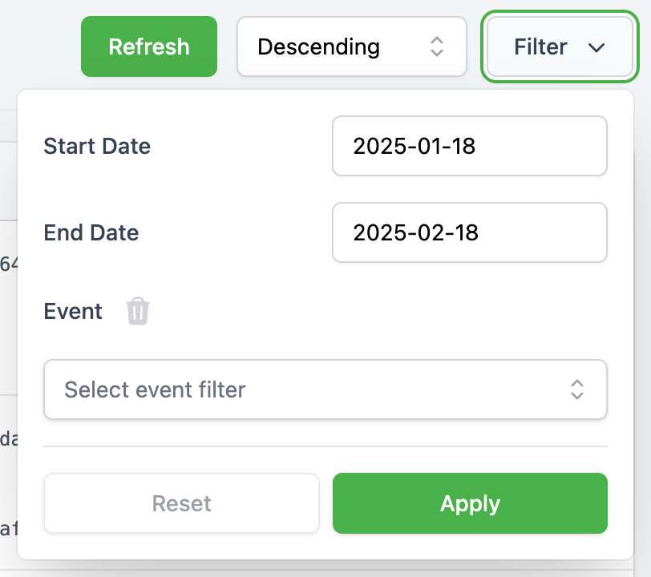

.. _hub/audit-logs:

Audit Logs
==========

The Audit Logs provide an overview of security-related events within Cryptomator Hub.
These logs allow administrators to track important account and vault-related actions.

.. note::
    Audit Logs are not available with a Community License.

.. _hub/audit-logs/event-list:

Event Types
-----------

The following events are logged:

- **DeviceRegister** – A device has been registered.
- **DeviceRemove** – A device has been removed.
- **SettingWotUpdate** – A Web-of-Trust setting has been updated.
- **SignedWotId** – A Web-of-Trust identity has been signed.
- **UserAccountReset** – A user account has been reset.
- **VaultAccessGrant** – Access to a vault has been granted.
- **VaultCreate** – A vault has been created.
- **VaultKeyRetrieve** – A vault key has been retrieved.
- **VaultMemberAdd** – A member has been added to a vault.
- **VaultMemberRemove** – A member has been removed from a vault.
- **VaultMemberUpdate** – A vault member’s permissions have been updated.
- **VaultOwnershipClaim** – Vault ownership has been claimed.
- **VaultUpdate** – A vault has been updated.
- **UserKeysChange** – User keys have been changed.
- **UserSetupCodeChanged** – A user’s setup code has been changed.

.. _hub/audit-logs/table-view:

Audit Log Table View
--------------------

The logs are displayed in a structured table containing the following columns:

- **Timestamp** – The exact time of the event.
- **Event** – The type of event that occurred.
- **Details** – Additional information about the event.

Each page contains up to 20 entries, with pagination controls at the bottom.

.. _hub/audit-logs/filters:

Filtering Audit Logs
--------------------

To refine the displayed logs, a filtering function is available:

- **Date Range Filter**: Allows filtering logs between two specific dates.
- **Event Type Filter**: A multi-select dropdown enables filtering by event type.

.. image:: ../img/hub/auditlogs-filter-events.png
    :alt: Audit Log Filtering Options
