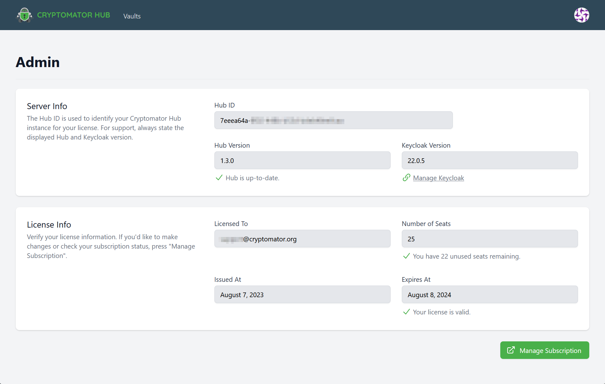

.. _hub/license:

License
=======

Every Cryptomator Hub instance requires a license.
The license is bound to the instance and cannot be transferred to another instance.
Every license has a number of seats and a validity period.
As an Hub administrator, you can view license information in the administration area.

.. _hub/license/seat:

What is a Seat?
---------------

A regular license contains a fixed number of *seats*.
A *seat* is taken for every user, which is assigned to at least one, not-archived vault.
Note that:

* If a user is not assigned to any vault, it *does not occupy* a seat.
* If a user is assigned to multiple vaults, it only *occupies one* seat.
* If :ref:`a user is created or imported to Hub <hub/user-group-management>`, it does not occupy a seat.

.. note:: Enterprise licenses can have have an unlimited number of seats. Visit `cryptomator.org <https://cryptomator.org/hub/>`_ for more information.

.. _hub/license/community-license:

Community License
-----------------

When you deploy Cryptomator Hub by yourself, it comes with a community license with life-long validity and 5 seats.

.. _hub/license/buy-license:

Updating your License
---------------------

If the communtiy license is not sufficient for your needs, you can upgrade it to a paid license.
You can also upgrade an already existing, paid license.
To do so, click on the button in the lower right corner of the administration area.
It will redirect you to the Cryptomator Hub license store.
After the purchase, you will be automatically redirected back to your Hub instance.