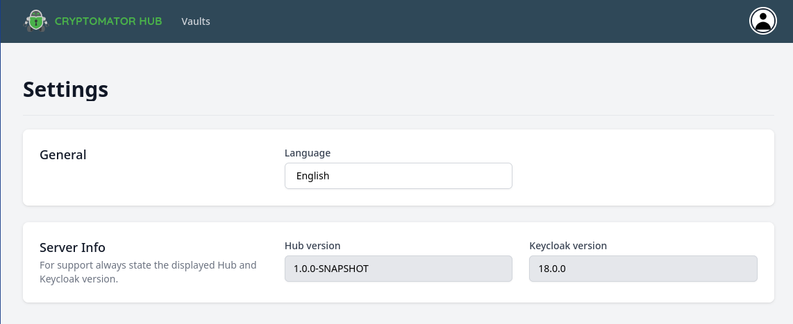

Settings
========

You can configure Cryptomator Hub to your needs. The following options are available:

.. _hub/settings/version:

Version
-------

The section ``Server Info`` shows the current running Hub and Keycloak version. Providing those values is required when you ask for support.

The following versions are compatible with each other:

.. list-table::
   :widths: 25 25 25 25 25
   :header-rows: 1

   * - Hub
     - Keycloak
     - Cryptomator Desktop
     - Cryptomator Android
     - Cryptomator iOS
   * - 1.0.0
     - 18, 19
     - 1.6.11 (beta)
     - N/A
     - N/A
