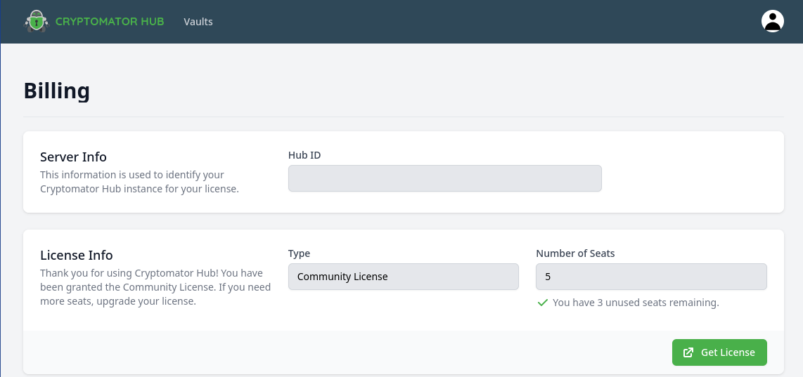
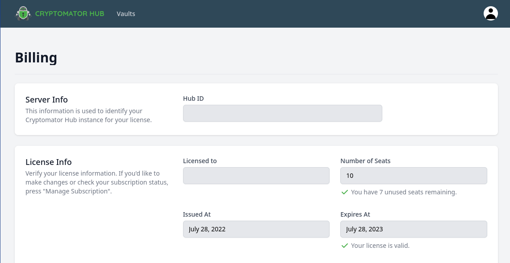

.. _hub/setup:

Setup
=====

Cryptomator Hub uses Keycloak as Source Identity and Access Management system. Hub manages your vaults whereas Keyloak the users, groups and authentication. You can deploy Keycloak together with the Hub instance or use an existing Keycloak instance.

Cryptomator hub can be deployed via Kubernetes or Docker Compose. To get a deployment template you can use the `Cryptomator Hub Setup Wizard <https://cryptomator.org/hub/setup/>`_. There you must specify, among other things, whether you want to create a new Keycloak instance or use your existing one.

.. _hub/setup/keycloak-administration:

Keycloak Administration
-----------------------

Using Keycloak, you can `create users <https://www.keycloak.org/docs/latest/server_admin/index.html#proc-creating-user_server_administration_guide>`_, `delete users <https://www.keycloak.org/docs/latest/server_admin/index.html#proc-creating-user_server_administration_guide>`_, `manage groups <https://www.keycloak.org/docs/latest/server_admin/index.html#proc-managing-groups_server_administration_guide>`_ and optionally also synchronize users/groups to Keycloak using `LDAP <https://www.keycloak.org/docs/latest/server_admin/#_ldap>`_ to whom you can then give access to vaults in Hub.

.. note::

    Subgroups are not supported at this time.

.. _hub/setup/billing:

Billing
-------

When Cryptomator Hub is freshly installed, it comes with a community license:

This license is valid for 5 seats. Only users assigned to a vault do occupy a seat.

The ``Get License`` button will open the cryptomator.org website where you can buy a license for this instance. If successful, you will be automatically redirected back to your Hub instance. 

.. _hub/setup/requirements:

Requirements
------------

Currently we are evaluating the environment requirements for Cryptomator Hub. If you can provide data, please send us an mail to hub-beta@cryptomator.org.
