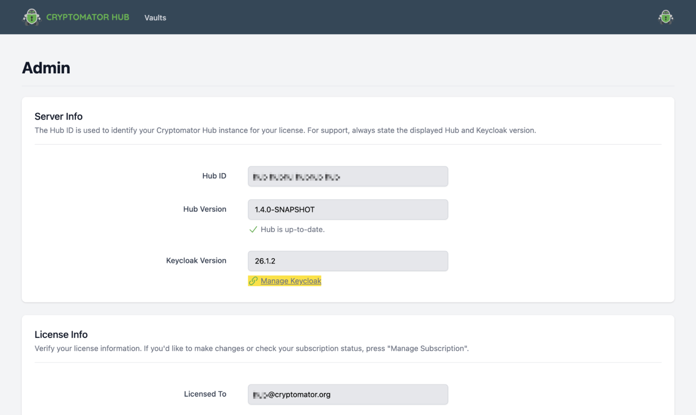

.. _hub/user-group-management:

User & Group Management
=======================

Users and groups are managed in `Keycloak <https://www.keycloak.org/>`, a powerful, open source identity and access management solution.
In the default configuration Cryptomator Hub provides its own Keycloak instance, but you can also integrate an existing instance.

You can access the Keycloak management interface over the admin section of Hub.

There you can perform all users or groups related tasks, such as
`creating new users <https://www.keycloak.org/docs/latest/server_admin/index.html#proc-creating-user_server_administration_guide>`_,
`deleting users <https://www.keycloak.org/docs/latest/server_admin/index.html#proc-deleting-user_server_administration_guide>`_ or
`manage groups <https://www.keycloak.org/docs/latest/server_admin/index.html#proc-managing-groups_server_administration_guide>`_.

.. note::
    Subgroups are not supported at this time.

.. _hub/user-group-management/external-id-providers:

Connect external identity management solutions
----------------------------------------------

Alternatively to the in-house administration, you can also connect Keycloak to other identity providers (e.g. Active Directory/Microsoft Entra) to keep your user management centralized.
You can either only synchronize existing users and groups from your identity provider to Keycloak (using LDAP or Active Directory) or completely delegate the authentication process to an identity provider of your choice via OpenID Connect or SAML.

Setting up LDAP synchronization is described in the `Keycloak documentation <https://www.keycloak.org/docs/latest/server_admin/#_ldap>`_.
For OpenID Connect and SAML, the Keycloak documentation provides `general information <https://www.keycloak.org/docs/latest/server_admin/#_identity_broker>`_.
A good step-by-step guide for setting up OpenID Connect with Microsoft Azure can be found `here <https://dev.to/andremoriya/keycloak-azure-active-directory-4cg4>`_.

.. note::
    With ``LDAP``, all users and groups are imported and synchronized with Keycloak, so they are available immediately after setup.
    With ``OpenID Connect`` or ``SAML``, users are unknown to Keycloak and Hub *until they log in for the first time*.

.. warning::
    All preconfigured Keycloak instance already contains a user called ``syncer``. **Do not edit or delete it!** It is necessary to synchronize users and groups from Keycloak to Hub.
