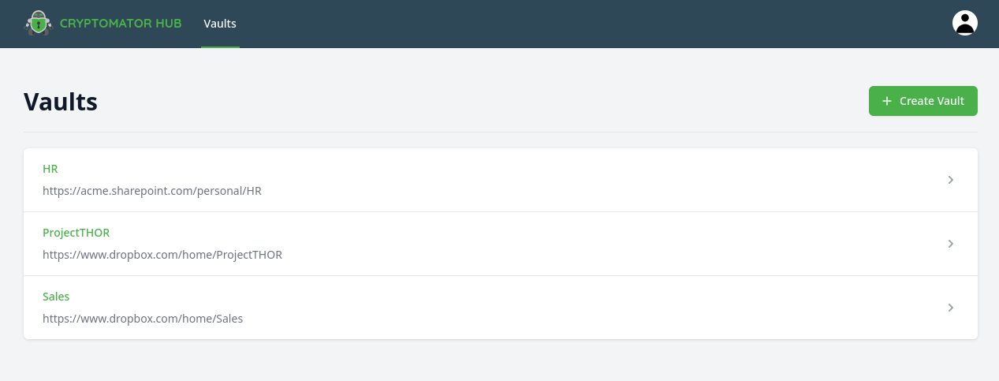
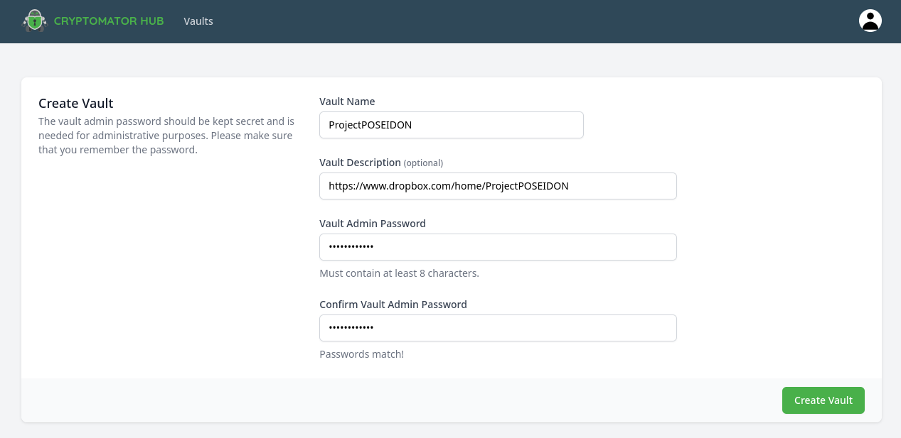
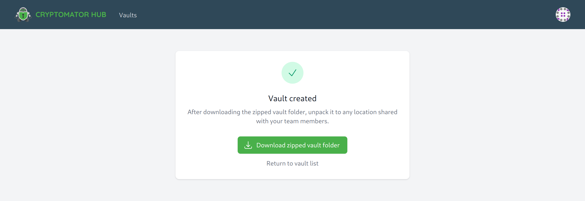
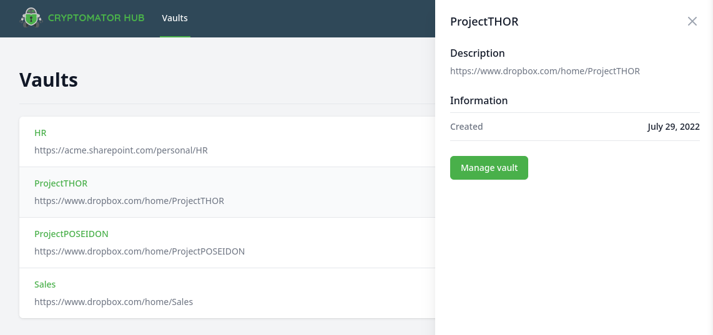
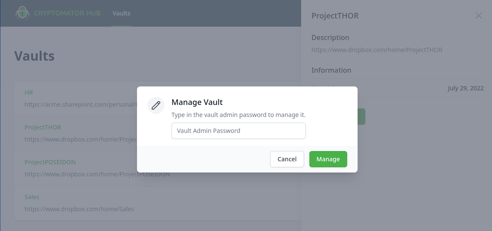
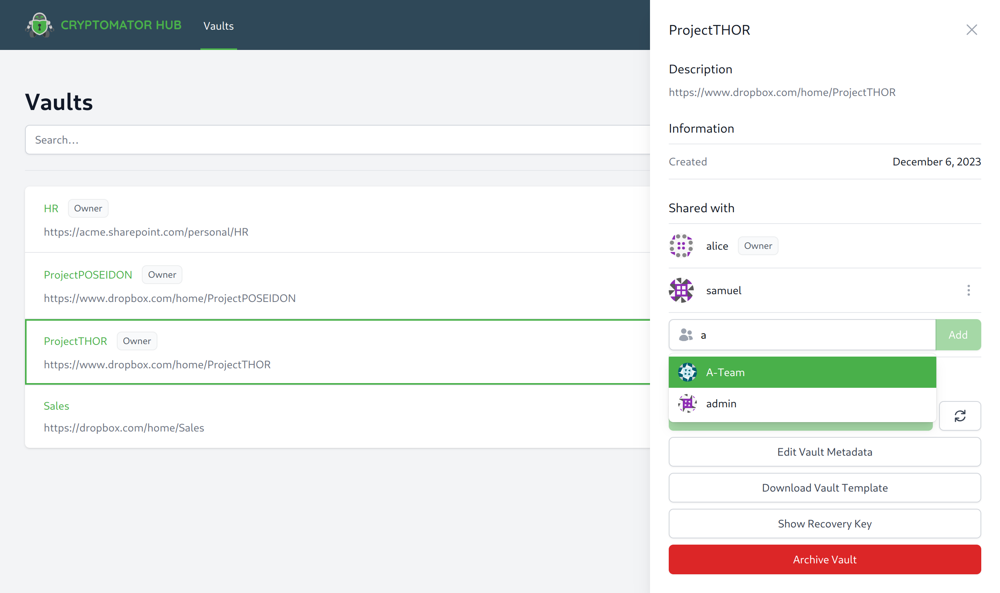
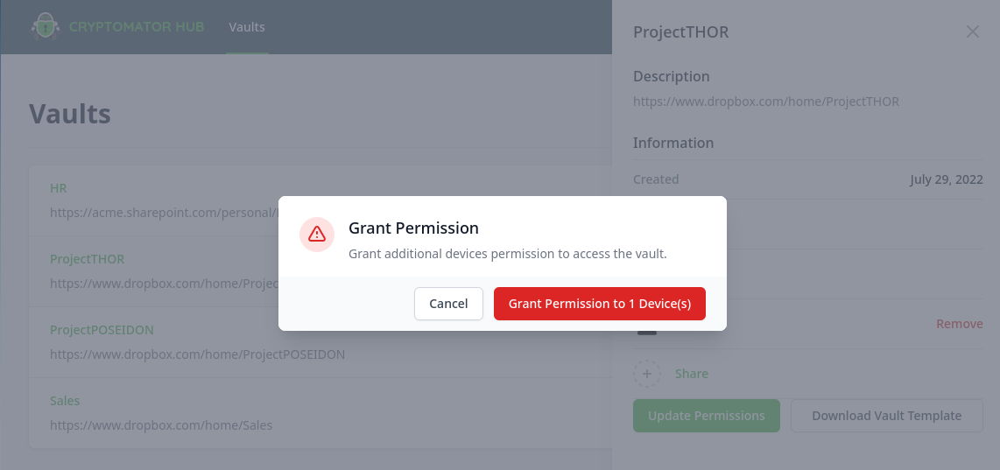

Vault Management
================

This section contains instructions to manage vaults in Cryptomator Hub.

.. _hub/vault-management/vault-list:

Vault List
----------

The vault list is the main page of Cryptomator Hub.
Here, all vaults which are shared with you, are listed.
After signing in, Hub redirects you to this list.
Alternatively, you can also access the list by clicking on the ``Vaults`` tab in the navigation bar.

.. note::

    Even if you are an administrator of the Hub instance, only vaults which are shared with you are listed.

.. _hub/vault-management/create-vault:

Create a Vault
--------------

To create a vault in Hub, navigate to the vault list and click on the ``Create Vault`` button in the top right corner.
Fill out the form and complete the setup by clicking the ``Create Vault`` button in the right corner.

.. note::
    The vault password is needed to grant or revoke access to the vault. It is not used to unlock the vault in Cryptomator apps.

When the setup is finished, you have the opportunity to download the initial vault template and place it in your desired cloud storage location.
If you skip this step, you can download the template :ref:`later <hub/vault-management/manage-vault>`.

.. _hub/vault-management/vault-details:

Vault Details
-------------

The vault details page shows metadata of a vault (e.g. creation date) and contains the management section of the vault (e.g. grant a user access).
To open it, navigate to the vault list and click on entry in the list.
The details are displayed on the right side.

.. _hub/vault-management/manage-vault:

Manage Vault
^^^^^^^^^^^^

To add a user, grant devices access, or view the members list, you have to enable the management section in the vault details.
Open the vault details and click the ``Manage Vault`` button.
In the dialog, enter the vault admin password.

If the password is correct, the vault details view is enriched with more elements:

* ``Shared with`` members list
* ``Download Vault Template`` button
* ``Update Permissions`` button (only shown if necessary)

.. _hub/vault-management/add-user:

Add a User
""""""""""

If a user should have access to this vault, you need to share it with the user.
Click on the ``Share`` button in the ``Shared with`` list.
A search field opens up where you can search for users and groups.

To add a user or group, select it from the results list and click the ``Add`` button.

.. _hub/vault-management/updating-permission:

Update Permissions
""""""""""""""""""

If a member of this vault registers a new device or still has unauthorized devices, an admin of the vault has to grant access to these devices explicitly. Only then, the user can unlock the vault with the device. As a vault admin, you can see that an update is necessary when an ``Update Permissions`` button appears.

