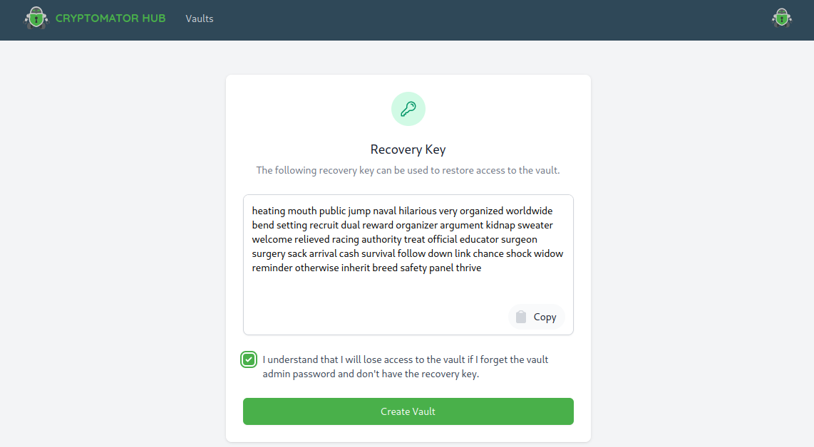
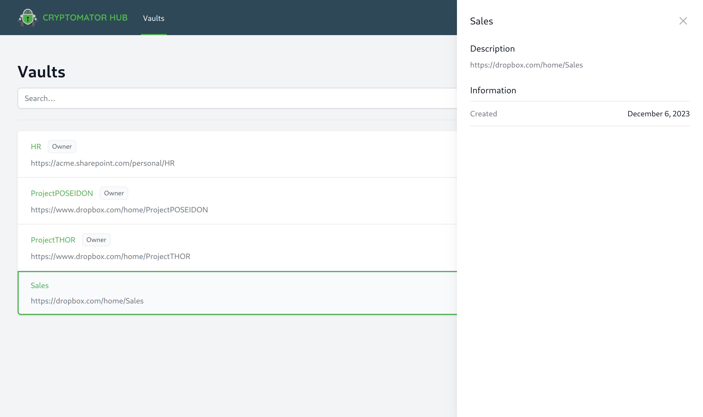
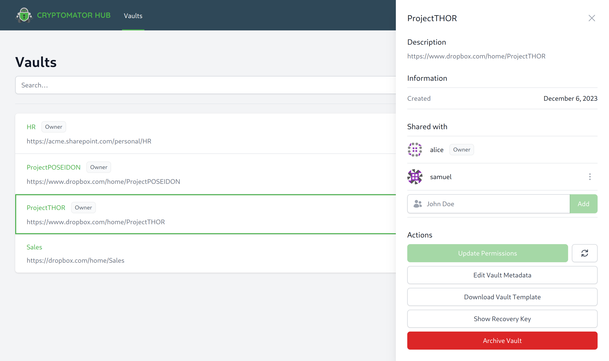
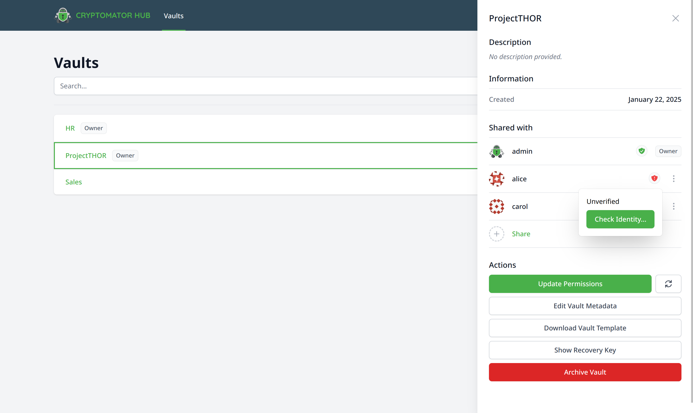
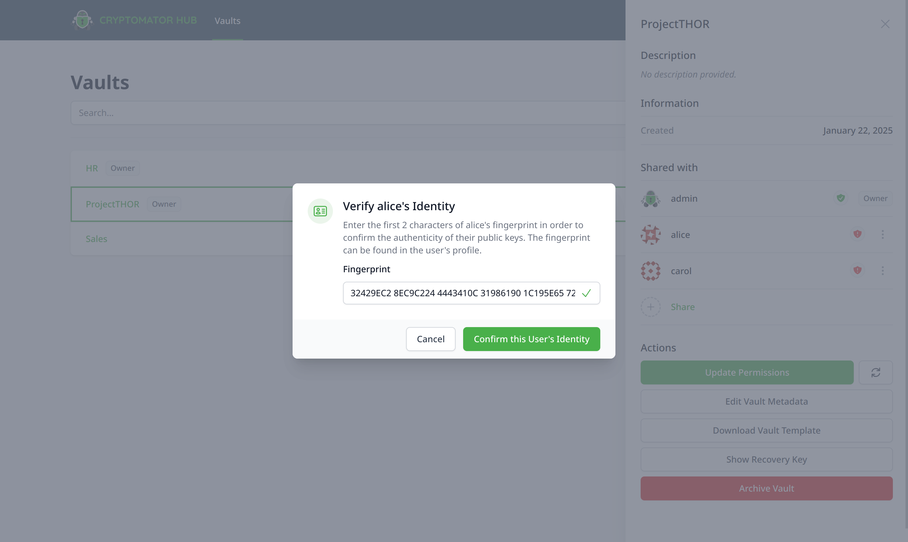
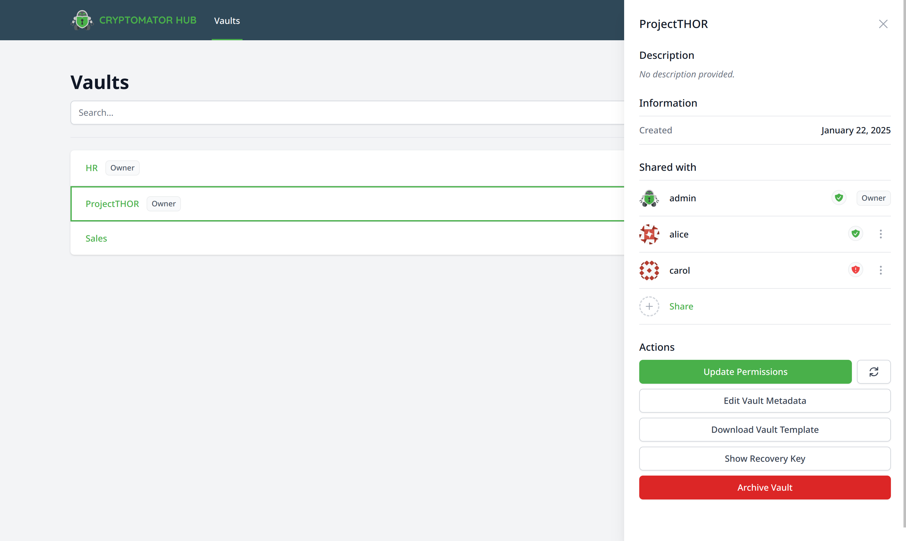
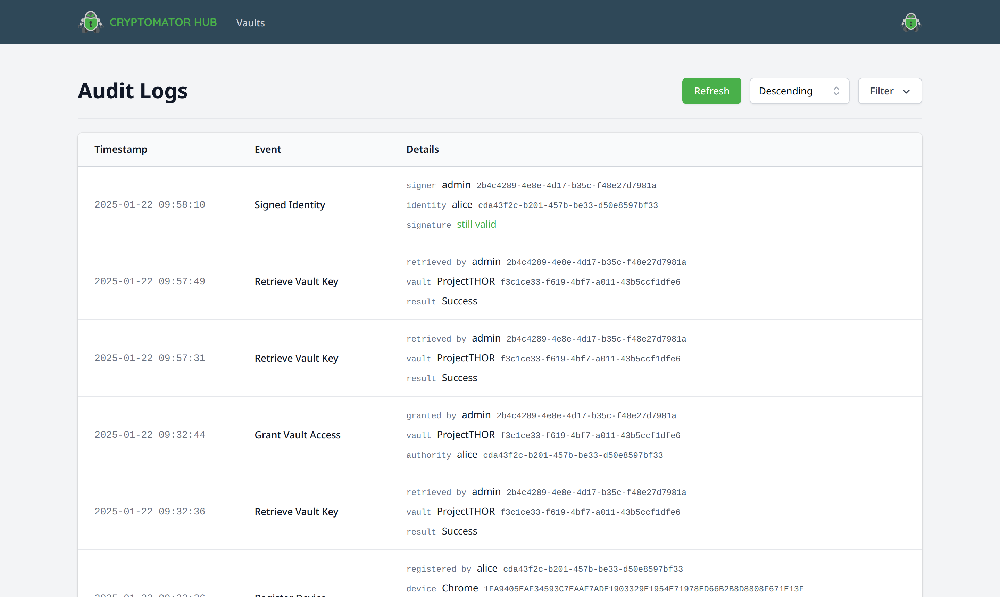

.. _hub/vault-management:

Vault Management
================

The central entities in Cryptomator Hub are vaults.
In Hub, every vault contains a key to encrypt and decrypt your data stored in the cloud of your choice.
Hub manages access to the vaults, it does not store any encrypted user data.
This section describes how to manage vaults in Cryptomator Hub.

.. _hub/vault-management/vault-list:

Vault List
----------

The vault list is the main page of Cryptomator Hub.
Here, all vaults which are shared with you, are listed.
After signing in, Hub redirects you to this list.
Alternatively, you can also access the list by clicking on the ``Vaults`` tab in the navigation bar.

.. image:: ../img/hub/vaultlist.png
    :alt: List vaults
    :width: 920px

.. note::

    * As a user, you will only see the vaults that you have access to.
    * As an admin of the Hub instance, you can see all vaults, but you can only access those that you have been granted access to.

.. _hub/vault-management/create-vault:

Create a Vault
--------------

.. note::
    Creating vaults do require the ``create-vault`` role. :ref:`Here <hub/user-group-management/roles>` you can read more about roles.

To create a vault in Hub, navigate to the vault list and click on the ``Create Vault`` button in the top right corner.
Every vault has a name and optionally a description.
Fill out the form and continue the process by clicking the ``Next`` button in the right corner.

.. image:: ../img/hub/create-vault.png
    :alt: Create a vault
    :width: 920px

In the next step, the vault *recovery key* is displayed.
It can :ref:`restore access to the vault data <hub/vault-recovery>` in case of an emergency, e.g. if Cryptomator Hub is down.
Store it at a safe location, tick the checkbox and complete the setup by clicking the ``Create Vault`` button at the bottom

.. warning::
    The recovery key is **highly confidential**.
    It is a human readable form of the vault :ref:`masterkey <security/architecture/masterkey>`, which is used to encrypt your data and independent of the key management in Cryptomator Hub.

When the setup is finished, you have the opportunity to download the initial vault template and place it in your desired cloud storage location.
You can unlock the vault and place data inside with `Cryptomator <https://cryptomator.org/downloads/>`_.
If you skip this step, you can download the template :ref:`later <hub/vault-management/download-vault-template>`.

.. image:: ../img/hub/create-vault-download.png
    :alt: Download vault template
    :width: 920px

.. _hub/vault-management/vault-details:

Vault Details
-------------

The vault details page shows metadata of a vault (e.g. creation date) and contains the management section of the vault (e.g. grant a user access).
To open it, navigate to the vault list and click on entry in the list.
The details are displayed on the right side.

With the user role, you have access to the following details:

With the owner role, you have access to the following sections:

.. _hub/vault-management/manage-vault:

Manage Vault
^^^^^^^^^^^^

To add a user, grant devices access, or view the members list, you need to have the vault owner role.
Open the :ref:`vault details <hub/vault-management/vault-details>` page to manage a vault.

* ``Shared with`` members list
* ``Update Permissions`` button (only clickable if necessary)
* ``Edit Vault Metatdata`` button
* ``Download Vault Template`` button
* ``Show Recovery Key`` button
* ``Archive Vault`` button

.. _hub/vault-management/add-user:

Share a vault
^^^^^^^^^^^^^

If a user should have access to this vault, you need to share it with the user.
Click in the search field of the ``Shared with`` section, select it from the results list and click the ``Add`` button.

.. image:: ../img/hub/vault-details-search.png
    :alt: Add a user or group in the vault details
    :width: 920px

.. _hub/vault-management/change-ownership:

Change Ownership
^^^^^^^^^^^^^^^^

To change user's ownership of a vault, click on the three dots next to the user's details in the :ref:`Shared a vault <hub/vault-management/add-user>` section of the :ref:`vault details <hub/vault-management/vault-details>`.

.. _hub/vault-management/updating-permission:

Update Permissions
^^^^^^^^^^^^^^^^^^

If members of the vault have finished the :ref:`first login <hub/your-account/setup>` or reset user accounts, a vault owner must explicitly grant access to these users.
Only then, the user can unlock the vault with its device.

As a vault owner, you can see that an update is necessary when the ``Update Permissions`` button is clickable.

.. image:: ../img/hub/update-permission.png
    :alt: Update permissions in the vault details
    :width: 920px

.. _hub/vault-management/edit-vault-metadata:

Edit Vault Metadata
^^^^^^^^^^^^^^^^^^^

To edit the vault metadata, click on the ``Edit Vault Metadata`` button in the :ref:`vault details <hub/vault-management/vault-details>`. It opens a form where you can change the vault name and description.

.. _hub/vault-management/download-vault-template:

Download Vault Template
^^^^^^^^^^^^^^^^^^^^^^^

To download the vault template, click on the ``Download Vault Template`` button in the :ref:`vault details <hub/vault-management/vault-details>`. It downloads the vault template to your local device. You can place it in your desired cloud storage location and unlock it with `Cryptomator <https://cryptomator.org/downloads/>`_. You can do that if you skipped the download vault template step during the vault creation.

.. note::
    Download the vault template only once! If you download it multiple times, you will have multiple vault templates in your cloud storage location. This can lead to confusion.

.. _hub/vault-management/show-recovery-key:

Show Recovery Key
^^^^^^^^^^^^^^^^^

To show the vault recovery key, click on the ``Show Recovery Key`` button in the :ref:`vault details <hub/vault-management/vault-details>`. It shows the same recovery key shown during vault creation. You can use it to :ref:`restore access to the vault data <hub/vault-recovery>` in case of an emergency, e.g. if Cryptomator Hub is down. Store it at a safe location.

.. _hub/vault-management/archive-vault:

Archive Vault
^^^^^^^^^^^^^

To archive the vault, click on the ``Archive Vault`` button in the :ref:`vault details <hub/vault-management/vault-details>`. It archives the vault and removes it from the "accessible" vault list.

You can unarchive it by clicking on the ``Owned by me`` tab in the navigation bar, select the vault and clicking on the ``Reactive Vault`` button.

.. _hub/vault-management/wot:

Web of Trust
^^^^^^^^^^^^

Cryptomator Hub uses the Web of Trust (WoT) to verify the identity of users during vault sharing.

The WoT state of a user is displayed in the vault details page. The state can be one of the following:

* **Unverified**: There is no turst chain between you and the specific user. You can change this by verifying the user.
* **Verified**: There is a trust chain between you and the specific user. You or a user you trust has verified the user.

The red and green shield icons indicate the WoT state of a user.

To verify ``alice``, click on the red shield icon and select ``Check Idenditiy...``

While verifiying a user, you need to enter the first characters of the user's public key fingerprint. This fingerprint is displayed in user coresponding user profile page.

``alice`` is now verified

The verification process is logged in the audit log with event type ``Signed Identity``

``signature still valid`` means that the ``identiy`` has still the same key. If the user account gets reset after verification, this message changes to ``was valid; signed key changed by now`` and the user needs to get verified again.

You can read more details about Web of Trust in the :ref:`Security section of Hub <security/hub/wot>`.

.. _hub/vault-management/import-vault:

Import a Vault
--------------

If you have a existing, password-based Cryptomator vault and want to switch to centralized, password-less user access management, you can import the vault in Cryptomator Hub.
For a successful import, the :ref:`recovery key<desktop/password-and-recovery-key/show-recovery-key>` of the vault and write access to its storage location is needed

The import is done via the Hub vault recovery feature.
Follow the :ref:`vault online recovery guide <hub/vault-recovery/online-recovery>` and use the recovery key of the password-based vault in the process.
Don't forget to replace the vault config file ``vault.cryptomator`` at the vault storage location at the end.
Finally, to ensure that the vault cannot be unlocked with its old password anymore, remove the file ``masterkey.cryptomator`` and all backup files ( ending with ``.bkup``).
