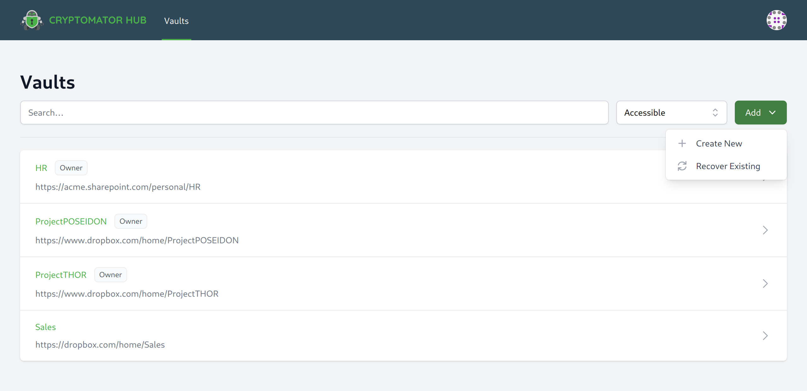
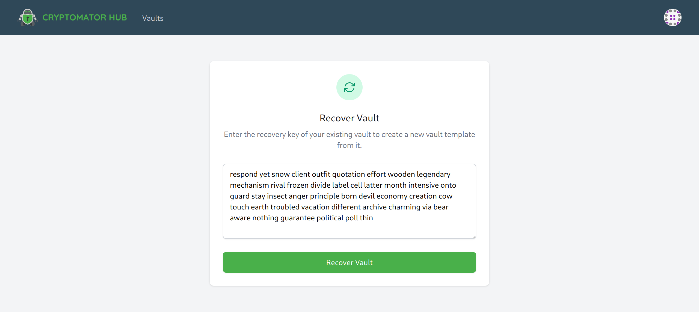
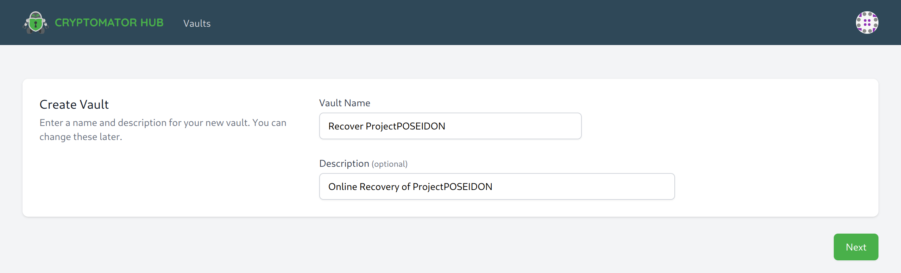
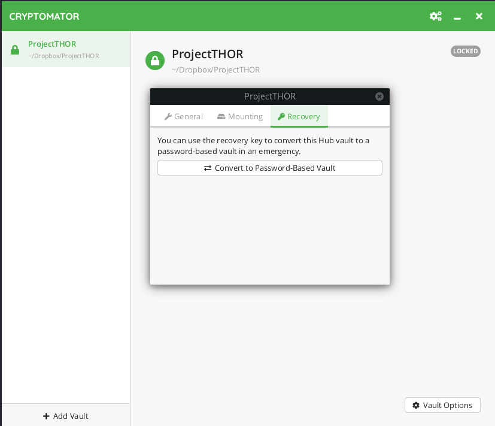
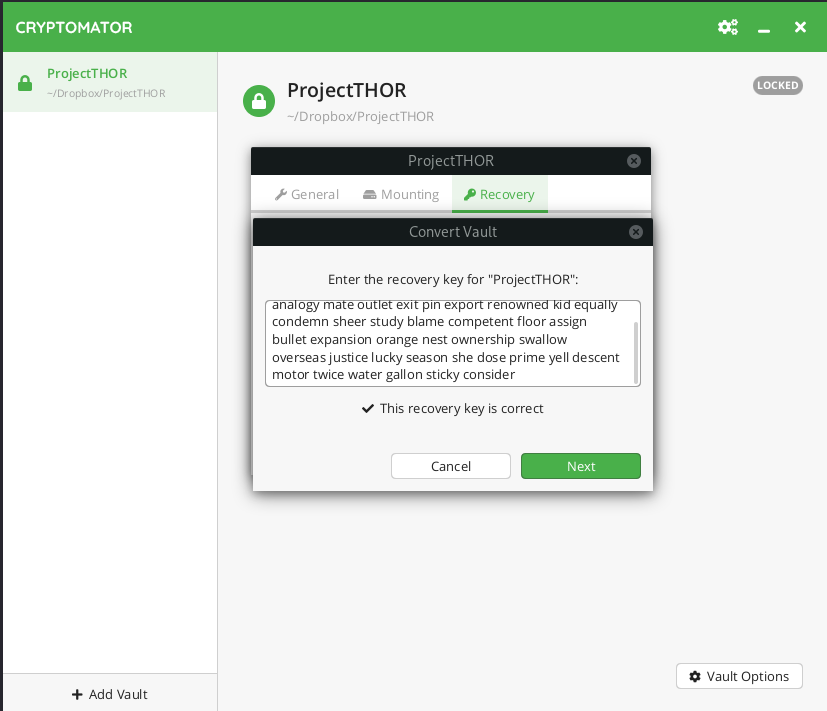
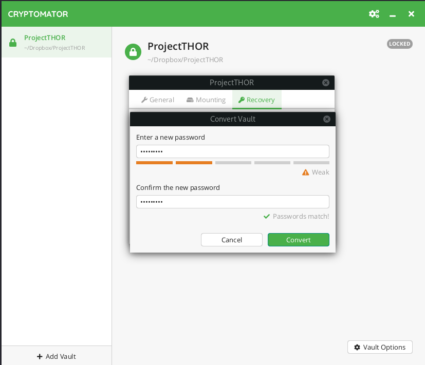
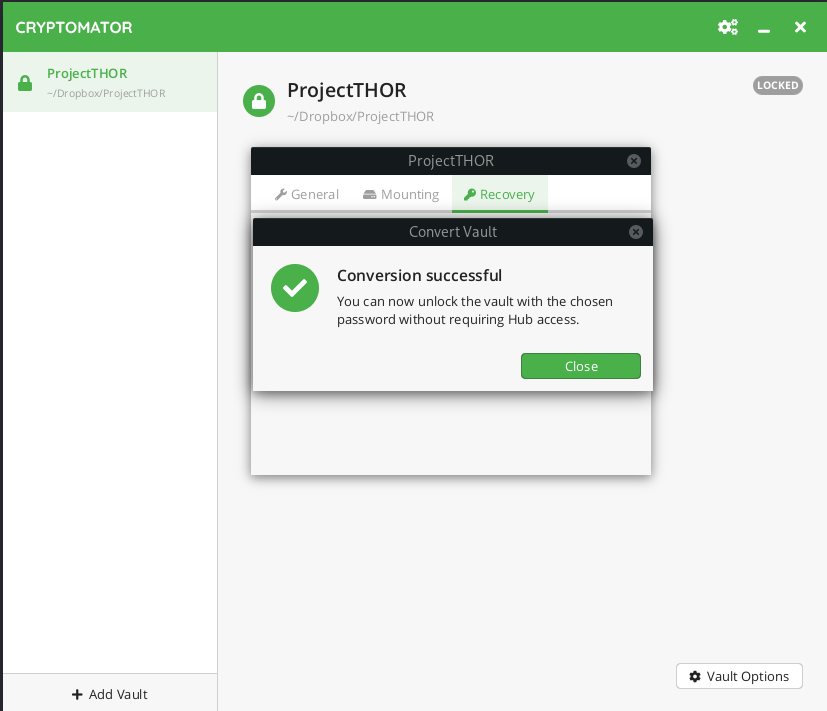
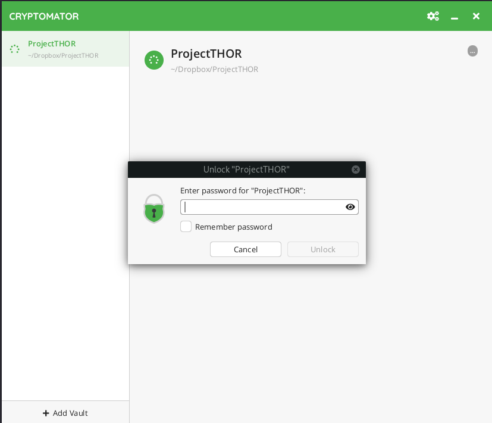

.. _hub/vault-recovery:

Vault Recovery
================

This section contains instructions for recovering Cryptomator Hub vaults using the vault recovery key.

Cryptomator Hub vaults can be recovered in two different ways for two different usecases:

1. **Online Recovery**: If no one has access to the vault admin password, it is possible to restore access to the vault using Cryptomator Hub. The recovery will create a new vault in the hub, but unfortunately the membership information will be lost, i.e. the users/groups that should have access to the vault will have to be added to the vault again.
2. **Offline Recovery**: If Cryptomator Hub is down or experiencing problems, it is possible to migrate a Hub vault to a normal Cryptomator vault using the Cryptomator desktop application. During the local migration you will be asked to set a vault unlock password which will be used to unlock the vault once the migration is complete.

.. _hub/vault-recovery/online-recovery:

Online Recovery
--------------------

Requirements:

* Access to Cryptomator Hub
* Access to the vault's folder on the device, in the cloud or on network storage
* Access to the recovery key of the vault

To restore a vault online using Cryptomator Hub, follow these steps.

In Cryptomator Hub navigate to the vault list, click ``Add`` and ``Recover Existing``

Enter the recovery key for the vault you want to restore. If you enter a recovery key from a different vault, the recovery will not work.

Proceed with ``Restore Vault``.

Enter a new vault name, description and vault admin password. The new vault admin password is required to grant or revoke access to the vault.

If successful, a new vault has been created. Proceed as follows:

1. Click on ``Download zipped vault folder`` of the new created vault
2. Unzip the downloaded folder
3. Copy the file ``vault.cryptomator`` of the unzipped folder
4. Browse locally on the device, directly in the cloud or network storage to the location of the vault folder. In that folder, replace the existing ``vault.cryptomator`` file with the one you just copied.

Now that you have created a new vault, you can manage it again. You will need to regrant permission to the vault members, and then the vault can be unlocked by the team.

.. _hub/vault-recovery/offline-recovery:

Offline Recovery
--------------------

Requirements:

* Access to the Cryptomator desktop application
* Access to the vault's folder on the device, in the cloud or on network storage
* Access to the recovery key of the vault

To restore a vault offline using Cryptomator, follow these steps

Before you start browse locally on the device or directly in the cloud or network storage to the location of the vault folder. In that folder, create a backup of the ``vault.cryptomator`` file by copying it from ``vault.cryptomator`` to, for example, ``vault-hub.cryptomator``.

In Cryptomator desktop navigate to the vault list, right-click on the vault you want to restore, click ``Show vault options`` and ``Recover``.

Click ``Convert to Password-Based Vault``

Enter the recovery key for the vault you want to restore. If you enter a recovery key from a different vault, the recovery will not work. Proceed with ``Next``.

Now it is time to choose a :ref:`good password <security/best-practices/good-passwords>` to unlock the vault. Cryptomator requires at least 8 characters but we recommend you to use a longer phrases such as pass-sentences. The bar below the password field estimates the strength of your password.

If the conversion was successful, you can close the dialogue box. This vault is now migrated to a local vault.

Try to unlock the vault. You should be prompted for the vault unlock password you set in the previous step.

If you want to migrate it back to a Cryptomator Hub vault, it's best to back up the current ``vault.cryptomator`` and ``masterkey.cryptomator`` files in that vault folder. Now you can remove the ``vault.cryptomator`` and ``masterkey.cryptomator`` files. Then use the backup you made in the first part to restore from the hub vault to a normal vault, e.g. by moving ``vault-hub.cryptomator`` to ``vault.cryptomator``. You can then unlock the vault again using the Cryptomator Hub.