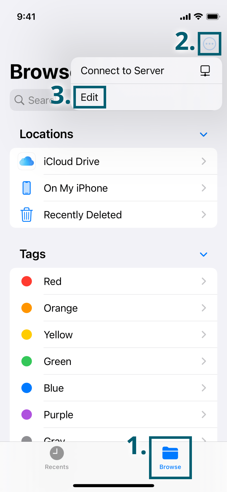

Working with Vaults
===================

Cryptomator for iOS is fully integrated into the Files app of iOS. In order to access your encrypted data, you have to use the Files app.

.. _ios/access-vault/enable-cryptomator-in-files-app:

Enable Cryptomator in Files App
-------------------------------

In order for Cryptomator to be listed in the Files app under "Locations", you may have to enable Cryptomator first. Open the Files app and then:

1. Tap on the **Browse** tab in the lower right corner.
2. Tap on the **(…)** button in the upper right corner.
3. Tap on **Edit**.
4. Enable **Cryptomator**.
5. Tap on **Done** in the upper right corner.

.. image:: ../img/ios/enable-cryptomator-in-files-app-02.png
    :alt: How to enable Cryptomator in Files app
    :width: 346px
