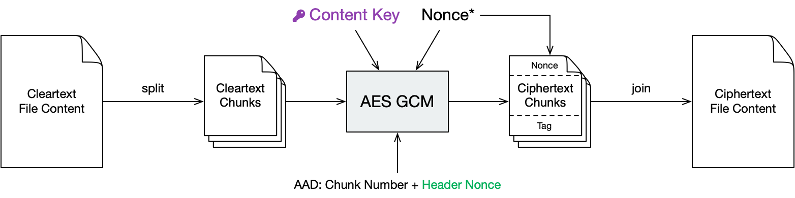

Security Architecture
=====================

.. _security/architecture/virtual-filesystem:

Virtual Filesystem
------------------

Cryptomator provides a virtual drive. Add, edit, remove files as you're used to with just any disk drive.

Files are transparently en- and decrypted.
There are no unencrypted copies on your hard disk drive.
With every access on your files inside the virtual drive, Cryptomator will en- and decrypt these files on-the-fly.

Currently Dokany (on Windows) and FUSE (on macOS and Linux) are our frontends of choice.
If they're not available on your system, Cryptomator will fall back on WebDAV, as it is supported on every major operating system. WebDAV is an HTTP-based protocol and Cryptomator acts as a WebDAV server accepting so-called loopback connections on your local machine only.

Whenever your file manager accesses files through this virtual drive, Cryptomator will process this request via the following layers.

.. _security/architecture/masterkey-derivation:

Masterkey Derivation
--------------------

Each vault has its own 256 bit encryption as well as MAC masterkey used for encryption of file specific keys and file authentication, respectively.

These keys are random sequences generated by a :abbr:`CSPRNG (Cryptographically secure pseudorandom number generator)`.
We use `SecureRandom <https://docs.oracle.com/javase/8/docs/api/java/security/SecureRandom.html>`_ with SHA1PRNG, seeded with 440 bits from ``SecureRandom.getInstanceStrong()``.

Both keys are encrypted using `RFC 3394 <https://tools.ietf.org/html/rfc3394>`_ key wrapping with a :abbr:`KEK (Key-encryption key)` derived from the user's password using `scrypt <https://tools.ietf.org/html/rfc7914>`_.

.. code-block:: console

    encryptionMasterKey := createRandomBytes(32)
    macMasterKey := createRandomBytes(32)
    kek := scrypt(password, scryptSalt, scryptCostParam, scryptBlockSize)
    wrappedEncryptionMasterKey := aesKeyWrap(encryptionMasterKey, kek)
    wrappedMacMasterKey := aesKeyWrap(macMasterKey, kek)

.. image:: ../img/security/key-derivation@2x.png
    :alt: KEK Derivation
    :width: 336px
    :align: center

The wrapped keys and the parameters needed to derive the KEK are then stored as integers or base64-encoded strings in a JSON file named ``masterkey.cryptomator``, which is located in the root directory of the vault.

.. code-block:: js

    {
        "version": 7, /* vault version for checking software compatibility */
        "scryptSalt": "QGk...jY=",
        "scryptCostParam": 16384,
        "scryptBlockSize": 8,
        "primaryMasterKey": "QDi...Q==", /* wrappedEncryptionMasterKey */
        "hmacMasterKey": "L83...Q==", /* wrappedMacMasterKey */
        "versionMac": "3/U...9Q=" /* HMAC-256 of vault version to prevent undetected downgrade attacks */
    }

When unlocking a vault the KEK is used to unwrap (i.e. decrypt) the stored masterkeys.

.. image:: ../img/security/masterkey-decryption@2x.png
    :alt: Masterkey Decryption
    :width: 440px
    :align: center

.. _security/architecture/file-header-encryption:

File Header Encryption
----------------------

The file header stores certain metadata, which is needed for file content encryption.
It consists of 88 bytes.

* 16 bytes nonce used during header payload encryption
* 40 bytes `AES-CTR <https://en.wikipedia.org/wiki/Block*cipher*mode*of*operation#Counter*.28CTR.29>`_ encrypted payload consisting of:

    * 8 bytes filled with 1 for future use (formerly used for file size)
    * 32 bytes file content key
* 32 bytes header MAC of the previous 56 bytes

.. code-block:: console

    headerNonce := createRandomBytes(16)
    contentKey := createRandomBytes(32)
    cleartextPayload := 0xFFFFFFFFFFFFFFFF . contentKey
    ciphertextPayload := aesCtr(cleartextPayload, encryptionMasterKey, headerNonce)
    mac := hmacSha256(headerNonce . ciphertextPayload, macMasterKey)

.. figure:: ../img/security/file-header-encryption@2x.png
    :alt: File Header Encryption
    :width: 706px
    :align: center

    \*Random per file change

.. _security/architecture/file-content-encryption:

File Content Encryption
-----------------------

This is where your actual file contents get encrypted.

The cleartext is broken down into multiple chunks, each up to 32 KiB + 48 bytes consisting of:

* 16 bytes nonce
* up to 32 KiB encrypted payload using AES-CTR with the file content key
* 32 bytes MAC of

    * file header nonce (to bind this chunk to the file header)
    * chunk number as 8 byte big endian integer (to prevent undetected reordering)
    * nonce
    * encrypted payload

Afterwards the encrypted chunks are joined preserving the order of the cleartext chunks.
The payload of the last chunk may be smaller than 32 KiB.

.. code-block:: js

    cleartextChunks[] := split(cleartext, 32KiB)
    for (int i = 0; i < length(cleartextChunks); i++) {
        chunkNonce := createRandomBytes(16)
        ciphertextPayload := aesCtr(cleartextChunks[i], contentKey, chunkNonce)
        mac := hmacSha256(headerNonce . bigEndian(i) . chunkNonce . ciphertextPayload, macMasterKey)
        ciphertextChunks[i] := chunkNonce . ciphertextPayload . mac
    }
    ciphertextFileContent := join(ciphertextChunks[])

    \*Random per chunk change

.. _security/architecture/directory-ids:

Directory IDs
-------------

Each directory has a unique ID that is required during filename encryption.
For historical reasons the directory ID is a String, even though any byte sequence would do the job.

The directory ID for the root directory is the empty string.
For all other directories it is a random sequence of at most 36 ASCII chars.
We recommend using random :abbr:`UUID (Universally unique identifier)`.

.. code-block:: console

    dirId := createUuid()

When traversing directories, the directory ID of a given subdirectory is processed in four steps to determine the storage path inside the vault:

#. Encryption of the directory ID using `AES-SIV <https://tools.ietf.org/html/rfc5297>`_ in order to encrypt directory hierarchies,
#. Creating a SHA1 hash of the encrypted directory ID in order to get a uniform length,
#. base32-encoding the hash to get a string of printable chars and
#. finally concatenation of a path from the base32-encoded hash.

.. code-block:: console

    dirIdHash := base32(sha1(aesSiv(dirId, null, encryptionMasterKey, macMasterKey)))
    dirPath := vaultRoot + '/d/' + substr(dirIdHash, 0, 2) + '/' + substr(dirIdHash, 2, 30)

Regardless of the hierarchy of cleartext paths, ciphertext directories are always stored in a flattened structure.
All directories will therefore effectively be siblings (or cousins, to be precise).

.. _security/architecture/filename-encryption:

Filename Encryption
-------------------

The cleartext name of a file gets encoded using UTF-8 in `Normalization Form C <https://unicode.org/reports/tr15/#Norm*Forms>`_ to get a unique binary representation.

Cryptomator uses `AES-SIV <https://tools.ietf.org/html/rfc5297>`_ to encrypt names.
The directory ID of the parent folder is passed as associated data.
This prevents undetected movement of files between directories.

.. figure:: ../img/security/filename-encryption@2x.png
    :alt: Filename Encryption
    :width: 614px
    :align: center

    \*Unencrypted directory ID of the partent dir `as described above <security/architecture/directory-ids>`_

.. code-block:: console

    ciphertextName := base64url(aesSiv(cleartextName, parentDirId, encryptionMasterKey, macMasterKey)) + '.c9r'

Depending on the kind of node, the encrypted name is then either used to create a file or a directory:

* Files are stored as files
* Non-Files are stored as directories. The type of the node then depends on the directory content:

    * Directories are denoted by a file called ``dir.c9r`` containing aforementioned directory ID
    * Symlinks are denoted by a file called ``symlink.c9r`` containing the encrypted link target
    * Further types may be appended in future releases

Thus, a directory structure like this:

.. code-block:: console

    .
    ├─ File.txt
    ├─ SymlinkToFile.txt
    └─ Subdirectory
    └─ ...

Becomes this:

.. code-block:: console

    .
    ├─ d
    │  ├─ BZ
    │  │  └─ R4VZSS5PEF7TU3PMFIMON5GJRNBDWA
    │  │     ├─ 5TyvCyF255sRtfrIv**83ucADQ==.c9r  # File.txt
    │  │     ├─ FHTa55bH*sUfVDbEb0gTL9hZ8nho.c9r  # Subdirectory
    │  │     │  └─ dir.c9r  # contains dirId
    │  │     ├─ gLeOGMCN358*UBf2Qk9cWCQl.c9r  # SymlinkToFile.txt
    │  │     │  └─ symlink.c9r  # contains link target
    │  └─ FC
    │     └─ ZKZRLZUODUUYTYA4457CSBPZXB5A77
    │        └─ ...
    ├─ masterkey.cryptomator
    └─ masterkey.cryptomator.DFD9B248.bkup

.. _security/architecture/name-shortening:

Name Shortening
---------------

.. note::

    This layer doesn't provide any additional security.
    Its sole purpose is to maximize compatibility.

To maximize compatibility, we need to make sure the ciphertext names don't exceed a length of 255 chars.
As some cloud sync services might want to add a suffix to a file in case of conflicts, we decided to use at most 220 chars.

If a encrypted name (including its ``.c9r`` extension) exceeds these 220 chars, we will instead create a directory named after its much shorter SHA-1 hash and the ``.c9s`` extension.
Additionally we will create a reverse-mapping file named ``name.c9s`` containing the original file inside of this directory.

.. code-block:: js

    if (length(ciphertextName) > 220) {
        deflatedName := base64url(sha1(ciphertextName)) + '.c9s'
        inflatedNameFilePath := deflatedName + '/name.c9s'
        fileContentsPath := deflatedName + '/contents.c9r'
        symlinkFilePath := deflatedName + '/symlink.c9r'
        dirIdFilePath := deflatedName + '/dir.c9r'
    }

Again, we have to distinguish the kind of a node:

* Non-Files (such as symlinks or directories) are stored as a directory anyway. Nothing changes for them.
* Files, on the other hand, need a different place to store their contents. Therefore we introduce the ``contents.c9r`` file inside the ``.c9s`` directory.

A vault containing several nodes with very long names might result in a ciphertext structure like this:

.. code-block:: console

    .
    ├─ d
    │  ├─ BZ
    │  │  └─ R4VZSS5PEF7TU3PMFIMON5GJRNBDWA
    │  │     ├─ 5TyvCyF255sRtfrIv**83ucADQ==.c9r
    │  │     ├─ FHTa55bH*sUfVDbEb0gTL9hZ8nho.c9r
    │  │     │  └─ dir.c9r
    │  │     ├─ gLeOGMCN358*UBf2Qk9cWCQl.c9r
    │  │     │  └─ symlink.c9r
    │  │     ├─ IjTsXtReTy6bAAuxzLPV9T0k2vg=.c9s  # shortened name...
    │  │     │  ├─ contents.c9r  # ...node is a regular file
    │  │     │  └─ name.c9s  # ...mapping to this full name
    │  │     ├─ q2nx5XeNCenHyQvkFD4mxYNrWpQ=.c9s  # shortened name...
    │  │     │  ├─ dir.c9r  # ...node is a directory
    │  │     │  └─ name.c9s  # ...mapping to this full name
    │  │     ├─ u*JJCJE-T4IH-EBYASUp1u3p7mA=.c9s  # shortened name...
    │  │     │  ├─ name.c9s  # ...mapping to this full name
    │  │     │  └─ symlink.c9r  # ...node is a symlink
    │  └─ FC
    │     └─ ZKZRLZUODUUYTYA4457CSBPZXB5A77
    │        └─ ...
    ├─ masterkey.cryptomator
    └─ masterkey.cryptomator.DFD9B248.bkup