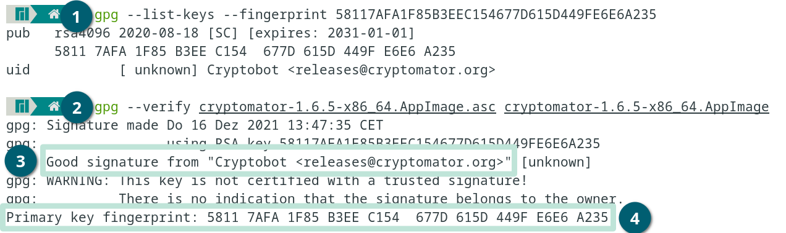

Verify Installer Signatures
===========================

If you are not sure whether an alleged Cryptomator installer is legitimate, you can verify its authenticity and integrity.

.. _security/verify-installers/linux:

Linux (AppImage)
-------------

Using the `AppImage.asc` signature file, you can check the authenticity and integrity of the `AppImage` file. First download both files and verify it in following four simple steps:

#. Use ``gpg --list-keys --fingerprint 58117AFA1F85B3EEC154677D615D449FE6E6A235`` to make sure you have loaded the GPG key. If it is not available, download it from a keyserver e.g.: ``gpg --keyserver keys.gnupg.net --recv-keys 58117AFA1F85B3EEC154677D615D449FE6E6A235`` or another trusted source like from Cryptobot using Github ``curl -sSL https://github.com/cryptobot.gpg | gpg --import -``.

#. Use ``gpg --verify cryptomator-*.AppImage.asc cryptomator-*.AppImage`` to execute the verification process (replace ``*`` with the downloaded version).

The message should say:

3. ``gpg: Good signature from "Cryptobot <releases@cryptomator.org>"``
4. ``Primary key fingerprint: 5811 7AFA 1F85 B3EE C154  677D 615D 449F E6E6 A235``

If shown, you can ignore the following warning:

``gpg: WARNING: This key is not certified with a trusted signature!``

.. _security/verify-installers/windows:

Windows (exe)
-------------

Our Windows installers are signed using a code signing certificate. You can verify the signature in five simple steps:

.. image:: ../img/security/verify-installer-win@2x.png
    :alt: How to check the code signing certificate on Windows
    :width: 1316px
    :align: center

#. Right click on the file and click on Properties.
#. Select the Digital Signatures tab: It should show a signature by ``Skymatic GmbH``.
#. Click on Details.
#. Click on View Certificates.
#. Click on Details. The serial number of our certificate should be ``63c45bff1a148d60ed2994d3a2639034``.
