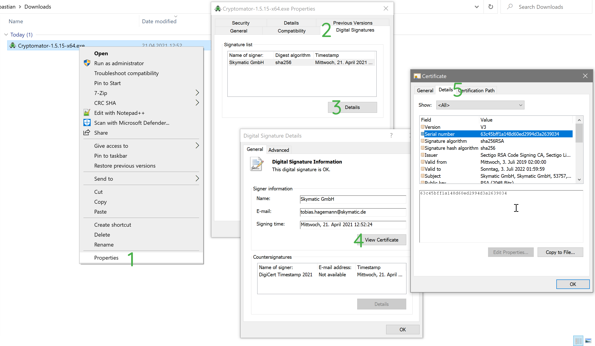

Verify Installer Signatures
===========================

If you are not sure whether an alleged Cryptomator installer is legitimate, you can verify its authenticity and integrity.

.. _security/verify-installers/windows:

Windows (exe)
-------------

Our Windows installers are signed using a code signing certificate. You can verify the signature in five simple steps:

#. Right click on the file and click on Properties.
#. Select the Digital Signatures tab: It should show a signature by ``Skymatic GmbH``.
#. Click on Details.
#. Click on View Certificates.
#. Click on Details. The serial number of our certificate should be ``63c45bff1a148d60ed2994d3a2639034``.
